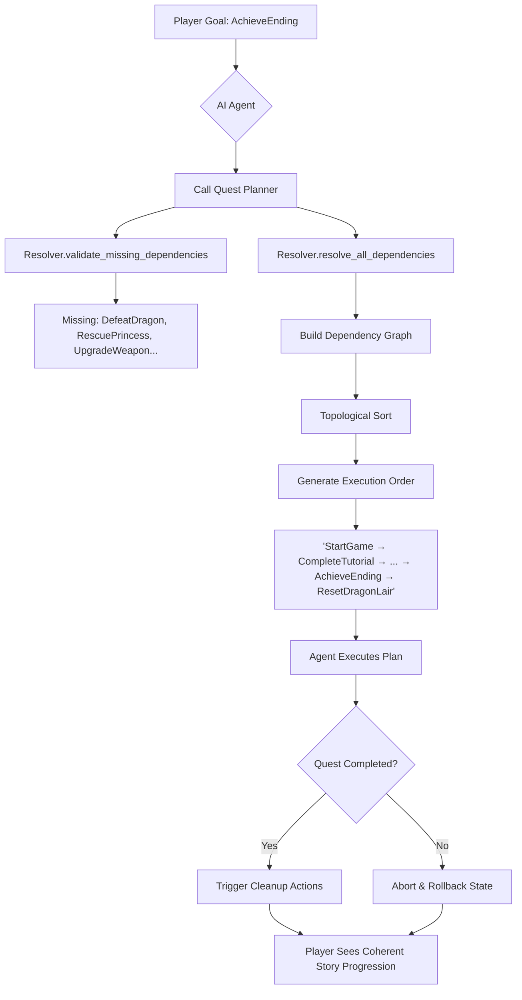

What if your AI agent could plan like a human — understanding prerequisites, sequencing actions logically, and cleaning up after itself?

In complex systems — from **game development** to **microservices** and **DevOps pipelines** — actions rarely exist in isolation. Each step may depend on multiple prerequisites, and executing them out of order can cause failures, inconsistencies, or broken user experiences.  

This is especially true in modern RPGs, where **AI-driven quest systems** must dynamically respond to player choices. Without proper dependency management, an agent might unlock a final boss before the player learns how to cast spells — or leave abandoned side quests dangling, breaking world consistency.

In this post, we’ll build a **Quest Dependency Resolver** that acts as an **AI Agent’s quest planner**, ensuring all dependencies are validated, execution order is correct, and cleanup steps are triggered automatically. 

---

## 🎮 Scenario: Quest Dependencies in an RPG  

Imagine a fantasy RPG where quests unlock progressively. Each quest depends on the successful completion of earlier tasks. At the same time, when a player abandons a main quest, the system must roll back or disable related side quests safely. Managing these intricate dependencies manually is error-prone and inflexible, especially as quest lines grow in complexity. A robust system is needed to automate this planning and ensure consistency.  

Here’s how we represent the quest system using Python data structures:  

- **`game_quest_dependencies`**: A dictionary mapping each quest to the list of quests that must be completed first.  
- **`game_cleanup_mapping`**: A mapping of quests to their corresponding cleanup actions (e.g., resetting a dungeon).  
- **`cleanup_ordering`**: A list of tuples defining the order in which cleanup tasks must be executed when multiple rollbacks are needed.  


```python
game_quest_dependencies = {
    "StartGame": [],
    "CompleteTutorial": ["StartGame"],
    "DefeatFirstBoss": ["CompleteTutorial"],
    "FindMagicSword": ["DefeatFirstBoss"],
    "RescuePrincess": ["FindMagicSword"],
    "UnlockSecretDungeon": ["DefeatFirstBoss"],
    "CollectTreasure": ["UnlockSecretDungeon"],
    "UpgradeWeapon": ["FindMagicSword"],
    "LearnFireSpell": ["CompleteTutorial"],
    "DefeatDragon": ["RescuePrincess", "UpgradeWeapon", "LearnFireSpell"],
    "AchieveEnding": ["DefeatDragon"]
}

game_cleanup_mapping = {
    "StartGame": "SaveAndQuit",
    "DefeatFirstBoss": "ResetBossArea",
    "UnlockSecretDungeon": "LockDungeon",
    "DefeatDragon": "ResetDragonLair"
}

cleanup_ordering = [
    ("ResetDragonLair", "ResetBossArea"),
    ("LockDungeon", "ResetBossArea"),
    ("ResetBossArea", "SaveAndQuit"),
]
```

---

## 🧠 AI Agent Workflow  

1. **Player defines a high-level goal**  
  Example: `AchieveEnding`.  

2. **Agent consults the Quest Planner (Resolver)**  
  The resolver expands the goal, identifying all missing prerequisites  
  (e.g., defeating the dragon, rescuing the princess, upgrading a weapon).  

3. **Agent receives a validated, ordered plan**  
  Topological sorting ensures tasks are arranged in a valid sequence that respects all dependencies.  

4. **Agent prepares for contingencies**  
  The resolver includes necessary cleanup tasks (rollback steps) mapped via `delete_mapping`,  
  ensuring the game world can be safely reset if needed.  



---

## ⚙️ Algorithm Explained  
Our Quest Dependency Resolver combines **Depth-First Search (DFS)** and **Topological Sorting (Kahn’s Algorithm)** to efficiently and correctly manage complex dependencies.

### 1. Resolving Transitive Dependencies (DFS)  
When the player requests a quest like `AchieveEnding`, the resolver recursively finds all its prerequisites:  
```
AchieveEnding → DefeatDragon → {RescuePrincess, UpgradeWeapon, LearnFireSpell}
```  
This ensures **no quest is started without its prerequisites**.  

### 2. Validating Missing Dependencies  
The resolver compares the player’s requested quests with the full dependency set, identifying what’s missing.  
This prevents “invalid goals” such as attempting `DefeatDragon` without `LearnFireSpell`.  

### 3. Constructing the Dependency Graph  
We build a directed graph where:  
- Edges represent prerequisites (e.g., `DefeatFirstBoss → FindMagicSword`).  
- Additional edges link `Create` quests to their cleanup actions (`DefeatDragon → ResetDragonLair`).  

### 4. Topological Sorting (Kahn’s Algorithm)  
We perform a topological sort to produce a valid quest execution order.  
- Start with quests that have no unmet prerequisites.  
- Repeatedly remove nodes with indegree = 0 and add their neighbors.  
- This ensures **quests are executed in an order that respects dependencies**.  

### 5. Handling Cleanup (Reverse Dependencies)  
The resolver appends cleanup tasks using the `delete_mapping`.  
This allows the Agent to maintain a consistent world state, even when a quest chain ends or is rolled back.  

---

## 📜 Example Run  

```python
if __name__ == "__main__":
    # Example usage of CommandDependencyResolver
    game_quest_dependencies = {
        "StartGame": [],
        "CompleteTutorial": ["StartGame"],
        "DefeatFirstBoss": ["CompleteTutorial"],
        "FindMagicSword": ["DefeatFirstBoss"],
        "RescuePrincess": ["FindMagicSword"],
        "UnlockSecretDungeon": ["DefeatFirstBoss"],
        "CollectTreasure": ["UnlockSecretDungeon"],
        "UpgradeWeapon": ["FindMagicSword"],
        "LearnFireSpell": ["CompleteTutorial"],
        "DefeatDragon": ["RescuePrincess", "UpgradeWeapon", "LearnFireSpell"],
        "AchieveEnding": ["DefeatDragon"]
    }

    game_cleanup_mapping = {
        "StartGame": "SaveAndQuit",
        "DefeatFirstBoss": "ResetBossArea",
        "UnlockSecretDungeon": "LockDungeon",
        "DefeatDragon": "ResetDragonLair"
    }

    cleanup_ordering = [
        ("ResetDragonLair", "ResetBossArea"),
        ("LockDungeon", "ResetBossArea"),
        ("ResetBossArea", "SaveAndQuit"),
    ]

    resolver = CommandDependencyResolver(
        command_dependencies=game_quest_dependencies,
        delete_mapping=game_cleanup_mapping,
        cleanup_ordering=cleanup_ordering
    )

    player_goals = ["AchieveEnding"]
    missing_quests = resolver.validate_missing_dependencies(player_goals)
    quest_sequence = resolver.resolve_all_dependencies(player_goals)

    print("Player Goal:", player_goals)
    print("Missing Quests:", missing_quests)
    print("Execution Order:", quest_sequence)

    print("Dependency Graph:")
    print(resolver.generate_text_dependency_graph())
    print("Dependency Graph (DOT):")
    print(resolver.generate_dot_graph())
```

**Sample Output:**  
```
Player Goal: ['AchieveEnding']
Missing Quests: {'CompleteTutorial', 'RescuePrincess', 'LearnFireSpell', 'UpgradeWeapon', 'StartGame', 'FindMagicSword', 'DefeatFirstBoss', 'DefeatDragon'}
Execution Order: ['StartGame', 'CompleteTutorial', 'LearnFireSpell', 
                  'DefeatFirstBoss', 'FindMagicSword', 'RescuePrincess', 
                  'UpgradeWeapon', 'DefeatDragon', 'AchieveEnding', 
                  'ResetDragonLair', 'ResetBossArea', 'SaveAndQuit']
```  

Here the AI Agent automatically expands the player’s goal into the **full quest plan**, filling in prerequisites and including cleanup steps.

---

## 🌳 Quest Dependency Graph (ASCII Tree)

This ASCII tree visualizes the quest hierarchy and cleanup flow. Quests branch out from `StartGame`, and cleanup actions (e.g., `ResetDragonLair`) are shown as leaves attached to their initiating quests.
*(Note: For clarity, some intermediate connections might be implied by indentation.)*
```
Dependency Graph:
StartGame
├── CompleteTutorial
├── ├── DefeatFirstBoss
├── ├── ├── FindMagicSword
├── ├── ├── ├── RescuePrincess
├── ├── ├── ├── └── DefeatDragon
├── ├── ├── ├── └── ├── AchieveEnding
├── ├── ├── ├── └── └── ResetDragonLair
├── ├── ├── └── UpgradeWeapon
├── ├── ├── ResetBossArea
├── ├── └── UnlockSecretDungeon
├── ├── └── ├── CollectTreasure
├── ├── └── └── LockDungeon
├── └── LearnFireSpell
└── SaveAndQuit
```

💡 Note on the ASCII Tree Visualization

The ASCII output below attempts to represent the dependency relationships using a tree-like structure for readability. However, it's important to note that the underlying data model is a **Directed Acyclic Graph (DAG)**, where a single node (quest) can have multiple dependencies (parents).

For example, the quest `DefeatDragon` depends on `RescuePrincess`, `UpgradeWeapon`, and `LearnFireSpell`. This multi-parent relationship cannot be accurately represented in a strict tree hierarchy. The ASCII visualization uses a Depth-First Search (DFS) traversal to display nodes, which can lead to nodes appearing under one of their parents in the text output, even though they might logically depend on others. It serves as a helpful, albeit imperfect, way to glimpse the overall structure.

For a precise representation of all dependencies and relationships, please refer to the `command_dependencies` and `delete_mapping` dictionaries used in the code.

---

## 📊 Visualizing Dependencies with Graphviz

The `generate_dot_graph()` method outputs a **Graphviz DOT language** representation of the full dependency graph.  
Unlike ASCII trees (which may struggle with nodes having multiple parents), DOT graphs provide a precise and scalable way to visualize complex dependencies.

You can render the DOT output using:

- **Graphviz CLI**  
  ```bash
  dot -Tpng -O graph.dot
  ```
  This will generate a `graph.dot.png` file with the visualized graph.

- **Online Graphviz Editor**  
  Paste the DOT output into [GraphvizOnline](https://dreampuf.github.io/GraphvizOnline/) to instantly view and adjust your graph interactively.

Cleanup edges (e.g., `Create → Delete`) are shown with **red dashed lines**,  
while additional cleanup orderings are drawn with **blue dotted lines** for clarity.

**Example DOT Output:**
```
digraph QuestDependencies {
  rankdir=TB;
  node [shape=box];
  "StartGame" -> "CompleteTutorial";
  "CompleteTutorial" -> "DefeatFirstBoss";
  "DefeatFirstBoss" -> "FindMagicSword";
  "FindMagicSword" -> "RescuePrincess";
  "DefeatFirstBoss" -> "UnlockSecretDungeon";
  "UnlockSecretDungeon" -> "CollectTreasure";
  "FindMagicSword" -> "UpgradeWeapon";
  "CompleteTutorial" -> "LearnFireSpell";
  "RescuePrincess" -> "DefeatDragon";
  "UpgradeWeapon" -> "DefeatDragon";
  "LearnFireSpell" -> "DefeatDragon";
  "DefeatDragon" -> "AchieveEnding";
  "StartGame" -> "SaveAndQuit" [color=red, style=dashed];
  "DefeatFirstBoss" -> "ResetBossArea" [color=red, style=dashed];
  "UnlockSecretDungeon" -> "LockDungeon" [color=red, style=dashed];
  "DefeatDragon" -> "ResetDragonLair" [color=red, style=dashed];
  "ResetDragonLair" -> "ResetBossArea" [color=blue, style=dotted];
  "LockDungeon" -> "ResetBossArea" [color=blue, style=dotted];
  "ResetBossArea" -> "SaveAndQuit" [color=blue, style=dotted];
}
```

**Rendered Graph Example Link** (opens in GraphvizOnline): [https://is.gd/FHvYgC](https://is.gd/FHvYgC)

---

## 📌 Implementation Details  

Below is the full implementation of the `CommandDependencyResolver` class, which powers the dependency validation, topological sorting, and cleanup mapping logic:  

```python
from typing import Dict, List
from collections import defaultdict, deque

class CommandDependencyResolver:
    def __init__(self,
                 command_dependencies: Dict[str, List[str]],
                 delete_mapping: Dict[str, str], cleanup_ordering: Optional[List[Tuple[str, str]]] = None):
        self.command_dependencies = command_dependencies
        self.delete_mapping = delete_mapping
        self.cleanup_ordering = cleanup_ordering or []

    def _resolve_transitive_dependencies(self, command: str) -> set:
        """Use DFS to collect all transitive dependencies for a command."""
        visited = set()
        stack = list(self.command_dependencies.get(command, []))
        while stack:
            current = stack.pop()
            if current not in visited:
                visited.add(current)
                stack.extend(self.command_dependencies.get(current, []))
        return visited

    def validate_missing_dependencies(self, user_commands: List[str]) -> set:
        """Return missing dependencies that user_commands do not explicitly include."""
        all_required = set(user_commands)
        for command in user_commands:
            all_required.update(self._resolve_transitive_dependencies(command))
        return all_required - set(user_commands)

    def resolve_all_dependencies(self, user_commands: List[str]) -> List[str]:
        """Resolve all forward and delete dependencies, return topologically sorted command list."""
        resolved_commands = set(user_commands)
        for command in list(resolved_commands):
            resolved_commands.update(self._resolve_transitive_dependencies(command))

        for cmd in list(resolved_commands):
            if cmd in self.delete_mapping:
                resolved_commands.add(self.delete_mapping[cmd])

        return self._topological_sort(resolved_commands)

    def _topological_sort(self, commands: set) -> List[str]:
        """Perform topological sort considering both forward and delete dependencies."""
        graph = defaultdict(list)
        indegree = defaultdict(int)

        # Forward dependencies
        for cmd in commands:
            for dep in self.command_dependencies.get(cmd, []):
                if dep in commands:
                    graph[dep].append(cmd)
                    indegree[cmd] += 1

        # Delete: CreateX → DeleteX
        for create_cmd, delete_cmd in self.delete_mapping.items():
            if create_cmd in commands and delete_cmd in commands:
                graph[create_cmd].append(delete_cmd)
                indegree[delete_cmd] += 1

        for before, after in self.cleanup_ordering:
            if before in commands and after in commands:
                graph[before].append(after)
                indegree[after] += 1

        queue = deque([cmd for cmd in commands if indegree[cmd] == 0])
        sorted_commands = []

        while queue:
            current = queue.popleft()
            sorted_commands.append(current)
            for neighbor in graph[current]:
                indegree[neighbor] -= 1
                if indegree[neighbor] == 0:
                    queue.append(neighbor)

        if len(sorted_commands) != len(commands):
            raise ValueError("Circular dependency detected in the command graph.")

        return sorted_commands

    def generate_text_dependency_graph(self) -> str:
        """Generate ASCII tree visualization of full dependency graph."""
        graph = defaultdict(list)

        for cmd, deps in self.command_dependencies.items():
            for dep in deps:
                graph[dep].append(cmd)

        for create_cmd, delete_cmd in self.delete_mapping.items():
            graph[create_cmd].append(delete_cmd)

        all_nodes = set(graph.keys()) | {n for children in graph.values() for n in children}
        child_nodes = {c for children in graph.values() for c in children}
        root_nodes = sorted(all_nodes - child_nodes)

        visited = set()
        output_lines = []

        def dfs(node: str, prefix: str = ""):
            if node in visited:
                return
            visited.add(node)
            output_lines.append(f"{prefix}{node}")
            children = sorted(graph.get(node, []))
            for i, child in enumerate(children):
                connector = "└── " if i == len(children) - 1 else "├── "
                child_prefix = prefix + ("    " if i == len(children) - 1 else "│   ")
                dfs(child, prefix + connector)

        for root in root_nodes:
            dfs(root)

        return "\n".join(output_lines)

    def generate_dot_graph(self) -> str:
        """Generate Graphviz DOT language representation of the full dependency graph."""
        lines = ["digraph QuestDependencies {"]
        lines.append("  rankdir=TB;") # Top to Bottom layout
        lines.append("  node [shape=box];") # Node style

        # Add forward dependency edges
        for cmd, deps in self.command_dependencies.items():
            for dep in deps:
                lines.append(f'  "{dep}" -> "{cmd}";')

        # Add delete/cleanup mapping edges (e.g., Create -> Delete)
        for create_cmd, delete_cmd in self.delete_mapping.items():
             lines.append(f'  "{create_cmd}" -> "{delete_cmd}" [color=red, style=dashed];')

        # Add explicit cleanup ordering edges (e.g., ResetA -> ResetB)
        for before, after in self.cleanup_ordering:
             lines.append(f'  "{before}" -> "{after}" [color=blue, style=dotted];')

        lines.append("}")
        return "\n".join(lines)
```

---

## 🔧 Extensions: Taking the Quest Planner Further  


### 1. Deploying as a Lightweight Planning Service
The dependency resolver's stateless nature makes it an ideal candidate for deployment as a **lightweight, on-demand service**. This could be a microservice (e.g., running on AWS Lambda, Google Cloud Functions, or within a Kubernetes cluster) or even a dedicated module within a larger game server architecture.

- **Benefits:**
  - **Stateless & Scalable**: Each request is self-contained, requiring only the goal and current dependency rules.
  - **On-Demand Efficiency**: Resources are consumed only when planning is needed.
  - **Integration-Friendly**: Easily integrates via APIs or message queues into existing game or workflow engines.
  - **Centralized Logic**: Acts as a single source of truth for valid task sequences, enhancing system consistency and safety by preventing invalid executions.

This approach decouples the planning logic from the execution engine, providing a robust and reusable planning backbone.

---

### 2. Cost-Aware Dependency Resolution  
Beyond simple dependency validation, we can assign **weights to each edge** in the dependency graph, representing cost factors such as:  
- **Time** (e.g., how long a quest or task takes)  
- **Resources** (e.g., compute power, in-game items, or server usage)  
- **Risk** (e.g., likelihood of failure or complexity)  

With this model, the AI Agent can:  
- Choose the **shortest path** to achieve a goal if time is critical.  
- Select the **lowest-cost path** if resources are limited.  
- Balance between speed and efficiency depending on player strategy or system policy.  

This transforms the resolver from a pure dependency checker into a **cost-optimized planner**, enabling more intelligent and adaptive decision-making.  

### 3. Declarative Configuration with YAML/JSON
Instead of hardcoding dependencies in Python, you can externalize the graph:
```
dependencies:
  AchieveEnding: [DefeatDragon]
  DefeatDragon: [RescuePrincess, UpgradeWeapon, LearnFireSpell]
  ...
cleanup:
  DefeatDragon: ResetDragonLair
  UnlockSecretDungeon: LockDungeon
```
This makes the system **data-driven** and allows designers (not just engineers) to modify quest logic without touching code.

---

## 🌍 Beyond Game Development  

Although this example is framed around RPG quests, the **dependency resolution algorithm** is broadly applicable:  

- **Microservices Orchestration**  
  Safely starting and shutting down services in the right order.  
- **DevOps Pipelines**  
  Automatically ensuring `Build → Test → Deploy → Monitor` runs without missing steps.  
- **Business Process Automation**  
  Managing workflows like `Payment → Shipping → Notification → Feedback`.  

In each case, the resolver acts as the **Agent’s planner**, ensuring consistency, correctness, and safety.  

---

## ✅ Conclusion  

The Quest Dependency Resolver is more than a tool for managing game quests —  
it’s a **blueprint for building intelligent AI Agents** that operate in any domain where actions have prerequisites.  

By combining dependency validation, topological sorting, and rollback planning,  
the resolver empowers agents to move beyond reactive behaviors and instead execute  
**complex, dependency-driven plans** with consistency and reliability.  

Whether orchestrating microservices, automating DevOps pipelines, or guiding a player  
through an epic RPG storyline, a well-structured dependency graph becomes the  
foundation of **robust and adaptive automation**.  

Sometimes, the most powerful AI doesn’t need deep learning —  
it just needs a clear and well-validated plan.
