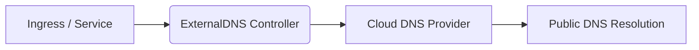



In Kubernetes production environments, exposing services to the public internet is common. We usually achieve this with `Ingress` or `LoadBalancer` type `Service`. However, every time we launch a new service or change a domain, manually adding an A record in the cloud provider’s DNS console is inefficient and error-prone.

Is there a way to let DNS records be **automatically created, updated, and cleaned up** along with service deployment? The answer is: **ExternalDNS**.

> 🔗 GitHub Project: [https://github.com/kubernetes-sigs/external-dns](https://github.com/kubernetes-sigs/external-dns)  
> 📚 Official Docs: [https://external-dns.github.io/](https://external-dns.github.io/)

ExternalDNS, maintained by Kubernetes SIGs, is an open-source controller that **automatically syncs Services and Ingress resources to external DNS systems** (such as AWS Route 53, Cloudflare, Alibaba Cloud, etc.), enabling a fully automated “service online = domain live” workflow.

---

## What is ExternalDNS?

ExternalDNS runs inside a Kubernetes cluster and continuously watches these resources:

- `Ingress` (most common)
- `Service` (type `LoadBalancer`)
- `Gateway` (Kubernetes Gateway API support)

When these resources change, ExternalDNS extracts domain info and uses the external DNS provider API to create, update, or delete DNS records (A, CNAME, TXT, etc.).

### Key Capabilities

- ✅ Automatic DNS record synchronization  
- ✅ Support for major cloud and third-party DNS providers  
- ✅ Multi-cluster and multi-tenant support  
- ✅ Fine-grained control via annotations  
- ✅ Seamless GitOps integration  

---

## How It Works

The workflow of ExternalDNS:

1. Watches `Ingress` and `Service` resources in Kubernetes  
2. Reads domain annotations (e.g. `external-dns.alpha.kubernetes.io/hostname`)  
3. Gets the public IP from the LoadBalancer or Ingress Controller  
4. Calls the DNS provider API to create/update A records  
5. Creates TXT records for ownership and conflict prevention  
6. Cleans up DNS records when resources are deleted  



---

## Quickstart: AWS Route 53 Example

### 1. Install ExternalDNS (Helm)

Helm is recommended for version management and easy configuration.

> ✅ **Pinned version info (latest stable as of September 2025)**

```bash
helm repo add external-dns https://kubernetes-sigs.github.io/external-dns/
helm install external-dns external-dns/external-dns \
  --version 1.19.0 \                    # Chart version (appVersion v1.19.0)
  --namespace kube-system \
  --set provider.name=aws \
  --set aws.region=us-west-2 \
  --set txtOwnerId=my-cluster \
  --set domainFilters[0]=example.com \
  --set logLevel=info \
  --set policy=upsert-only              # Recommended for production
```

📌 **Version Notes:**  
- Helm Chart `1.19.0` maps to ExternalDNS **appVersion v1.19.0**  
- Kubernetes version: **v1.22+ recommended**  
- See [Helm Chart Releases](https://artifacthub.io/packages/helm/external-dns/external-dns)  

---

### 2. Configure AWS IAM Permissions

ExternalDNS requires Route 53 permissions. Without them, DNS records cannot be created.

#### Example IAM Policy:

```json
{
  "Version": "2012-10-17",
  "Statement": [
    {
      "Effect": "Allow",
      "Action": [
        "route53:ChangeResourceRecordSets"
      ],
      "Resource": "arn:aws:route53:::hostedzone/YOUR_HOSTED_ZONE_ID"
    },
    {
      "Effect": "Allow",
      "Action": [
        "route53:ListHostedZones",
        "route53:ListResourceRecordSets"
      ],
      "Resource": "*"
    }
  ]
}
```

> 🔐 **Security Tips:**  
> - Use IAM Roles bound to nodes or IRSA (IAM Roles for Service Accounts)  
> - Avoid long-lived AccessKeys  
> - `ChangeResourceRecordSets` is essential for write access  
> - `ListHostedZones` is needed for zone discovery  

> 🔒 **Production Best Practice: `policy=upsert-only`**  
> Default `sync` behavior deletes records when resources are removed, which may accidentally wipe non-cluster records.  
> With `--set policy=upsert-only`, ExternalDNS **only creates/updates** and never deletes records, reducing risk.  
> Deletion should be handled by CI/CD cleanup jobs or manually.  

---

### 3. Example Ingress

```yaml
apiVersion: networking.k8s.io/v1
kind: Ingress
metadata:
  name: my-app
  annotations:
    kubernetes.io/ingress.class: "nginx"
    external-dns.alpha.kubernetes.io/hostname: "app.example.com"
spec:
  rules:
    - host: app.example.com
      http:
        paths:
          - path: /
            pathType: Prefix
            backend:
              service:
                name: my-service
                port:
                  number: 80
```

After deployment, ExternalDNS will:  
- Get the LoadBalancer IP of Nginx Ingress Controller  
- Create an A record for `app.example.com` in Route 53  
- Create a TXT record **at the same hostname (`app.example.com`)** containing:  
  `"heritage=external-dns,external-dns/owner=my-cluster,external-dns/resource=ingress/my-app"`

---

## TXT Records Explained

ExternalDNS creates TXT records for each DNS entry:

> 🔐 **Ownership & Conflict Prevention**

When multiple ExternalDNS instances (e.g. multi-cluster or multi-env) manage the same domain, TXT records (with `txtOwnerId`) prevent conflicts. ExternalDNS checks TXT records before deleting/updating to avoid overwriting others.

📌 In multi-cluster setups, always use distinct `txtOwnerId`, e.g.:

```bash
--set txtOwnerId=prod-cluster
--set txtOwnerId=staging-cluster
```

---

## Supported Resources & Providers

### Supported Resources

| Resource | Description |
|----------|-------------|
| `Ingress` | Most common, for HTTP/HTTPS |
| `Service` (LoadBalancer) | Directly exposes IP, suitable for TCP/UDP |
| `Gateway` (Gateway API) | Next-gen gateway standard |

### Supported Providers

| Provider | Supported |
|----------|-----------|
| AWS Route 53 | ✅ |
| Google Cloud DNS | ✅ |
| Azure DNS | ✅ |
| Cloudflare | ✅ |
| DigitalOcean | ✅ |
| Alibaba Cloud | ✅ |
| CoreDNS (self-hosted) | ✅ |
| PowerDNS | ✅ |

---

## Advanced Usage & Best Practices

### 1. Multiple Hostnames

```yaml
external-dns.alpha.kubernetes.io/hostname: "web.example.com,api.example.com"
```

### 2. Custom TTL

```yaml
external-dns.alpha.kubernetes.io/ttl: "60"
```

### 3. Ignore Certain Resources

```yaml
external-dns.alpha.kubernetes.io/ignore: "true"
```

### 4. Manually Set Target

For non-LoadBalancer cases:

```yaml
external-dns.alpha.kubernetes.io/target: "1.2.3.4"
```

⚠️ **Notes:**  
- Technically, A records can point to private IPs (e.g. 10.x.x.x), but public clients cannot reach them → usually ineffective  
- More suitable for CNAME or private DNS setups  
- Known Issue: With `policy=sync`, `target` annotation may be ignored in some versions; `policy=upsert-only` is safer  

---

## Where It Fits / Doesn’t Fit

| Scenario | Works? | Notes |
|----------|--------|-------|
| ✅ Public cloud (AWS/GCP/Aliyun) | ✔️ | Best practice |
| ✅ CI/CD pipelines | ✔️ | Domain auto-bound per release |
| ✅ Multi-env (dev/stg/prod) | ✔️ | Combine with domainFilters |
| ❌ Private-only clusters | ⚠️ | Needs private DNS (e.g. CoreDNS) |
| ❌ Ops-managed DNS | ❌ | May conflict with manual workflows |

---

## Debugging & Troubleshooting

### 1. View Logs

```bash
kubectl logs -n kube-system deployment/external-dns
```

Enable debug logs:

```bash
--set logLevel=debug
```

Sample output:

```
time="2025-04-05T10:00:00Z" level=debug msg="Adding DNS record: app.example.com -> 203.0.113.10"
time="2025-04-05T10:00:01Z" level=info  msg="Desired change: CREATE app.example.com A [Id: /hostedzone/Z12345]"
```

### 2. Dry-run Mode

Use `--set dryRun=true` to preview intended changes without modifying DNS.

### 3. Monitoring with Prometheus

ExternalDNS exposes Prometheus metrics at `/metrics` (default `:7979`).

| Metric | Description |
|--------|-------------|
| `external_dns_controller_sync_duration_seconds` | Sync cycle duration |
| `external_dns_endpoint_count` | DNS records managed |
| `external_dns_registry_zone_records` | Records per hosted zone |
| `external_dns_updates_total` | Successful updates |
| `external_dns_update_failures_total` | Update failures |
| `external_dns_zones_count` | Zones managed |

> 📊 **Recommendation:**  
> - Scrape metrics with Prometheus  
> - Build Grafana dashboards for DNS sync state  
> - Alert on `update_failures_total`  

---

## Edge Cases & Caveats

### 1. Wildcards

```yaml
external-dns.alpha.kubernetes.io/hostname: "*.example.com"
```

✅ Supported by most providers  
⚠️ Some (e.g. Cloudflare) restrict second-level wildcards (`*.staging.example.com`)  

### 2. Targets with Private IPs

```yaml
external-dns.alpha.kubernetes.io/target: "10.0.0.1"
```

⚠️ **While technically possible, public clients cannot resolve private IPs**  
✅ Useful only in private DNS/internal resolution (e.g. CoreDNS inside a VPC)  

---

## Summary

ExternalDNS is a key tool for **automated DNS management** in Kubernetes. By using declarative configs, it decouples service exposure from DNS operations, boosting DevOps efficiency.

### Core Value

- 🚀 Automation: Service online = Domain live  
- 🔐 Safety: TXT records prevent conflicts, `upsert-only` avoids accidental deletions  
- 🧩 Flexibility: Multi-cloud, multi-env, multi-tenant support  
- 📊 Observability: Built-in Prometheus metrics  
- 🛠️ Integration: Works with Helm, GitOps, CI/CD  

> 💡 **One-liner takeaway:**  
> **ExternalDNS = Declarative DNS + Automated Ops**

> ✅ Highly recommended for microservices, SaaS, and CI/CD-heavy architectures.  

---

## References

- GitHub Project: [https://github.com/kubernetes-sigs/external-dns](https://github.com/kubernetes-sigs/external-dns)  
- Official Docs: [https://external-dns.github.io/](https://external-dns.github.io/)  
- Helm Chart: [https://artifacthub.io/packages/helm/external-dns/external-dns](https://artifacthub.io/packages/helm/external-dns/external-dns)  
- AWS IAM Permissions: [Route 53 API Permissions](https://docs.aws.amazon.com/Route53/latest/DeveloperGuide/security_iam_service-with-iam.html)  
- Prometheus Metrics: [https://github.com/kubernetes-sigs/external-dns#metrics](https://github.com/kubernetes-sigs/external-dns#metrics)  

---

*This post is based on ExternalDNS v1.19.0, Helm Chart 1.19.0, Kubernetes v1.22+. Configs and behavior may change, please refer to the official docs for updates.*  
