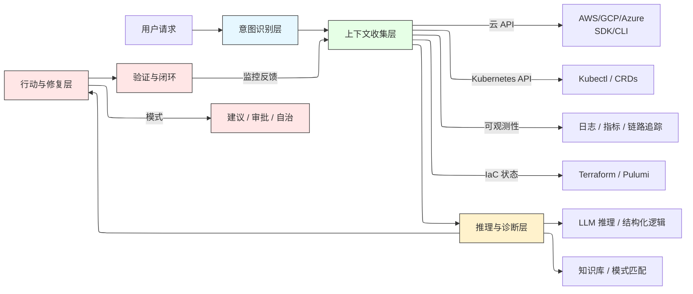



现代云基础设施堪称工程奇迹，但复杂性却成了它最大的敌人。运维工程师管理着庞大的 Kubernetes 集群、复杂的虚拟网络和分布式微服务，经常陷入一种被动循环：**救火模式**。这套流程太熟悉了——翻阅日志、解读晦涩的错误信息、在迷宫般的系统中手动关联故障。

但是，如果我们能打破这个循环呢？如果云基础设施能够**理解、诊断并自我修复**呢？

随着 **大语言模型（LLMs）驱动的 AI Agents** 崛起，这不仅是渐进式改进，而是一次范式转变。我们正在超越只能总结日志的简单聊天机器人，走向能够理解意图、收集上下文、推理根因并采取修复行动的**自治代理**。这是 **Agent-Native Cloud（代理原生云）** 的曙光。

本文探讨了 AI Agents 如何重塑云管理，并结合三篇关键论文的洞见：
*   **[1] Cloud Infrastructure Management in the Age of AI Agents**：探讨代理应当如何与云交互的基础研究。
*   **[2] Building AI Agents for Autonomous Clouds**：呼吁实现**闭环自治**。
*   **[3] Agentic AI for Cloud Troubleshooting**：提出**结构化工作流**的蓝图。

---

## **为什么云迫切需要 AI Agents**

传统的云运维存在根本性缺陷：
1.  **被动而非主动**：工程师总是在事故导致宕机或成本超支之后才介入。
2.  **手工且繁琐**：故障排查是一个跨越孤立工具的、耗费人力的逐步过程。
3.  **重复且容易出错**：同样的问题反复出现（VPC 配置错误、ConfigMap 拼写错误、IAM 权限缺失）。

**AI Agents 提供了变革性的解决方案：**
*   **大规模模式识别**：可以快速识别常见故障模式（如 “VPC 缺少 NAT 网关” 或 “Kubernetes ConfigMap 拼写错误”）。
*   **自动化上下文收集**：可以在几秒钟内从云 API（AWS、Azure）、Kubernetes 控制平面、可观测性平台（Prometheus、Datadog）收集数据。
*   **可解释推理**：不仅仅给出解决方案，还能生成自然语言的**根因分析（RCA）**，解释问题*为什么*发生。
*   **行动与闭环**：能够提出修复建议，未来还能安全地自动执行，实现真正的**闭环系统**。

---

## **云 AI Agent 的四层架构**

一个健壮的云 AI Agent 并不是单一的大模型，而是一个复杂的系统。受 **[3]** 中结构化工作流的启发，可以定义一个四层架构：

1.  **意图识别层**
    *   **功能**：理解自然语言查询（如 “为什么应用无响应？” 或 “修复失败的部署”）。
    *   **机制**：使用 LLM 分类或规则系统判断范围（集群、节点、Pod）及紧急程度。

2.  **上下文收集层**
    *   **功能**：作为代理的“眼睛和耳朵”，收集相关数据。
    *   **来源**：
        *   **云 API**（如 `describe-subnet`, `get-iam-policy`）
        *   **Kubernetes API**（如 `kubectl describe pod`, `kubectl logs`）
        *   **可观测性系统**（指标查询、日志检索）
    *   **来自 [2] 的关键洞见**：这一层是**工具增强型**，而非凭空臆测。代理会调用 `kubectl` 或 `aws-cli`，确保结果准确。

3.  **推理与诊断层**
    *   **功能**：代理的“大脑”。关联收集的上下文，识别异常并进行因果推理。
    *   **机制**：LLM 使用 **逐步推理（CoT）** 或 **树状推理（ToT）**，结合工具输出作为证据，得出根因。

4.  **行动与修复层**
    *   **功能**：将推理结果转化为行动。
    *   **能力**：
        *   **建议模式**：提出修复方案（如 “为子网 X 添加 NAT 网关”）。
        *   **审批模式**：在人工确认后执行。
        *   **自治模式**：执行安全的预先批准操作（如重启 Pod），并具备回滚机制。

这个 **意图 → 上下文 → 推理 → 行动** 的流程，是智能云运维的基石。

---

## **研究带来的洞见**

### **1. 代理之战与多智能体未来 ([1])**
论文 **[1]** 不只是理论，还做了实验，让代理分别通过不同接口（SDK、CLI、IaC、Web）操作云环境。关键发现：
*   **没有单一最佳接口**：CLI 适合简单任务，IaC 擅长复杂状态更新，Web 在监控方面意外表现不错。这证明了**多代理系统的必要性**。
*   **协调器是关键**：单一代理无法精通所有接口，需要一个 **Orchestrator Agent** 来把任务分配给合适的“专家代理”。

👉 **实践意义**：未来是**分层多代理系统**，而不是单一大代理。

---

### **2. 工具增强不可或缺 ([2])**
论文 **[2]** 强调了一个关键点：**信任**。臆想的修复是危险的，真正调用 `kubectl apply -f` 才可靠。

*   **闭环自治**：真正的自治意味着 **检测 → 修复 → 验证**。代理必须在修复后再次调用监控 API，确认问题解决。  
*   **嵌入控制平面**：代理需要与云的原生 API 和 IaC 工具深度集成，才能安全高效。

👉 **实践意义**：**工具增强型代理是通往可靠自治的唯一途径。**

---

### **3. 可解释性建立信任 ([3])**
论文 **[3]** 指出代理不能是黑箱，必须解释其推理过程。

*   **超越 “是什么” 到 “为什么”**：不仅要说 “Pod 失败了”，还要说明 “Pod 失败是因为镜像 my-app:v1 在私有仓库 my-ecr-repo 中未找到，可能缺少 imagePullSecret”。  
*   **人机协作**：清晰的解释能赢得工程师的信任，尤其适合高风险场景下的人类监督。

👉 **实践意义**：**清晰、可读的根因分析是落地的关键。**

---

## **案例：Agent如何工作**

**场景**：一个新应用部署失败。  

1.  **意图识别**：解析查询，识别为“部署级别”问题。  
2.  **上下文收集**：  
    *   调用 `kubectl describe deployment my-app` → 得到 `ImagePullBackOff`。  
    *   调用 `kubectl logs my-app-pod-12345` → 确认 “Failed to pull image”。  
    *   检查云 IAM 策略 → 发现服务账号缺少 ECR 权限。  
3.  **推理**：关联信息后得出结论：Pod 无法拉取镜像，因为服务账号缺少 `ecr:GetAuthorizationToken` 和 `ecr:BatchGetImage` 权限。  
4.  **行动**：  
    *   **建议**：为服务账号 `my-app-sa` 添加 `AmazonEC2ContainerRegistryReadOnly` 策略。  
    *   **（高级模式）**：在审批后，生成并应用 Terraform 计划更新 IAM 角色，并验证部署恢复正常。  

---

## **未来方向：挑战与机遇**

从 **助手（Co-Pilot）** 向 **自治运维者（Autonomous Operator）** 转变的过程中，有几个关键方向：  
1.  **多代理协调**：为网络、存储、安全等提供专用代理，由中央大脑协调。  
2.  **安全自治修复**：建立可靠的**护栏**（如 [1] 提出的 “Cloud Gym” 沙箱、策略合规检查、失败时自动回滚）。  
3.  **跨云智能**：管理混合云和多云环境的代理。  
4.  **人机协作**：人类给出高层目标（如 “优化成本”），代理负责实现路径，并在关键时刻升级处理。  

---

## **结论：Agent-Native 云是必然趋势**

研究已经很明确：云基础设施的未来是 **Agent-Native**。  
结合 **[1]**（多模态交互与协调）、**[2]**（工具增强与闭环）、**[3]**（可解释与结构化工作流），我们可以构建不仅自动化、更是**智能化**的系统。  

这不是要取代工程师，而是要**增强他们**。让他们从重复性排错中解放出来，专注于创新、架构和战略性工作。  

从被动排错到自治运维的旅程已经开启。未来的云不仅是 Cloud-Native，更将是 **Agent-Native**。  
