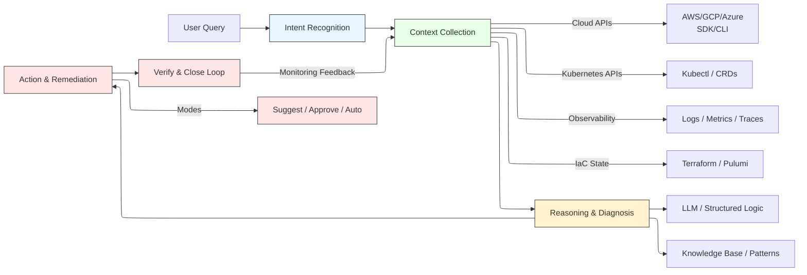



Modern cloud infrastructure is a marvel of engineering, but its complexity has become its own worst enemy. Engineers managing sprawling Kubernetes clusters, intricate virtual networks, and distributed microservices are often trapped in a reactive cycle: **firefighting**. The routine is all too familiar—scouring logs, deciphering cryptic error messages, and manually correlating failures across a labyrinth of systems.

But what if we could break this cycle? What if our cloud infrastructure could **understand, diagnose, and heal itself**?

The emergence of **AI Agents** powered by Large Language Models (LLMs) is not just an incremental improvement; it's a paradigm shift. We're moving beyond simple chatbots that summarize logs, towards **autonomous agents** capable of understanding intent, gathering context, reasoning about root causes, and taking corrective actions. This is the dawn of the **agent-native cloud**.

This article explores how AI Agents are poised to revolutionize cloud management, drawing deep insights from three pivotal research papers:
*   **[1] Cloud Infrastructure Management in the Age of AI Agents**: A foundational study on *how* agents should interact with the cloud.
*   **[2] Building AI Agents for Autonomous Clouds**: A call for *closed-loop* autonomy.
*   **[3] Agentic AI for Cloud Troubleshooting**: A blueprint for *structured* agent workflows.

---

## **Why the Cloud is Screaming for AI Agents**

Traditional cloud operations are fundamentally flawed:
1.  **Reactive, Not Proactive**: Engineers respond *after* incidents cause downtime or cost overruns.
2.  **Manual & Tedious**: Troubleshooting is a human-intensive, step-by-step process across siloed tools.
3.  **Repetitive & Error-Prone**: The same issues (misconfigured VPCs, typos in ConfigMaps, IAM permission gaps) recur constantly.

**AI Agents offer a transformative solution:**
*   **Pattern Recognition at Scale**: They can instantly identify known failure patterns (e.g., "NAT Gateway missing in VPC" or "typo in Kubernetes ConfigMap").
*   **Automated Context Gathering**: They can programmatically collect data from diverse sources—cloud APIs (AWS, Azure), Kubernetes control planes, and observability platforms (Prometheus, Datadog)—in seconds.
*   **Explainable Reasoning**: They don't just spit out a solution; they provide a natural language **Root Cause Analysis (RCA)**, explaining *why* something failed.
*   **Action & Closure**: They can suggest, and in the future, safely execute remediation, creating a true **closed-loop** system.

---

## **The Anatomy of a Cloud AI Agent: A Four-Layer Architecture**

A robust Cloud AI Agent isn't a single monolithic model; it's a sophisticated system. Inspired by the structured workflow in **[3]**, we can define a four-layer architecture:

1.  **Intent Recognition Layer**
    *   **Function**: Interprets natural language queries ("Why is my application unresponsive?" or "Fix the failing deployment").
    *   **Mechanism**: Uses LLM classification or rule-based systems to determine the scope (cluster, node, pod) and urgency.

2.  **Context Collection Layer**
    *   **Function**: Acts as the agent's "eyes and ears," gathering relevant data.
    *   **Sources**:
        *   **Cloud APIs** (e.g., `describe-subnet`, `get-iam-policy`)
        *   **Kubernetes APIs** (e.g., `kubectl describe pod`, `kubectl logs`)
        *   **Observability Systems** (e.g., metric queries, log searches)
    *   **Key Insight from [2]**: This layer is **tool-augmented**, not hallucination-based. The agent *calls* `kubectl` or `aws-cli`, ensuring accuracy.

3.  **Reasoning & Diagnosis Layer**
    *   **Function**: The agent's "brain." It correlates the collected context, identifies anomalies, and performs causal inference.
    *   **Mechanism**: An LLM uses **Chain-of-Thought** or **Tree-of-Thoughts** prompting, fed with the *actual* tool outputs as evidence, to reason about the root cause.

4.  **Action & Remediation Layer**
    *   **Function**: Translates reasoning into outcomes.
    *   **Capabilities**:
        *   **Suggestion Mode**: Proposes fixes ("Add a NAT Gateway to subnet X").
        *   **Approval Mode**: Executes actions after human confirmation.
        *   **Autonomous Mode**: Performs safe, pre-approved actions (e.g., restarting a pod) with built-in rollback mechanisms.

This **Intent → Context → Reasoning → Action** pipeline is the cornerstone of intelligent cloud operations.

---

## **Deep Dive: What the Research Tells Us**

Let's integrate the specific, powerful insights from the three papers to build a more nuanced picture.

### **1. The "Battle of the Agents" and the Multi-Agent Future ([1])**

The paper **[1]** doesn't just theorize; it runs a "battle" between AI agents using different cloud interfaces (SDK, CLI, IaC, Web). Its findings are crucial:

*   **No Single "Best" Interface**: CLI agents are fast for simple tasks, IaC agents excel at complex state updates, and Web interfaces are surprisingly good for monitoring. This **proves the need for a multi-agent system**.
*   **The Orchestrator is Key**: A single agent cannot master all interfaces. We need an **Orchestrator Agent** (as hinted in [1]) that can route tasks to the right "expert" agent—e.g., send a "create VM" task to a CLI agent, and a "complex network update" task to an IaC agent.

> **In Practice**: The future is **hierarchical multi-agent systems**, not monolithic agents.

### **2. Tool Augmentation is Non-Negotiable ([2])**

Paper **[2]** emphasizes a critical point: trust. An agent that *imagines* a fix is dangerous. An agent that *calls* `kubectl apply -f` is trustworthy.

*   **Closed-Loop Autonomy**: True autonomy means **Detect → Fix → Verify**. The agent must not only apply a fix but also call monitoring APIs to confirm the issue is resolved.
*   **Embedded in the Control Plane**: For maximum efficiency and safety, agents must be tightly integrated with the cloud's native APIs and IaC tools.

> **In Practice**: **Tool-augmented agents are the only path to reliable, trustworthy automation.**

### **3. Explainability Builds Trust ([3])**

Paper **[3]** stresses that an agent is not a black box. It must articulate its reasoning.

*   **Beyond "What" to "Why"**: Instead of just saying "Pod failed," it should say, "Pod failed because the image 'my-app:v1' was not found in the private registry 'my-ecr-repo'. This is likely due to a missing `imagePullSecret` in the pod spec."
*   **Human-in-the-Loop**: This explainability is vital for gaining engineer trust and enabling human oversight, especially for high-stakes changes.

> **In Practice**: **Clear, human-readable RCA is essential for adoption.**

---

## **Bringing it to Life: Agent in Action**

Let's see this integrated architecture in a real-world scenario:

**Incident**: "The new application deployment is failing."

1.  **Intent Recognition**: The agent parses the query and identifies it as a "deployment-level" issue.
2.  **Context Collection**:
    *   Calls `kubectl describe deployment my-app` → Finds `ImagePullBackOff`.
    *   Calls `kubectl logs my-app-pod-12345` → Confirms "Failed to pull image."
    *   Checks cloud IAM policies → Finds no permissions for the ECR registry.
3.  **Reasoning**: The agent correlates the data: "The pod cannot pull the image because the service account lacks the necessary `ecr:GetAuthorizationToken` and `ecr:BatchGetImage` permissions."
4.  **Action**:
    *   **Suggests**: "Add the `AmazonEC2ContainerRegistryReadOnly` policy to the service account `my-app-sa`."
    *   **(Advanced)**: With approval, it generates and applies an IaC (Terraform) plan to update the IAM role, then verifies the deployment succeeds.

---

## **The Road Ahead: Challenges and Opportunities**

We're moving from **co-pilots** to **autonomous operators**. Key future directions include:

1.  **Sophisticated Multi-Agent Orchestration**: Specialized agents for networking, storage, and security, coordinated by a central brain.
2.  **Safe Autonomous Remediation**: Implementing robust **guardrails** (as proposed in [1]), such as sandbox testing ("Cloud Gym"), policy compliance checks, and automatic rollback on failure.
3.  **Cross-Cloud Intelligence**: Agents that seamlessly manage hybrid and multi-cloud environments.
4.  **Human-AI Collaboration**: Designing interfaces where humans provide high-level goals ("Optimize for cost"), and agents figure out the optimal path, with clear escalation paths for critical decisions.

---

## **Conclusion: The Agent-Native Imperative**

The research is clear: the future of cloud infrastructure is **agent-native**. By combining the strengths of **[1]** (multi-modal interaction and orchestration), **[2]** (tool-augmented, closed-loop action), and **[3]** (explainable, structured workflows), we can build systems that are not just automated, but **intelligent**.

This isn't about replacing engineers; it's about **augmenting** them. It's about freeing them from the drudgery of repetitive troubleshooting so they can focus on innovation, architecture, and strategic initiatives.

The journey from reactive troubleshooting to autonomous operations has begun. The cloud of tomorrow won't just be cloud-native, it will be **agent-native**.
