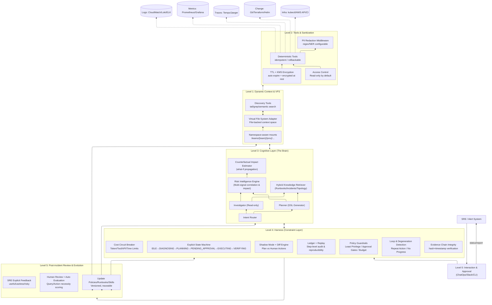



随着云原生架构（Kubernetes、AWS/GCP）复杂度的指数级增长，传统的静态规则监控 + 人工 Runbook 响应模式逐渐成为系统韧性的瓶颈。许多 AIOps 尝试仍停留在“RAG + Chatbot”的范式上，常见痛点包括：上下文窗口限制导致关键信息被截断或丢失、幻觉风险难以控制、以及缺乏工业级的执行安全感与审计能力。

本文介绍 Aegis —— 一种面向关键基础设施的 Agentic 故障诊断与自愈系统。Aegis 不把 LLM 当作全能黑盒，而是将其定位为 **结构化推理与规划引擎**，并通过三项关键设计实现“可控、可审计、可持续演进”的生产级 Agent：

- **虚拟文件系统适配器 (VFS Adapter)**：将云端异构状态统一抽象为文件读写，配合“零拷贝”的动态上下文发现；长输出不截断，而是落盘并用 `tail/grep/语义检索` 渐进加载。
- **多源风险智能引擎 (Risk Intelligence Engine)**：对 Logs/Metrics/Traces/Topology/Change 等多信号进行噪音过滤、关联分析与爆炸半径评估，并在 Dry-run 阶段引入反事实影响预估（counterfactual impact），使高风险操作具备更可靠的事前风险刻画。
- **确定性 Harness 约束层 (Deterministic Harness)**：以显式状态机、预算熔断、循环退化检测、影子模式与权限门控为核心，确保长期运行的 Agent 可观测、可回放、可评估并可纠偏；并进一步提供证据链完整性验证（hash + timestamp），防止长周期 incident 中的上下文漂移导致误判。

本文将拆解其 **0–5 层架构**与工程实现要点，并通过真实云运维场景展示端到端工作流。

---

## 1. 核心设计哲学 (Core Philosophy)

构建 Aegis 时，我们拒绝将 LLM 视为全知全能的黑盒，而是遵循三条工程共识：

1. **世界即文件系统 (The World as a File System)**  
   受 Cursor IDE 的动态上下文发现启发，我们将异构的云端状态（Logs、Metrics、IAM Policies、Git Commits、Terraform Plans、Incident Timeline）统一抽象为标准的文件读写操作。  
   重点不是“把世界变成文件”，而是：**把可进入上下文的内容统一落到外部存储，再由 Agent 按需发现与加载**。

2. **认知与执行分离 (Separation of Reasoning & Execution)**  
   LLM 仅负责生成结构化计划（Plan / DSL）与证据链引用，所有带副作用的操作均由确定性工具执行，并受 Harness 代码级约束与审批门控。

3. **安全内建 (Safety Native)**  
   系统必须默认假设 Agent 会犯错：Harness 的权限高于 Agent；系统默认运行在 **影子模式 / Dry-run 模式**；任何实际写入必须经过最小权限、风险评估与审批流程。对高风险变更（如 `blast_radius_score > 0.7`），可启用 **双人审批（two-person approval）** 与不可变审批留痕，以满足强监管场景的合规要求。

---

## 2. 总体架构：0–5 层模型 (The 0–5 Layer Architecture)

为避免“概念正确但落地困难”，Aegis 将一个可长期运行的运维 Agent 系统拆分为 6 个层级（0–5），每层解决一个明确的工程难题：

- **Level 0：交互与审批 (Interaction & Approval / ChatOps)**  
  用户入口、权限上下文注入、审批与通知（Slack/CLI/Console）。
- **Level 1：动态上下文与 VFS (Dynamic Context & VFS Adapter)**  
  统一外部记忆空间、长输出落盘、渐进式读取、算子下推；支持多租户/多环境 namespace 隔离。
- **Level 2：工具与合规中间件 (Deterministic Tools & Sanitization)**  
  预定义原子工具、幂等/回滚、PII 脱敏、访问控制与审计挂钩；VFS 文件可配置 TTL 与 KMS 加密存储。
- **Level 3：Agent 认知层 (Cognitive Layer)**  
  任务路由、侦查与规划、多信号风险引擎、知识检索；支持结构化 Skills/DSL 模块降低自由生成带来的歧义。
- **Level 4：Harness 约束层 (Constraint Layer / Long-running Harness)**  
  显式状态机、预算熔断、循环退化检测、影子模式、权限门控、可回放；执行前进行证据链完整性验证（hash 校验）。
- **Level 5：演进与评估 (Post-incident Review & Evolution)**  
  事后评估每一步是否必要、提炼可复用 runbook、更新护栏与技能库；可记录 SRE 显式反馈用于排序/过滤（而非端到端生成微调）。

---

## 2.1 架构图 (Mermaid)



---

## 3. Level 1：动态上下文与 VFS 适配器 (Dynamic Context Discovery)

Aegis 解决“上下文窗口爆炸”与“数据实时性”的核心创新，是 **将上下文从 prompt 内存迁移到外部文件空间**，并采用渐进式披露策略按需加载。

### 3.1 虚拟文件系统：云环境是一棵目录树 (The Virtual File System)

在 Agent 眼中，整个云环境是一个受控的目录树（默认只读），例如：

```plaintext
/
├── teams/
│   ├── payments/
│   │   ├── prod/
│   │   │   ├── monitor/eks/cluster-prod/events/warning.txt
│   │   │   ├── monitor/eks/cluster-prod/pods/payment/describe.txt
│   │   │   ├── monitor/eks/cluster-prod/logs/payment-pod/tail.log
│   │   │   ├── metrics/payment/5xx_rate.prom
│   │   │   ├── traces/payment/last_15m.trace
│   │   │   ├── config/aws/iam/roles/{role}/policy.json
│   │   │   └── change/terraform/plans/latest.plan
│   │   └── staging/...
│   └── fraud/...
└── context/
    ├── active_incidents.md
    ├── conversation_history.txt
    └── skills/
        ├── k8s_triage.skill.yaml
        └── iam_debug.skill.yaml
```

关键原则（借鉴 Cursor 的“文件即外部大脑”）：

- **长输出不截断**：工具输出完整落盘，LLM 只获得路径与摘要指针。
- **默认从 `tail` 开始**：先以极低上下文成本探测结论/错误，再决定扩大读取范围。
- **按需检索而非预灌输**：技能、工具说明、历史对话都可被 grep/语义检索定位后再加载片段。
- **多租户/多环境隔离**：通过 namespace-aware mounts 将可见性限制在 `/teams/{team}/{env}/...` 子树，避免跨团队信息泄露或权限混淆。

### 3.2 上下文预算与证据纪律 (Context Budget & Evidence Pointer Discipline)

为了让“动态上下文发现”可控而不是随意读取，Aegis 引入两条硬约束：

- **Context Budget Policy**：每轮最多引入 N 个片段/总 token 上限；加载必须附带 `why-needed`；优先使用 tail/关键词定位。
- **Evidence Pointer Discipline**：Planner 输出的每个关键结论与操作建议必须引用证据指针：  
  `file_path + query_id + line_range`（或等价定位信息）。  
  若缺少证据引用，Harness 拒绝进入 EXECUTING。

### 3.3 证据链完整性验证 (Evidence Chain Integrity)

仅有 `path + line_range` 仍可能在长周期 incident 中出现“上下文漂移”：日志轮转、文件覆盖、索引更新导致证据与引用不一致。Aegis 因此引入证据链完整性验证机制：

- 工具输出写入 VFS 时，自动附加 **时间戳** 与 **内容哈希（如 SHA256）**；
- Planner 引用证据时需提供：`file_path + hash + line_range`；
- Harness 在进入 EXECUTING 前校验当前文件内容哈希是否匹配；
- 若不匹配（如日志轮转/覆盖），则拒绝执行并触发重新采集或重新定位证据。

这使得 Aegis 在长周期、跨班次的 incident 中依然能保持推理依据的可追溯与一致性。

### 3.4 关键技术：算子下推 (Predicate Push-down)

传统 RAG 会把数据拉回本地再处理；在 GB 级日志/大指标集上不可接受。Aegis 的 VFS Adapter 实现轻量查询编译器，将过滤与限制下推到数据源执行。

- 场景：Agent 想做  
  `grep "Timeout" /.../logs/payment/error.log | tail -n 50`

- 反面教材：下载 10GB → 本地 grep → 超时/内存溢出。

- Aegis（算子下推）流程：
  1) **拦截**：Adapter 识别 grep(Filter) + tail(Limit)  
  2) **编译**：转换为云端查询（如 Loki LogQL / CloudWatch Insights）  
  3) **执行**：云端执行，仅返回 50 行结果写入文件

示例（Loki LogQL）：

```sql
{app="payment"} |= "Timeout" | line_format "{{.ts}} {{.msg}}"
```

并在 Adapter 层强制 limit：

```json
{ "query": "{app='payment'} |= 'Timeout'", "limit": 50 }
```

这种“计算向数据移动”的设计，让 Agent 能以毫秒级延迟探索海量数据，同时保持极低 token 成本。

---

## 4. Level 2：工具与合规中间件 (Tools & Sanitization)

这一层确保所有操作 **原子性、可重放、可合规**，并让写操作始终处在受控边界内。

### 4.1 原子工具库：禁止任意代码执行 (Deterministic Tooling)

Agent 不能运行任意 Python/Shell，只能调用预定义的工具集合，例如：

- `check_pod_status`
- `get_pod_events`
- `query_logs(filter, window, limit)`
- `query_metrics(promql, window)`
- `git_diff(range)`
- `terraform_plan(workspace)`
- `apply_change(change_id)`（仅在审批后）

工具必须满足：

- **结构化输入输出（JSON）**
- **幂等性（Idempotency key）**
- **可回滚或可补偿（Rollback/Compensation）**
- **自动落盘证据（输出写入 VFS）**

### 4.2 幂等与回滚（Production 必备）

- **Idempotency**：每个写操作绑定 `change_id` 与幂等键，重复提交不会重复执行。
- **Rollback/Compensation**：
  - K8s：`rollout undo` / `scale back` / `traffic drain`
  - Terraform：apply 前保存 plan + 状态快照；失败触发补偿流程（回滚模块或恢复版本）

### 4.3 隐私脱敏中间件 (PII Redaction Middleware)

在工具输出写入 VFS、被 LLM 读取前，统一通过脱敏扫描（策略可配置：regex 或 NER）：

- Input: `User email: admin@example.com`
- Output: `User email: [REDACTED_EMAIL]`

这样可用于满足 GDPR/CCPA 等合规要求（尤其当 SQL 查询结果可能带用户数据时）。

### 4.4 VFS 文件 TTL 与加密存储 (TTL + Encryption)

为降低数据泄露风险，Aegis 支持对 VFS 文件设置：

- **自动过期策略（TTL）**：例如 72 小时自动删除；
- **静态加密**：使用 KMS（AWS KMS / GCP Cloud KMS）对敏感文件加密；
- **分级策略**：不同目录（logs / sql-results / traces）可配置不同 TTL 与加密级别。

### 4.5 读写权限默认只读 (Read-only by Default)

- VFS 默认 **只读挂载**：Agent 只能读取 `/monitor/ /metrics/ /traces/` 等目录。
- 写入仅允许到受控目录（如 `/change_requests/`），并必须经过 Harness 批准与审批门控。

---

## 5. Level 3：Agent 认知架构 (The Cognitive Layer)

为了避免单体 Agent 的混乱，我们采用多 Agent 协作（ReAct 风格），并把“执行安全”从 Agent 内移到 Harness 外。

### 5.1 专职 Agent 协同

- **Investigator（侦探）**：只读权限。负责在 VFS 中搜集证据、验证假设、构建证据链。
- **Planner（架构师）**：负责生成修复计划，不直接执行。输出 JSON DSL（领域计划）。

Planner 的 DSL 示例（简化）：

```json
{
  "incident_id": "INC-2026-0127-001",
  "hypothesis": "ECR auth token missing",
  "evidence": [
    {
      "path": "/teams/payments/prod/monitor/eks/cluster-prod/pods/payment/describe.txt",
      "hash": "sha256:9b1c...f3a2",
      "lines": "120-140"
    }
  ],
  "actions": [
    { "tool": "terraform_plan", "params": { "workspace": "prod", "module": "iam" } },
    {
      "requires_approval": true,
      "tool": "apply_change",
      "params": { "change_id": "CHG-8891", "idempotency_key": "INC-2026-0127-001#CHG-8891" }
    }
  ],
  "verify": [
    { "tool": "check_pod_status", "params": { "pod": "payment-pod" } },
    { "tool": "query_metrics", "params": { "promql": "rate(http_5xx[5m])" } }
  ]
}
```

### 5.2 风险智能引擎：多信号关联、爆炸半径与反事实推理 (Risk Intelligence Engine + Counterfactuals)

Risk Engine 不是另一个 LLM，而是一个**嵌入推理循环的信号融合器**，输出量化风险包络（Risk Envelope），供 Harness 与 Planner 使用：

- **关联分析（Correlation via Topology）**  
  将孤立告警合并为 RootCauseCandidate：  
  例如 DB CPU 飙高 + API 500，依赖拓扑证实因果链可能成立。
- **爆炸半径评估（Impact Analysis）**  
  对“重启 Pod / 回滚部署 / 修改 IAM”等动作给出风险评分与门控建议。
- **反事实推理（Counterfactual Reasoning）**  
  在 Dry-run 阶段，除了工具层 dry-run（terraform plan / helm diff），Risk Engine 进一步做“what-if”传播估计：  
  例如修改 IAM 后，哪些依赖服务可能失联、预计影响时长、是否需要灰度或先行验证。

Risk Envelope 示例：

```json
{
  "blast_radius_score": 0.82,
  "impact_scope": ["payments/prod", "payment-service", "us-west-2"],
  "confidence": 0.74,
  "required_gates": ["dry_run_required", "human_approval_required", "two_person_approval_required"],
  "counterfactual_impact": {
    "affected_services": ["payment-api", "refund-worker"],
    "estimated_downtime_sec": 120
  },
  "safe_alternatives": ["graceful_drain_then_restart", "canary_rollback_first"]
}
```

Risk Engine 会把高风险警告以“结构化信号”注入 Planner，而不是靠自然语言吓唬模型。

### 5.3 Skills：从 Markdown 文档到可组合 DSL 模块 (Composable Skills)

为降低幻觉风险并提升 plan 复用性，Aegis 支持将高频 runbook 升级为结构化技能模块（YAML/JSON Schema），Planner 可以“调用技能”而非自由发挥生成。

示例：

```yaml
skill: k8s_ecr_auth_fix
triggers:
  - log_contains: "ECR authorization token"
  - pod_status: ImagePullBackOff
steps:
  - tool: get_iam_policy
    output_var: current_policy
  - tool: generate_terraform_patch
    input:
      policy: $current_policy
      required_perms: [ecr:GetAuthorizationToken]
  - tool: terraform_plan
    input:
      workspace: prod
  - tool: request_approval
    input:
      severity: high
      required: two_person
```

这种“可组合技能模块”便于版本管理、测试与审计，并能显著减少自由生成计划的歧义。

---

## 6. Level 4：Harness —— 长期运行的约束层 (The Harness)

在工业级系统中，Harness 往往比 LLM 更关键。它是包裹在 Agent 外部的确定性代码（Go/Python），充当“监护人”。

### 6.1 显式状态机 (Explicit State Machine)

系统维护全局状态机：

`IDLE → DIAGNOSING → PLANNING → PENDING_APPROVAL → EXECUTING → VERIFYING`

Harness 不允许 Agent 跳跃步骤；每次状态迁移必须通过断言检查（例如：证据完整、风险评分满足阈值、已完成 dry-run、审批已通过）。

### 6.2 长程 Agent Harness 清单（映射 long-running agent 的有效约束）

Aegis 将“长期运行”拆成可工程化的 checklist（简化版）：

- **Stateful execution**：任务/步骤显式状态，支持暂停/恢复  
- **Budgeting**：token、工具调用次数、时间、云 API 成本上限  
- **Degeneration detection**：重复查询、无进展检测（progress metric）  
- **Action gating**：默认 dry-run；高危操作审批；最小权限  
- **Persistence & replay**：证据文件与 step ledger 可回放、可重放  
- **Evaluation hooks**：为事后评估暴露 step-level 结构化接口  

### 6.3 成本熔断与死循环检测 (Cost Circuit Breaker)

- **Loop Detection**：连续 3 次相似 action（相似度阈值）→ 强制中断并请求人类介入
- **Budget Control**：每 session 设定成本上限（如 $2.00 或 N 次工具调用）→ 超支熔断并升级给 SRE

### 6.4 影子模式 (Shadow Mode) 与 Diff Engine

上线早期或高危服务，Aegis 运行在影子模式：

- 人类 SRE 实际操作  
- Agent 在后台生成 Plan  
- Diff Engine 比对 “Agent Plan vs Human Actions”

只有当影子模式下连续达标（例如：关键动作一致率、风险建议命中率、误报率等），系统才逐步授予写权限或缩短审批链。

### 6.5 双人审批与审批留痕 (Two-person Approval + Immutable Audit)

对 `blast_radius_score > 0.7` 或命中高危策略的变更：

- 强制 **two-person approval**（Slack 中两位具备权限的 SRE 先后确认）
- 审批写入不可变 ledger：审批人、时间、理由（可选）、关联的 `change_id` 与证据哈希
- 可与企业 IAM（如 Okta）集成，验证审批人身份与权限

### 6.6 Step Ledger：可审计、可回放、可评估的事实记录

每一步操作都会写入 Ledger（结构化事件轨迹），包括：

- `intent`：为何做这一步  
- `evidence_ptrs`：引用哪些文件/查询结果（含 hash）  
- `tool_call`：工具与参数  
- `outcome`：结果摘要 + 指向完整输出文件  
- `cost`：token/time/api cost  
- `risk_envelope`：当时风险评分与门控  

这份 ledger 是 Level 5 事后评估的输入，也是“可信”的核心证据。

---

## 7. Level 5：事后评估与演进 (Post-incident Review & Evolution)

Aegis 不把“学习”留给黑箱微调，而采用可控的工程反馈回路：**评估 → 提炼 → 更新**。

### 7.1 必要性评估：每次查询/操作是否有必要？

针对同一次 incident 的查询链与操作链，评估维度包括：

- **信息增益（Information Gain）**：是否显著降低不确定性
- **重复度（Redundancy）**：与前序步骤相似度是否过高
- **影响面（Blast Radius）**：高风险动作是否先做了低风险验证
- **替代成本（Cheaper Alternative）**：是否存在更小干预方案

评估产物：

- 标记“无效/重复查询”
- 标记“高风险但缺少证据的操作建议”
- 提炼“可复用 runbook 片段”
- 生成“护栏策略更新建议（版本化）”

### 7.2 演进更新：Runbook / Skills / Policy 的可追踪版本更新

所有更新是 **版本化、可追踪、可回滚** 的：

- 更新 skills：新增/修订 `.skill.yaml` 模块
- 更新 policy：哪些动作必须审批、哪些服务必须 shadow mode
- 更新检索索引：让未来 incident 更快命中相似案例

### 7.3 可选：人类反馈强化学习（RLHF）用于排序/过滤（不用于生成）

在保持“LLM 仅作规划器”的哲学下，Aegis 可记录 SRE 对 Plan 的显式反馈（有用/无用/危险），用于：

- 训练 reward model 或轻量打分器
- 对候选 plan / skill 调用进行排序与过滤

但不做端到端生成微调，以维持确定性与可控性。

---

## 8. 真实场景演练：EMR on EKS 故障自愈

故障背景：EMR 大数据任务失败，Pod 状态显示 `ImagePullBackOff`。

1) **Level 0 (Interaction)**：Slack 收到报警，SRE 点击 “Activate Aegis（Shadow Mode）”。  
2) **Level 3 (Router)**：识别为 K8s / Permission 类问题，唤醒 Investigator。  
3) **Level 1 (VFS)**：Investigator 通过 VFS 读取 `kubectl describe pod` 输出（写入文件，不截断）。  
   - 关键证据（tail）：`401 Unauthorized: ECR authorization token is expired or missing.`  
4) **Level 3 (Risk Engine)**：关联分析表明更像权限/凭证问题而非网络（NAT/路由指标正常）。  
5) **Level 1 (VFS)**：读取 IAM role policy：`/config/aws/iam/roles/EMR_Job_Role/policy.json`  
   - 发现缺少 `ecr:GetAuthorizationToken`  
6) **Level 3 (Planner)**：不直接修改 AWS；改 IaC：读取 `/change/git/...` 与 `/change/terraform/...`  
   - 输出 JSON Plan（含证据哈希 + 风险包络 + 反事实影响预估）  
7) **Level 4 (Harness)**：执行 `terraform plan`（dry-run），通过后进入 `PENDING_APPROVAL`  
8) **Level 0 (Interaction)**：Slack 展示差异（Diff）与风险门控建议；命中高风险策略则触发双人审批  
9) **Level 4 (Harness)**：执行 apply + 验证（Pod 拉取恢复、任务重试成功）  
10) **Level 5 (Evolution)**：生成 post-mortem 初稿；对步骤链做必要性评估；将该 case 提炼为 skill 模块并更新索引。

---

## 9. 总结与展望 (Conclusion)

Aegis 不只是自动化脚本集合，它代表一种面向关键基础设施的 **可信自主运维（Trustworthy Agentic Operations）** 方向：

- **VFS Adapter** 让海量数据的动态上下文发现可控、低成本、零拷贝，并支持多租户 namespace 隔离；
- **Evidence Chain Integrity** 通过 hash+timestamp 保证长周期 incident 中证据一致性，避免上下文漂移导致误判；
- **Risk Intelligence Engine + Counterfactuals** 将多信号关联、爆炸半径与 what-if 影响估计结构化，为高风险操作提供更可靠的事前评估；
- **Deterministic Harness** 用状态机、预算、影子模式、双人审批、回放与评估钩子，为长期运行 Agent 戴上工程化“紧箍咒”；
- **Post-incident Review** 将“复盘”结构化为必要性评估与可追踪策略更新，使系统可持续演进而不依赖黑箱微调。

最终，Aegis 的目标不是“让 AI 接管运维”，而是让 AI 成为一个 **可观测、可审计、可评估、可持续改进** 的合作伙伴：减少 MTTR、降低变更风险，并为数字基础设施韧性建设提供可复制的工程范式。
