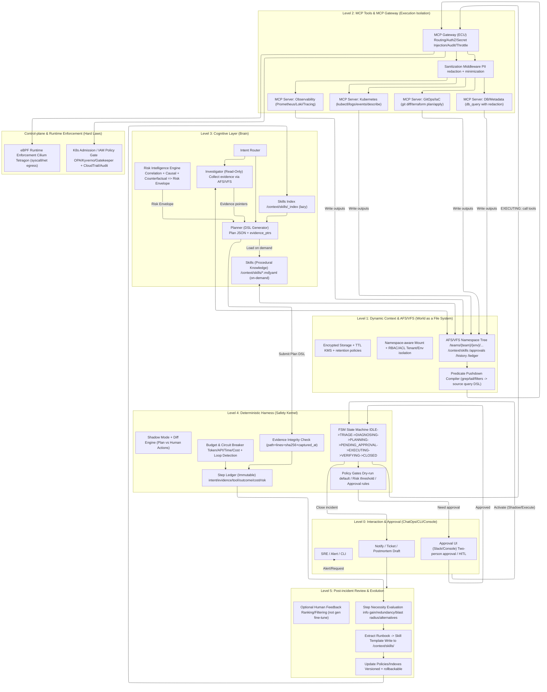
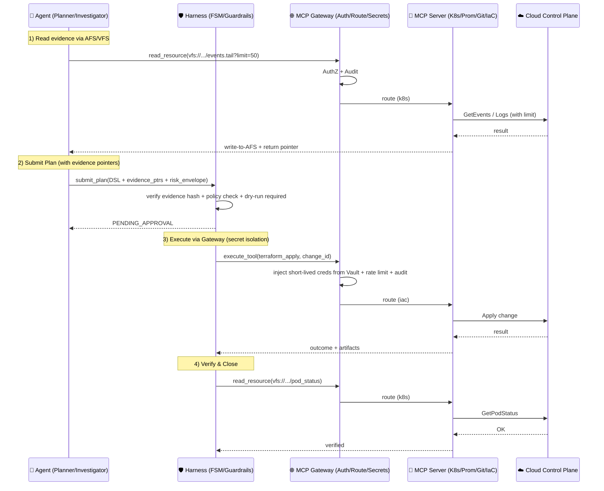



随着云原生架构（Kubernetes、AWS/GCP、多云与混合云）复杂度指数级增长，传统“静态监控 + 人工 Runbook”的响应模式逐渐触及认知与协作的上限。许多 AIOps 仍停留在“RAG + Chatbot”的范式上：上下文受窗口限制而被截断、跨系统证据难以一致引用、以及缺乏工业级的执行安全感与审计闭环。

当 LLM 被用于关键基础设施（Critical Infrastructure）时，问题进一步放大为三类结构性障碍：

- **上下文碎片化（Context Fragmentation）**：告警、指标、日志、Trace、配置、变更与权限信息分散在多个系统与查询语言中，造成认知过载与上下文腐烂（Context Rot）。
- **非确定性风险（Nondeterministic Risk）**：概率生成的推理与计划在运维领域的容错空间极小，任何“1% 的错误”都可能被放大为生产事故。
- **执行隔离缺失（Execution Isolation）**：若智能体直接持有云密钥或能绕过流程执行高危操作，则幻觉、提示注入或权限滥用会直接变成灾难性副作用。

Project Aegis 提出一种面向关键基础设施的 **Agentic Operator** 架构：以“**世界即文件系统（World as a File System）**”为核心隐喻，将异构云端状态抽象为 **Agentic File System（AFS）/VFS** 上可寻址资源；以 **Model Context Protocol（MCP）+ MCP Gateway** 作为标准化驱动与隔离层，实现可复用的工具接入、路由鉴权与凭证隔离；并在 Agent 之外引入 **确定性 Harness** 与 **控制平面/运行时硬约束（Policy-as-Code、Admission Controller、eBPF 等）**，形成可审计、可门控、可回放的安全免疫系统。

本文系统拆解 Aegis 的 **0–5 层架构**，重点阐述：

- AFS/VFS 如何通过 **谓词下推（Predicate Pushdown）** 支持动态上下文发现并兼顾性能；
- **Agent Skills** 如何沉淀专家程序性知识并按需加载，降低自由生成带来的歧义与幻觉风险；
- **Risk Engine** 如何结合 **因果推断（Causal AI）与反事实模拟（Counterfactual Simulation）** 刻画高风险操作的潜在影响；
- **Harness** 如何通过 **证据链完整性（Evidence Chain Integrity）**、状态机与执行门控，将概率性智能约束在确定性安全边界内。


## 1. 核心设计哲学（Core Philosophy）

Aegis 的构建遵循三条经过验证的工程共识，目标是解决 AI 在生产落地的“最后一公里”：**可控、可审计、可持续演进**。

### 1.1 世界即文件系统（The World as a File System）

借鉴 Unix 的“一切皆文件”与 Plan 9 的分布式哲学，Aegis 将 Logs、Metrics、Traces、IAM Policy、Git Commits、Runbooks 等抽象为 AFS/VFS 的资源。这里的重点**不是**“把世界真的变成文件”，而是：**把可能进入上下文的内容统一外部化为可寻址对象，再由 Agent 按需发现与加载**（受 Cursor 动态上下文发现启发）。因此 Agent 不必学习数千个专有 API，只需掌握少量原语（read/ls/grep/diff/tail）即可组合式探索复杂系统。

### 1.2 认知与执行的物理分离（Separation of Reasoning & Execution）

LLM（Agent）仅作为规划器（Planner），输出结构化计划（DSL）与证据引用；所有带副作用的操作必须通过确定性工具执行，并穿过 Harness 的流程约束与审批门控，再由 MCP Gateway 完成路由、鉴权与凭证注入。

**关键原则：**Agent 永远不持有云厂商的 Root 密钥，也不直接与云控制面进行高权限交互。

### 1.3 安全内建于“流程 + 控制平面/运行时”（Safety Native）

Aegis 默认假设 Agent 会犯错、会被提示注入、或在不完整上下文下产生幻觉，因此安全不依赖 prompt，而是由两类硬机制共同保证：

- **确定性流程约束（Harness-first）**：显式状态机、预算熔断、影子模式/Dry-run、最小权限与审批门控（高风险可启用双人审批与不可变留痕）。
- **基础设施硬约束（Kernel/Control-plane Enforcement）**：控制平面侧通过 Policy-as-Code / Admission Controller 阻止越权配置；运行时侧可用 eBPF（如 Tetragon）对异常系统调用与网络外联执行不可绕过的拦截。

这使“安全”成为系统底层的定律，而不是对 Agent 的道德期待。

---

## 2. 总体架构：0–5 层模型（The 0–5 Layer Architecture）

为避免“概念正确但落地困难”，Aegis 将一个可长期运行的运维 Agentic Operator 拆分为 6 个层级（0–5）。每一层都解决一个明确的工程难题，并对上下层提供清晰的输入/输出契约（contract）。这种分层让系统可以渐进式落地：从只读诊断（Level 1–3）开始，到受监督执行（Level 4），再到事后评估与知识演进（Level 5）。

> **总览：从“触发”到“自愈闭环”**  
> Level 0 负责触发与人机交互；Level 1–2 负责“看”和“动”的接口统一与合规；Level 3 负责推理与风险刻画；Level 4 负责确定性门控与执行安全；Level 5 负责复盘、评估与技能库演进。

### Level 0：交互与审批（Interaction & Approval / ChatOps）

- **解决的问题**：统一入口与上下文注入，让系统“带着正确的权限与环境信息开始工作”。  
- **主要能力**：
  - 接收告警/工单触发（Slack / AlertManager / PagerDuty / CLI / Console）。
  - 注入权限与环境上下文（team/env/tier/region/namespace、值班信息、变更窗口、冻结期开关）。
  - 负责通知与审批交互（包括高风险的双人审批 two-person approval）。
- **产出（对下游）**：标准化 `Incident Context`（含 incident_id、severity、scope、SLO、预算上限、审批策略等）。

### Level 1：动态上下文与 AFS/VFS（Dynamic Context & Agentic File System）

- **解决的问题**：把碎片化的运维世界变成“可寻址、可搜索、可渐进加载”的外部记忆空间，避免上下文窗口爆炸与信息截断。  
- **主要能力**：
  - **AFS/VFS 资源抽象**：将 Logs/Metrics/Traces/Config/Policy/Code/Runbooks 映射为目录树资源（read/ls/grep/diff/tail）。
  - **动态上下文发现**：长输出不截断，落入“外部文件”，Agent 通过 tail/grep/语义检索按需取回片段。
  - **谓词下推（Predicate Pushdown）**：将 grep/tail/limit 等意图下推到 Loki/CloudWatch/Prometheus/SQL 引擎，仅回传最小必要片段。
  - **多租户/多环境隔离（Namespace-aware mount）**：例如 `/teams/payments/prod/...` 与 `/teams/fraud/staging/...`，避免跨团队信息泄露。
- **产出（对上游 Agent）**：稳定、可重复引用的“证据文件”与资源视图（并为后续证据链机制提供基础）。

### Level 2：MCP 工具层与合规中间件（MCP Tools & Compliance Middleware）

- **解决的问题**：让执行与数据访问变得确定、可审计、可合规，且把“凭证”从 Agent 手里拿走。  
- **主要能力**：
  - **MCP（Model Context Protocol）**：把底层能力封装为原子工具（Tools）与资源读取接口（Resources），形成标准化“驱动层”。
  - **MCP Gateway（集中路由/鉴权/凭证隔离）**：
    - 路由：`mcp://github/...`、`mcp://k8s/...`、`mcp://prometheus/...` 统一转发到对应 MCP Server。
    - 鉴权：基于 team/env/namespace + RBAC/ABAC 策略控制读写范围。
    - **凭证隔离**：真实 AWS AK/SK、Kubeconfig、DB 凭证存储在 Vault/KMS 后端，Gateway 负责按需注入，Agent 永不接触高权限密钥。
    - 连接复用：维护长连接与连接池，降低握手延迟与抖动。
  - **合规与数据治理中间件**：
    - PII/敏感字段脱敏（regex/NER 可配）。
    - VFS 文件 TTL 自动过期（如 72 小时）与静态存储加密（KMS）。
    - 工具幂等、回滚语义与审计挂钩（每次调用写入审计事件）。
- **产出（对 Harness/执行层）**：可控、可追踪的工具调用通道与合规的数据出入口。

### Level 3：认知层（Cognitive Layer：Router / Investigator / Planner / Risk Engine）

- **解决的问题**：把“推理”拆分为可控的角色协作，并把风险刻画从“拍脑袋”升级为多信号与因果/反事实评估。  
- **主要能力**：
  - **Intent Router**：根据 incident 类型与上下文选择策略（加载哪些 Skills、优先查哪些信号）。
  - **Investigator（只读侦查）**：在 VFS 中收集证据、验证假设、形成结构化 RCA。
  - **Planner（结构化规划）**：输出 **Plan DSL / JSON DSL**，明确动作、目标、前置条件、回滚方案与证据引用。
  - **Agent Skills（程序性知识库）**：
    - 技能以 Markdown/YAML 存储在 `/context/skills/`，启动只加载索引（Lazy Loading），按需加载正文。
    - 高价值技能可升级为“可组合 DSL 模块”，降低自由生成带来的歧义与幻觉。
  - **Risk Intelligence Engine（风险智能）**：
    - 关联分析：Logs/Metrics/Traces/Topology/Changes 多信号合并与去噪。
    - **Blast Radius**：基于拓扑依赖图量化影响范围。
    - **Causal AI + Counterfactual Simulation**：回答“如果执行该动作会怎样”，输出 `counterfactual_impact`（受影响服务、估计 downtime、失败概率等）。
- **产出（对 Harness）**：可审计的 `Plan DSL + Evidence Pointers + Risk Report`。

### Level 4：确定性 Harness 约束层（Deterministic Harness for Long-running Agents）

- **解决的问题**：把概率性的 Agent 行为关进确定性的笼子，让系统可长期运行、可门控、可回放、可纠偏。  
- **主要能力**：
  - **显式状态机（FSM）**：例如 `IDLE -> TRIAGE -> DIAGNOSING -> PLANNING -> PENDING_APPROVAL -> EXECUTING -> VERIFYING -> CLOSED`，禁止跨级跳转。
  - **预算熔断与循环退化检测**：Token/API 成本上限、重复 Action 检测、强制升级人类。
  - **影子模式（Shadow Mode）**：先“只生成计划不执行”，与人类操作做 Diff，对齐后逐步放权。
  - **Evidence Chain Integrity（证据链完整性）**：
    - VFS 写入证据文件时附加 `hash + timestamp`；
    - Planner 的计划必须携带 `evidence_ptrs: [{path, hash, line_range}]`；
    - Harness 执行前校验哈希一致性，若证据过期/被覆盖则拒绝执行并触发重新采集。
  - **审批门控与合规留痕**：高风险操作可强制 two-person approval；审批记录写入不可变 ledger。
  - **执行编排**：通过 MCP Gateway 调用确定性工具执行（支持 dry-run、灰度、回滚与验证策略）。
- **产出（对系统）**：每一步可审计的执行记录、可复盘的状态迁移轨迹与安全事件日志。

### Level 5：事后评估与演进（Post-incident Review & Evolution）

- **解决的问题**：让系统不只“修一次”，还会“越来越会修”，并能用人类标准评估每一步是否必要。  
- **主要能力**：
  - **事后评估（Action Necessity Review）**：对一次 incident 中的查询/动作逐步评估其必要性、信息增益与风险成本。
  - **Runbook/Skill 自动提炼**：从成功处置链中提炼 SOP，生成/更新 `/context/skills/` 中的技能文件（组织知识“自我繁衍”）。
  - **护栏演进**：更新策略、风险阈值、审批规则与黑名单模式（例如某类操作永远必须人工批准）。
  - **人类反馈闭环**：记录 SRE 显式反馈（有用/无用/危险），用于 **排序/过滤/路由**，而非端到端替代生成，保持“规划可学习、执行仍确定”的哲学。
- **产出**：更强的 Skills、更严格的 Guardrails、更可靠的风险模型与更低的 MTTR。

> **分层落地建议**：  
> 先落地 Level 0–3（只读诊断 + 计划生成 + 风险报告），以 Shadow Mode 积累对比数据；再引入 Level 4 的受监督执行；最后用 Level 5 的评估与技能提炼实现持续演进。

---

## 2.1 架构图 (Mermaid)



---

## 3. Level 1：动态上下文与 AFS/VFS（Dynamic Context Discovery）

这一层解决“上下文窗口爆炸”和“实时数据获取”的矛盾，是 Aegis 的核心创新之一。Aegis 的关键做法不是把更多信息塞进 prompt，而是把上下文迁移到一个**可寻址、可检索、可审计**的外部文件空间（AFS/VFS），并用**渐进式披露（Progressive Disclosure）**在“信息刚好够用”的位置停止加载。

### 3.1 AFS/VFS：语义化资源抽象（Semantic Resource Tree）

在 Agent 眼中，云环境不是一堆 API 文档，而是一棵语义化目录树。它通过少量通用原语（`ls/read/grep/diff/tail`）就能探索日志、指标、Trace、配置、权限与变更，并将它们统一为“可引用的证据对象”。

```text
/
├── teams/
│   ├── payment/
│   │   ├── prod/
│   │   │   ├── logs/error.log                 (Loki/CloudWatch)
│   │   │   ├── metrics/latency.prom           (Prometheus)
│   │   │   ├── traces/checkout.trace          (Tempo/Jaeger)
│   │   │   ├── config/deploy.yaml             (K8s API)
│   │   │   ├── code/terraform/iam.tf          (GitOps/Terraform)
│   │   │   └── docs/runbook.md                (Wiki/Notion)
│   │   └── staging/...
│   └── fraud/...
└── context/
    ├── skills/                                 (Skill Library)
    │   ├── _index.json                         (技能索引/路由元数据)
    │   ├── k8s/crashloop_diagnosis.skill.yaml
    │   └── aws/iam_ecr_auth_fix.skill.yaml
    ├── history/session_log.md                  (Conversation/Action History)
    └── approvals/pending/                      (Approval Requests)
```

> **Skills 在 VFS 中的定位（轻量说明）**：`/context/skills/` 既是技能存储，也是“可版本化的操作知识”。Level 1 只负责提供可寻址与可检索的技能文件与索引；Level 3 的 Router/Planner 负责选择、加载与编排这些技能，形成具体的 Plan DSL。

**关键原则（结合 Cursor 的“文件即外部大脑”实践）**  
- **长输出不截断**：工具/查询输出完整落入 VFS（或对象存储），LLM 只拿到路径与最小摘要指针，避免截断造成的信息丢失。  
- **默认从 tail 开始**：先以极低上下文成本探测结论/错误，再决定扩大读取范围或关键词定位。  
- **按需检索而非预灌输**：工具说明、技能、历史对话都在外部文件空间里，只有在“需要时”才通过 grep/语义检索定位并加载相关片段。  

**多租户/多环境隔离（Namespace-aware Mount）**  
在企业级部署中，AFS 必须支持 namespace-aware mount（例如 `/teams/payment/prod/...` 与 `/teams/fraud/staging/...`），并通过 RBAC/ACL 在目录树层面限制可见性与读写权限，避免跨团队信息泄露或权限混淆。

---

### 3.2 渐进式披露与上下文预算（Progressive Disclosure & Context Budget）

为了让“动态上下文发现”可控而不是随意读取，Aegis 在 VFS 读取侧引入明确的预算策略：

- **Context Budget Policy**：每轮最多引入 N 个片段/总 token 上限；每次加载必须说明 `why-needed`；优先使用 `tail` / 关键词定位 / 小范围窗口读取。  
- **读取策略（默认）**：`tail -> grep -> narrow read -> wider read`，在信息足够做决策时停止扩展，避免“多读反而噪音更大”。

> 这条策略在工程上非常重要：它把“上下文管理”从 prompt 工程，转化为可配置的系统行为，并且可在事后复盘中评估“每次读取是否必要”。

---

### 3.3 证据指针纪律（Evidence Pointer Discipline）

仅仅“读到”信息还不够，关键是让结论与动作**可审计、可回放**。因此 Aegis 要求：Planner 的关键结论与每个变更建议都必须携带证据指针（evidence pointers）：

- 最小形式：`file_path + line_range`（或等价定位信息）  
- 推荐形式（与 Level 4 的证据完整性配套）：`file_path + hash + timestamp + line_range`

如果缺少证据引用或证据无法定位，Harness 将拒绝进入 `EXECUTING`，把系统停在可复核的安全状态。

---

### 3.4 证据链完整性（Evidence Chain Integrity）

在长周期 incident 中，仅有 `path + line_range` 仍可能产生“上下文漂移”：日志轮转、文件覆盖、索引更新会导致引用与内容不一致。为此，Aegis 引入证据链完整性机制：

- 工具输出写入 VFS 时，自动附加 **时间戳** 与 **内容哈希（如 SHA256）**；  
- Planner 引用证据时必须提供：`file_path + hash + line_range`；  
- Harness 在进入 `EXECUTING` 前校验：当前文件内容哈希是否匹配；  
- 若不匹配（如日志轮转/覆盖），拒绝执行并触发重新采样或重新定位证据。

这使得 Aegis 在跨班次、跨阶段的 incident 中仍能保持推理依据的一致性与可追溯性。

---

### 3.5 谓词下推（Predicate Pushdown）

传统 RAG 往往把数据拉回本地再处理；面对 GB/TB 级日志或大指标集，这在性能与成本上都不可接受。Aegis 在 AFS/VFS 层实现算子下推，把“计算”推向数据源：

- **场景**：Agent 执行 `grep "OOM" /logs/app.log | tail -n 50`  
- **反面**：下载大文件 -> 本地过滤 -> 超时/爆内存  
- **Aegis 流程**：  
  1) **拦截**：识别 `grep`（过滤）与 `tail`（限制）意图  
  2) **翻译**：转换为云端查询（如 Loki LogQL / CloudWatch Logs Insights / ES DSL / SQL） 
  3) **执行**：云端执行，后端完成过滤与截断，仅返回必要结果（例如 50 行）并写入证据文件

示例（Loki LogQL）：
```json
{app="payment"} |= "OOM" | line_format " "
```
并在 Adapter 层强制 limit：
```json
{ "query": "{app='payment'} |= 'OOM'", "limit": 50 }
```

这种“计算向数据移动”的设计，让 Agent 能以极低 token 成本探索海量数据，并保持结果可解释、可审计。

---

## 4. Level 2：MCP 工具层与 MCP Gateway（Tools & Execution Isolation）

这一层解决“**怎么安全执行**”的问题：把 Agent 的意图转化为**确定性、可审计、可控风险**的执行动作，并把“真实凭证/高权限能力”从 Agent 侧彻底剥离。它是 Aegis 从 demo 走向生产的关键，也是“执行隔离（Execution Isolation）”落地的主要承载层。

Aegis 在 Level 2 采用两件事来完成这件事：
- **MCP（Model Context Protocol）**：把外部系统能力标准化为“驱动 + 原子工具（Tools）”
- **MCP Gateway**：作为 ECU（电子引擎控制单元），统一路由、鉴权、凭证注入、审计与限流

> 位置关系：Agent 不直接连 K8s/AWS/Git/DB；它只连 Gateway。Gateway 再把请求转发给对应的 MCP Server（驱动），并在需要时临时注入凭证。

---

### 4.1 MCP：驱动协议（Model Context Protocol as Drivers）

在 Aegis 中，MCP Server 扮演“设备驱动”的角色：将外部系统的能力暴露为**确定性的原子工具（Deterministic Tools）**，并提供结构化的输入输出。

常见 MCP 工具类型示例：
- 观测类：`query_prometheus`, `query_loki`, `query_trace`, `kubectl_get_events`, `kubectl_logs`
- 变更类：`git_diff`, `terraform_plan`, `terraform_apply`, `kubectl_rollout_restart`, `scale_deployment`
- 数据类：`db_query`（带脱敏与最小化输出）
- 安全/合规模块：`policy_check`, `pii_redact`, `evidence_write`

**工具必须满足的工程约束（生产必备）**
1. **结构化输入输出（JSON）**：便于 Harness 审计、回放、Diff 与自动评估  
2. **幂等性（Idempotency）**：写操作必须带 `change_id` 与 `idempotency_key`，重复提交不重复执行  
3. **可回滚或可补偿（Rollback/Compensation）**：失败时能自动触发回滚路径或补偿动作  
4. **自动落盘证据（Evidence Write-through）**：工具输出写入 AFS/VFS，生成 `timestamp + hash`，供 Evidence Chain 使用  
5. **结果最小化（Result Minimization）**：默认返回必要字段/行数，避免无意义大输出挤占上下文预算（与 Level 1 的渐进式披露配合）

> 你可以把 MCP 理解为：把“云 API / 命令行 / 查询语言”封装成可控的积木，而不是让 Agent 直接写 shell 或 SDK 调用。

---

### 4.2 MCP Gateway：ECU（统一路由、鉴权、凭证注入、审计）

如果让 Agent 直接连接 K8s/AWS，你必须把 Kubeconfig、AK/SK 或 DB Admin 凭证交给 Agent，这在关键基础设施场景是不可接受的。Aegis 引入 **MCP Gateway** 作为唯一对外执行出口，提供“执行隔离”的硬边界。

MCP Gateway 的核心职责：

#### 4.2.1 凭证隔离（Secret Isolation）
- Agent 侧只持有 **Gateway Token**（最小权限、可过期、可撤销）
- 真实凭证（AWS AK/SK、Kubeconfig、DB Admin、Git Token）存储在 Gateway 后端的 **Vault/KMS** 中  
- Gateway 在请求合法且通过策略检查时，才对单次调用进行**临时凭证注入**（短时、可审计、可绑定 scope）

> 结果：即使 Agent 被提示注入或“想象”出危险操作，也拿不到云厂商 Root 密钥。

#### 4.2.2 统一路由（Unified Routing）
Gateway 根据 URI 前缀/服务名将请求路由到不同 MCP Server：
- `mcp://k8s/...` → Kubernetes MCP Server
- `mcp://prom/...` → Prometheus MCP Server
- `mcp://loki/...` → Loki MCP Server
- `mcp://github/...` → GitHub MCP Server
- `mcp://db/...` → Database MCP Server

这使得 Agent 的执行接口保持稳定：它只需要“调用 tool / 读写资源”，不需要理解每个系统的认证细节与 API 风格。

#### 4.2.3 连接复用（Connection Reuse）
- Gateway 维护连接池/长连接，减少握手延迟
- 对高频查询进行缓存与去重（在策略允许范围内）
- 对外部系统做 backpressure，避免 incident 时“雪崩式查询”

#### 4.2.4 审计、限流与熔断（Audit, Throttle, Circuit Breaking）
- 全量记录：请求参数、响应摘要、耗时、成本、调用链 trace_id  
- 配额与速率限制：按团队/环境/工具类别限流  
- 熔断：异常率升高或预算接近上限时暂停执行并上报 Harness/人类审批

> Level 4 的 Budget/Loop Detection 是“会话级治理”，Gateway 的 Throttle/Circuit 是“执行出口级治理”，两者叠加形成双保险。

---

### 4.3 工具合规中间件（Sanitization & Compliance）

在 AFS/VFS 的结果进入 LLM 上下文之前，Level 2 提供统一的合规中间件链（可配置策略）：

#### 4.3.1 PII 脱敏（PII Redaction Middleware）
- 支持 **regex 规则**（默认）与（可选）**NER 模型**
- 典型场景：DB 查询结果、用户标识、token、email、IP 等

示例：
```text
Input:  User email: admin@example.com
Output: User email: [REDACTED_EMAIL]
```

#### 4.3.2 TTL 与加密存储（TTL + Encryption）
- 对敏感目录配置 TTL（例如 72 小时自动删除）
- 静态加密使用 KMS（AWS KMS / GCP Cloud KMS）
- 分级策略：`/logs`、`/sql-results`、`/traces` 可配置不同 TTL/加密级别/可见性

#### 4.3.3 结果最小化（Result Minimization）
- 默认只返回必要字段/行数（limit、projection）
- 对超大输出写入 VFS，返回“摘要 + 指针”
- 与 Level 1 的 `tail/grep` 策略协同，减少 token 噪音与成本

---

### 4.4 幂等与回滚（Idempotency & Rollback / Compensation）

这是 Level 2 的“生产级动作安全带”。

- **幂等（Idempotency）**：  
  每个写操作绑定 `change_id` 与 `idempotency_key`，重复提交不会重复执行；Gateway 可做去重与重放保护。

- **回滚/补偿（Rollback/Compensation）**：  
  - K8s：`rollout undo` / `scale back` / `traffic drain`  
  - Terraform：apply 前保存 `plan` + `state snapshot`；失败触发补偿流程（回滚模块或恢复版本）  
  - DB：只允许白名单变更路径，必要时写入“补偿脚本”并走审批

> 注意：哪些回滚动作能自动执行，通常由 Level 4 的 Harness 决定（风险阈值/审批策略），但工具层必须提供这些“可执行的回滚原语”。

---

### 4.5 默认只读与受控写入（Read-only by Default）

为了确保“写操作始终处在受控边界内”，Aegis 的默认策略是：
- AFS/VFS 默认只读挂载（观测类目录可读）
- 写入只允许进入受控目录（例如 `/change_requests/` 或 `/approvals/pending/`）
- 任何“真实执行”的写操作必须：
  1) 由 Harness 进入允许状态（如 `APPROVED/EXECUTING`）  
  2) 经 Gateway 策略检查与凭证注入  
  3) 产生可审计证据与回滚路径

---

### 4.6 与 Level 4 的边界：谁负责“允许执行”？

为避免职责混淆，可以在文中加一条清晰边界（推荐保留）：

- **Level 2（MCP + Gateway）**负责：把动作变成“可执行且隔离”的调用（驱动、路由、凭证、审计、合规、幂等）  
- **Level 4（Harness）**负责：决定“是否允许执行”（状态机、预算、循环检测、证据完整性校验、审批门控、风险阈值）

也就是说：**Level 2 让执行变得安全可控；Level 4 决定执行是否发生。**

---

## 5. Level 3：Agent 认知层（Cognitive Layer：Multi-Agent + Skills + Risk）

这一层解决“**怎么聪明且专业地做事**”。Aegis 的目标不是让单体 Agent 自由发挥，而是把认知拆成可审计、可复用、可门控的子模块：**采证（Investigator）**、**规划（Planner）**、**程序性知识（Skills）**、以及**风险智能（Risk Engine）**。同时，Aegis 明确把“执行安全”从 Agent 内移到 Level 4 Harness 外部，避免将安全寄托在模型的自觉上。

---

### 5.1 多 Agent 协作：Investigator 与 Planner（ReAct 风格解耦）

为避免单体 Agent 的混乱与权限扩散，Aegis 采用专职分工：

- **Investigator（侦探，只读）**：通过 AFS/VFS 搜集证据、验证假设、构建证据链（Evidence Chain）。  
  目标是“把事实搞清楚”，并把关键证据沉淀为可定位、可校验的指针（见 Level 1/4 的 Evidence Discipline & Integrity）。

- **Planner（规划器）**：基于证据生成结构化修复计划（JSON DSL），**不直接执行**。  
  目标是“把行动说清楚”：要做什么、为什么做、风险如何、需要哪些门控、怎么验证、怎么回滚。

这种解耦带来三个直接收益：
1) 推理与采证分离：减少“边想边做”导致的漂移与误判  
2) 权限边界清晰：Investigator 永远只读；Planner 只产出计划  
3) 审计更简单：计划天然结构化，便于 Harness 做 gate/verify/replay

**Planner 的 JSON DSL 示例（简化）**
```json
{
  "incident_id": "INC-2026-0127-001",
  "hypothesis": "ECR auth token missing",
  "evidence": [
    {
      "path": "/teams/payments/prod/monitor/eks/cluster-prod/pods/payment/describe.txt",
      "hash": "sha256:9b1c...f3a2",
      "lines": "120-140"
    }
  ],
  "actions": [
    { "tool": "terraform_plan", "params": { "workspace": "prod", "module": "iam" } },
    {
      "requires_approval": true,
      "tool": "apply_change",
      "params": { "change_id": "CHG-8891", "idempotency_key": "INC-2026-0127-001#CHG-8891" }
    }
  ],
  "verify": [
    { "tool": "check_pod_status", "params": { "pod": "payment-pod" } },
    { "tool": "query_metrics", "params": { "promql": "rate(http_5xx[5m])" } }
  ]
}
```

---

### 5.2 Skills（技能库）：程序性知识，不与 MCP 冗余

一个常见误解是：既然有了 MCP（工具/驱动），为什么还要 Skills？  
Aegis 的结论非常明确：**Skills 不冗余，反而是认知层与执行层之间的“粘合剂”。**

- **MCP / Tools 是“手脚”（Capabilities）**：原子化、确定性的能力，例如 `kubectl_logs`、`query_prometheus`、`terraform_plan`。  
  它解决的是“**能做什么**”。

- **Skills 是“大脑皮层 / SOP”（Procedural Knowledge）**：把专家经验（Runbooks）结构化成可组合的步骤与约束。  
  它解决的是“**怎么做得对、做得稳**”。

> 没有 Skills 的 Agent，就像拿着全套手术刀（Tools）但没上过医学院（Skills）的实习生：有能力，但没有专业操作流程。

#### 5.2.1 Skills 如何天然适配“文件系统隐喻”（World as a File System）
Aegis 采用文件系统作为外部大脑，因此 Skills 最自然的落点就是 **AFS/VFS 的 `/context/skills/`**：

- **懒加载（Lazy Loading）**：  
  Agent 启动时只读取 `_index.json`（元数据、触发条件、简短描述），几乎不占 token；  
  当 Router 判断需要某类处理（例如 CrashLoop、Redis、IAM），才 `read_file` 加载对应 skill 的详细内容。

- **价值**：  
  在企业里可能有 500+ runbooks，若全部塞进 System Prompt 会导致 context window 爆炸；  
  Skills 的“按需加载”与 Level 1 的动态上下文发现完全一致。

AFS 示例目录（与 Level 1 协同）：
```text
/context/
  skills/
    _index.json
    k8s/
      crashloop_diagnosis.md
      ingress_debug.md
    aws/
      iam_policy_check.yaml
    db/
      postgres_deadlock_fix.yaml
```

#### 5.2.2 从 Markdown 文档到可组合 DSL 模块（Composable Skills）
为了降低自由生成的歧义与幻觉风险，Aegis 支持将高频 runbook 升级为结构化技能模块（YAML/JSON Schema），Planner 可以“调用技能”而不是完全自由发挥。

示例（结构化 Skill）：
```yaml
skill: k8s_ecr_auth_fix
triggers:
  - log_contains: "ECR authorization token"
  - pod_status: "ImagePullBackOff"
steps:
  - tool: get_iam_policy
    output_var: current_policy
  - tool: generate_terraform_patch
    input:
      policy: $current_policy
      required_perms: ["ecr:GetAuthorizationToken"]
  - tool: terraform_plan
    input:
      workspace: prod
guardrails:
  - require_evidence: true
  - max_retries: 2
  - allow_write: false   # default; must be lifted by Harness approval
```

这种形式带来的好处：
- **可版本管理、可测试**（像代码一样 CI 验证）
- **可审计**（每一步工具调用清晰可见）
- **可复用**（不同 incident 共享同一 SOP）
- **更稳定**（减少 Planner 自由生成导致的变体与歧义）

---

### 5.3 Risk Intelligence Engine：关联 + 因果 + 反事实（Causal AI + Counterfactuals）

Risk Engine 不是另一个 LLM，而是嵌入推理循环的**信号融合与风险建模组件**，为 Planner 与 Harness 提供“结构化风险包络（Risk Envelope）”。它的目标是：**抑制幻觉、减少盲搜、把高风险动作的事前评估做扎实**。

#### 5.3.1 关联分析（Correlation via Topology）
- 将 Logs / Metrics / Traces / Change / Topology 等信号映射到依赖拓扑图  
- 把“孤立告警”聚合为更可信的 RootCauseCandidate  
- 典型收益：减少无意义的 token 消耗与错误方向探索

#### 5.3.2 爆炸半径评估（Blast Radius）
- 在任何写操作前量化影响范围：受影响服务、依赖链路、流量、是否有状态、SLO 风险  
- 给出门控建议：是否必须 dry-run、是否必须人类审批、是否需要双人审批等

#### 5.3.3 因果推断与反事实模拟（Causal AI + Counterfactual Simulation）
Risk Engine 将风险评估从“相关性”推进到“反事实”：
- 回答 “**如果执行该动作会怎样**”（What-if）  
- 在影子模式/沙箱/数字孪生中模拟拓扑扰动传播  
- 用轻量因果模型（SCM）或规则/图模型估计级联影响，而不仅依赖历史相似事件

Risk Envelope 示例（结构化输出，便于 Harness gate）：
```json
{
  "blast_radius_score": 0.82,
  "impact_scope": ["payments/prod", "payment-service", "us-west-2"],
  "confidence": 0.74,
  "required_gates": ["dry_run_required", "human_approval_required", "two_person_approval_required"],
  "counterfactual_impact": {
    "affected_services": ["payment-api", "refund-worker"],
    "estimated_downtime_sec": 120
  },
  "why": ["IAM change impacts shared role used by multiple workloads"],
  "safe_alternatives": ["canary_rollback_first", "graceful_drain_then_restart"]
}
```

> 关键点：Risk Engine 把高风险信息以“结构化信号”注入 Planner/Harness，而不是仅靠自然语言“吓唬”模型，从而让门控与审计可自动化。

---

### 5.4 与其他层的接口：认知层输出什么？

为了与 Level 1/2/4 清晰对齐，Level 3 的产出应该稳定为两类对象：
1) **Evidence-backed Plan（带证据的 DSL 计划）**：Planner 输出，包含 evidence pointers（path + hash + lines）  
2) **Risk Envelope（结构化风险包络）**：Risk Engine 输出，驱动 Harness 的门控决策

这样，Aegis 才能在“聪明”之外，保证“可控、可审计、可复现”。

---

## 6. Level 4：Harness（长期运行的确定性约束层）

在工业级系统中，Harness 往往比 LLM 更关键：它是包裹在 Agent 外部的确定性代码（Go/Python），充当“监护人/内核安全模块”。Aegis 的核心思路是把概率性的推理夹在**确定性的输入处理**与**确定性的执行验证**之间，形成一套可审计、可回放、可门控的“安全免疫系统”。

---

### 6.1 显式状态机（Explicit State Machine / FSM）

Harness 维护一个全局有限状态机，强制自愈流程的可控顺序：

`IDLE -> TRIAGE -> DIAGNOSING -> PLANNING -> PENDING_APPROVAL -> EXECUTING -> VERIFYING -> CLOSED`

关键规则：
- **禁止跳跃**：Agent 不能从 DIAGNOSING 直接进入 EXECUTING；状态迁移由 Harness 的硬逻辑控制（非 prompt）。
- **断言门槛（Assertions）**：每一次迁移都必须满足断言，例如：
  - 证据完整（Evidence Pointers 齐全且可校验）
  - 风险评分满足阈值（Risk Envelope + Gate 决策）
  - Dry-run 已完成且结果可追溯
  - 审批令牌已就绪（必要时双人审批）
- **可暂停/可恢复**：长周期 incident 支持 pause/resume，状态与上下文指针可持久化。

---

### 6.2 长程 Agent Harness 清单（Long-running Constraints Checklist）

Aegis 将“长期运行”拆成可工程化的 checklist（简化版）：

- **Stateful execution**：步骤显式状态 + pause/resume
- **Budgeting**：token、工具调用次数、时间、云 API 成本上限
- **Degeneration detection**：重复查询、无进展检测（progress metric）
- **Action gating**：默认 dry-run；高危操作审批；最小权限；必要时双人审批
- **Persistence & replay**：证据文件与 step ledger 可回放、可重放
- **Evaluation hooks**：为 Level 5 暴露 step-level 结构化评估接口

---

### 6.3 成本熔断与死循环检测（Budget + Loop Detection）

为防止 Agent 陷入“反复查询无结果”的退化循环导致 token/API 成本爆炸，Harness 内置两类熔断：

- **Loop Detection**：连续 N 次相似 Action（相似度阈值）→ 强制中断并请求人类介入  
  （例如连续 3 次查询同一指标窗口、同一日志过滤条件却无新增信息）
- **Budget Control**：每个 Session 设定预算上限（例如 $2.00 或 N 次 tool calls / N tokens / T 分钟）  
  超支 → 熔断并升级给 SRE（并在 ledger 中记录触发原因与当时上下文）

---

### 6.4 证据链完整性（Evidence Chain Integrity）

仅有 `path + line_range` 在长周期 incident 中会遇到“上下文漂移”：
日志轮转、文件覆盖、索引更新会让引用证据与实际内容不一致。Aegis 因此引入证据链完整性验证：

- **采集时附加指纹**：AFS/VFS 在写入/返回数据时自动附加：
  - `sha256`（内容哈希）
  - `captured_at`（采集时间）
- **计划必须引用证据指纹**：Planner 提交 Plan 时必须包含：
  - `path + line_range + sha256 + captured_at`
- **执行前强校验**：Harness 在进入 EXECUTING 前校验：
  - 当前文件内容哈希是否匹配（防止被覆盖/篡改）
  - 是否超出时效窗口（例如日志文件 TTL 或“已过期”策略）
- **不匹配即拒绝执行**：若哈希不一致（如日志轮转）或证据过期 → 拒绝执行并触发重新采样/重新定位证据

这让 Aegis 在跨班次、长周期事件中依然保持“推理依据可追溯、可复验、不可抵赖”。

---

### 6.5 审批门控：HITL、双人审批与审批留痕（Two-person Approval + Immutable Audit）

Harness 将“人类在回路（HITL）”做成可强制执行的 gate，而不是流程建议：

- **风险驱动的审批策略**：
  - `blast_radius_score` 超阈值 → 强制进入 `PENDING_APPROVAL`
  - 高危（例如 > 0.7 或命中高危策略）→ **双人审批（two-person approval）**
- **身份与权限对齐**：
  - 审批人必须具备对应 namespace/env 的权限（RBAC/ACL）
  - 可与企业 IAM/SSO（例如 Okta）集成，验证审批人身份与角色
- **不可变审批留痕**：
  - 所有审批写入不可变 ledger（审批人、时间、理由可选、关联 change_id、证据哈希、风险包络摘要）

此设计面向金融/医疗等强监管场景，满足“可审计、可追责、可合规”的要求。

---

### 6.6 影子模式（Shadow Mode）与 Diff Engine

上线初期或高危系统中，Aegis 默认运行在影子模式，先“会诊”再“动手”：

- **并行运行**：人类 SRE 实际操作的同时，Agent 在后台生成 Plan
- **Diff Engine**：实时比对 `Agent Plan` vs `Human Actions`，统计：
  - 关键动作一致率
  - 风险建议命中率
  - 误报率/漏报率
- **渐进授权**：达标后逐步提升权限：
  `Read-only -> Suggest -> Execute with Approval -> Limited Autonomy`

影子模式把“信任建立”变成可量化的工程过程，而不是一次性放权。

---

### 6.7 Step Ledger：可审计、可回放、可评估的事实记录

Harness 将每一步写入结构化 Step Ledger，作为“可信”的核心证据，同时也是 Level 5 演进与复盘的输入：

- `intent`：为何做这一步
- `evidence_ptrs`：引用哪些文件/查询结果（含 hash + captured_at）
- `tool_call`：工具与参数（含 idempotency_key / change_id）
- `outcome`：结果摘要 + 指向完整输出文件（AFS 路径）
- `cost`：token/time/api cost
- `risk_envelope`：当时风险评分、门控与反事实影响摘要
- `approvals`：审批记录（如适用）

---

### 6.8 “内核级/控制平面级约束”：最后一道不可绕过的防线（Kernel/Control-plane Enforcement）

强调一点：Harness 是确定性“内核安全模块”，但 Aegis 不把安全只放在应用层。  
在云原生场景里，“系统内核”的隐喻更准确地指向**云控制平面（Cloud Control Plane）**与**运行时层（Runtime）**，因此 Aegis 还需要一层“物理上不可绕过”的硬防线：

#### 6.8.1 控制平面约束（Kubernetes Admission Controller）
即使 Agent 生成了恶意或不合规的 Pod YAML 并试图绕过上层逻辑，K8s API Server 层的策略控制器（OPA/Gatekeeper/Kyverno）也会直接拒绝：
- 特权容器 / Root 权限
- 不合规的网络策略
- 越权的 ServiceAccount / RoleBinding 等

> 这与 Agent 的意愿无关，是控制平面层面的“不可通过”。

#### 6.8.2 运行时约束（eBPF 执法：Cilium Tetragon 等）
即便某些工作负载“已经被启动”，Aegis 仍可在运行时层面使用 eBPF（如 Cilium Tetragon）实现**不可见的强制执法**：

- **未授权公网外联（疑似 C2）**：  
  Pod 进程试图连接未授权公网 IP / 域名 -> 内核网络栈直接丢弃数据包并终止进程（或隔离该进程/容器）

- **可疑 syscall / 进程行为**：  
  进程执行异常 `exec`、访问敏感路径（如读取敏感挂载、尝试提权）、或触发高风险 syscall 模式 -> 直接拦截并告警（必要时 kill）

这类约束**不依赖 Agent 是否“遵守”**，也不依赖 Prompt 或输出过滤，而是运行在 Agent 无法触及的基础设施层面的“物理定律”：
> 不是“不要做”，而是“做不了（不可为）”。

**总结**：在 Aegis 里，“内核级约束”意味着把安全下沉到 Agent 无法绕过的控制平面 + 运行时层，而不是依赖 Agent 的“自觉”。

---

## 7. Level 5：事后评估与演进（Post-incident Review & Evolution）

Aegis 不把“学习”留给黑箱式端到端微调，而采用可控、可审计的工程反馈回路：**评估 → 提炼 → 更新**。  
其目标不仅是修复一次事故，更是把修复过程转化为组织可复用资产，使下一次响应更快、更稳、更安全。

### 7.1 Step-level 必要性评估：每次查询/操作是否值得（Necessity Evaluation）

Aegis 在每次 Incident 结束后，对本次 **Step Ledger**（查询链 + 操作链 + 风险门控 + 证据链）进行结构化评估。典型维度包括：

- **信息增益（Information Gain）**：该读取/查询是否显著降低不确定性？是否改变了假设空间？
- **重复度（Redundancy）**：与前序步骤相似度是否过高？是否触发“无进展查询”模式？
- **风险先行验证（Risk-First Validation）**：高风险动作前是否先完成低风险验证（例如先 dry-run / 先只读采证）？
- **证据充足性（Evidence Sufficiency）**：关键结论与建议是否满足 Evidence Pointer Discipline（含 hash/timestamp）？
- **替代成本（Cheaper Alternative）**：是否存在更小干预方案（如先 drain 再重启、先灰度再回滚）？

**评估产物（Outputs）**通常包括：

- 标记 **无效/重复查询**（供 Router/Planner 未来抑制）
- 标记 **高风险但证据不足的建议**（驱动 Guardrail/Policy 加严）
- 提炼 **可复用 runbook 片段**（形成 Skills 的候选步骤）
- 生成 **护栏策略更新建议**（版本化、可追踪、可回滚）

### 7.2 演进更新：Runbook / Skills / Policy 的版本化闭环（Versioned Evolution）

在 Aegis 的设计中，演进不是“写一段总结”，而是把知识固化为可执行资产，并且全部可追踪、可回滚：

#### 7.2.1 自动提炼 Runbook/Skill：从一次事件到一个可复用 Skill
引入 Skills 后，Level 5 的最重要产物就是 **新的 Skill 文件**（或对现有 Skill 的修订）：

- 输入：本次事件的 **操作链 + 证据链 + 风险信号 + 人类审批记录**
- 过程：抽象出稳定的触发条件（triggers）与可复现步骤（steps）
- 输出：写入 `/context/skills/`（并更新 `_index.json` 以支持路由检索与懒加载）

示例（概念）：
- 本次解决了一个冷门故障：Postgres 死锁恢复
- 复盘自动总结：有效的诊断与修复顺序
- 生成：`/context/skills/postgres_deadlock_fix.skill.yaml`
- 下次出现相似告警：Router `ls`/search 命中该 Skill，Planner 直接调用并复用 SOP

> 这就是 Aegis 的“知识晶体化”：把一次性经验变成可组合、可审计、可版本管理的能力。

#### 7.2.2 Policy 与 Gate 的持续更新（Guardrails as Code）
演进还包括对“可信约束”体系的更新，使后续自动化更安全：

- 更新 **policy**：哪些动作必须审批、哪些服务必须 shadow mode、哪些变更需要 two-person approval
- 更新 **risk thresholds**：blast_radius_score/confidence 的门槛与门控逻辑
- 更新 **证据要求**：哪些场景必须强制 evidence hash 校验与时效校验（避免上下文漂移）

#### 7.2.3 检索索引与案例对齐（Better Recall, Lower Cost）
为降低 Token 消耗并提升命中率，系统会更新：

- Skills 索引（metadata / tags / triggers）
- 相似案例索引（incident signatures）
- 关键路径的“元数据优先”策略（优先目录/摘要/头部，再按需读全文）

### 7.3 可选：人类反馈闭环（RLHF for Ranking/Filtering, Not Generation）

在保持“LLM 仅作规划器（Planner）”的哲学下，Aegis 可以记录 SRE 对 Plan 的显式反馈：

- ✅ 有用（useful）
- ❌ 无用（unhelpful）
- ⚠️ 危险（dangerous）

这些反馈用于：

- 训练 **reward model / 轻量打分器**
- 对候选 Plan、Skill 调用、调查路径进行 **排序与过滤**
- 改善 Router 的决策与 Guardrail 的门控

但**不做端到端生成微调**，避免引入不可控的行为漂移，维持系统的确定性与可审计性。

---

**小结**：Level 5 让 Aegis 具备“组织级记忆”——它不仅能修复一次事故，还能把修复过程变成可复用的 Skill 与可验证的 Policy，使系统在安全边界内持续进化。

---

## 8. 端到端工作流演示（End-to-End Workflow, OS Metaphor）

为了把 **Agent、AFS/VFS、MCP、MCP Gateway、Harness、Control-plane/eBPF** 的协作讲清楚，我们用“操作系统”类比贯穿全流程，并追踪一个具体的运维请求是如何在这些组件之间流转的：

- **Agent（CPU/进程）**：负责推理、生成结构化计划（Plan/DSL），但不直接产生副作用  
- **AFS/VFS（文件系统）**：统一的世界界面（资源树 + 动态文件），支持谓词下推与渐进式读取  
- **MCP（驱动协议）**：标准化“工具能力”的暴露方式（像设备驱动）  
- **MCP Gateway（总线/设备管理器）**：路由、鉴权、凭证注入与审计（像 ECU/总线管理）  
- **Harness（内核安全模块）**：状态机、证据校验、预算熔断、审批门控、Diff/Shadow 等确定性约束  
- **Control-plane/eBPF（物理定律）**：最终不可绕过的硬防线（Admission Controller / Runtime eBPF）

> 下面选择一个**与业务无关**的云基础设施场景：**Spark Job OOM（Driver 内存不足）**。  
> 该例子强调“读—推理—计划—审批—执行—验证—演进”的全链路，而不是单点排障技巧。

### 场景：Spark on Kubernetes 任务失败（Driver OOM）

#### 8.1 感知与上下文注入（Trigger & Context）
1) **Level 0（Trigger / ChatOps）**  
   AlertManager/Argo/EMR-on-EKS Runtime 报警：`SparkApplication FAILED`，提示 `Driver OOMKilled`。  
   Slack/CLI 注入 Incident Context（cluster/env/job_id/namespace/owner）。

2) **Level 4（Harness 初始化）**  
   Harness 创建本次 Session：  
   - 初始化 **FSM**：进入 `DIAGNOSING`  
   - 建立 **budget**（token/tool/api cost/time）与 **step ledger**  
   - 默认启用 **read-only + dry-run-first** 策略

#### 8.2 动态发现与证据采集（Discovery via AFS/VFS）
3) **Level 3（Router + Skills 懒加载）**  
   Router 从 `/context/skills/_index` 搜索关键词：`spark`, `oom`, `driver`, `k8s`  
   懒加载 `skills/spark_oom_triage`（只加载 metadata → 再按需加载正文步骤）。

4) **Level 1（AFS/VFS 读取：把“云状态”当文件）**  
   Investigator（只读）按 Skill 步骤进行渐进式读取（先 tail/摘要，再扩大范围）：

   - 读取事件（只取最近 N 条）：  
     `/teams/data/prod/k8s/namespaces/{ns}/pods/{driver_pod}/events.tail`
   - 读取 driver 日志（下推 limit）：  
     `/teams/data/prod/k8s/namespaces/{ns}/pods/{driver_pod}/logs.tail?limit=200`
   - 读取 SparkApplication/Job spec（配置证据）：  
     `/teams/data/prod/jobs/{job_id}/spec.yaml`
   - 读取资源使用摘要（若有 metrics 目录挂载）：  
     `/teams/data/prod/metrics/pods/{driver_pod}/memory.prom?window=15m`

   **关键点：这些“文件”是动态的。**  
   `read` 触发 MCP Server 实时查询（k8s api / loki / prometheus），并将结果落盘到 AFS，供后续引用与审计。

5) **Level 1（谓词下推：避免拉全量日志）**  
   例如 Agent 需要定位 OOM 关键行，相当于执行：  
   `grep "OOM|Killed|OutOfMemory" ... | tail -n 50`  
   AFS/VFS 会将 filter/limit **编译下推**到 Loki/CloudWatch/ES/K8s log API，仅返回必要行，降低延迟与 token 成本。

#### 8.3 推理与计划（Reasoning & Planning）
6) **Level 3（Planner 生成结构化 Plan DSL）**  
   Planner 基于证据得出结论：Driver memory 不足，并提出“低风险优先”的修复路径：  
   - 首先：仅修改 job 配置（driver memory → 2G），不触碰集群级别策略  
   - 先 dry-run / diff，再申请审批执行  
   - 验证指标与任务重试结果

   Plan 必须包含 **证据指针**（`path + lines + sha256 + captured_at`），否则 Harness 不允许进入执行态。

7) **Level 3（Risk Intelligence Engine 注入风险包络）**  
   Risk Engine 不是另一个 LLM，而是结构化信号融合器：  
   - **Blast Radius**：修改单个 Job spec（低/中风险），但可能增加资源占用，影响队列公平性  
   - **Counterfactual**：一次性拉高 driver memory 可能导致同 namespace 并发资源紧张 → 建议先小幅上调（1G→2G），必要时再迭代  
   - 输出 `risk_envelope`：门控建议（dry-run required / approval required）

#### 8.4 执行隔离与审批门控（Execution via Gateway）
8) **Level 4（Harness 门控：证据校验 + 状态机 + 审批）**  
   - 校验 evidence hash/timestamp（防止日志轮转/上下文漂移）  
   - 强制先做 dry-run（例如生成 patch / run “apply --dry-run=server” / 或提交前 diff）  
   - 风险未超阈值：可走单人审批；超阈值：触发双人审批（two-person）

9) **Level 0（Interaction：Slack 展示 Diff + 风险解释 + 证据指针）**  
   Slack 卡片展示：  
   - config diff（driverMemory: 1G → 2G）  
   - 风险解释（blast radius + counterfactual）  
   - 证据引用（指向 AFS 文件 + 行范围 + hash）

10) **Level 2（Execution via MCP Gateway：凭证隔离）**  
   Harness 才能调用 `gateway.execute_tool()`；Agent 本身无云密钥。  
   - MCP Gateway 从 Vault 拉取短期凭证（kubeconfig / repo token）  
   - 路由到对应 MCP Server（k8s/gitops/job-service）执行变更  
   - 全程审计：who/what/why/cost/result

#### 8.5 验证与收敛（Verify & Close）
11) **Level 4（Verify）**  
   - 验证 driver pod 不再 OOMKilled  
   - 验证 Job 运行成功 / 重试成功  
   - 验证 metrics（内存曲线、失败率、重启次数）恢复到预期

12) **Control-plane/eBPF（最终防线）**  
   即使某一步出现异常：  
   - Admission Controller 拦截不合规变更（特权容器、越权资源、禁用网络策略等）  
   - Runtime eBPF（如 Tetragon）阻断异常 syscall / 未授权外联（不可见强制执法）

13) **Level 5（Evolution）**  
   - 生成 post-mortem 初稿（基于 step ledger）  
   - 做必要性评估（去除重复查询/优化路由）  
   - 将本次处置提炼为新/改 Skill：`skills/spark_driver_oom_fix`

---

## 9. 真实场景演练：EMR on EKS（ImagePullBackOff / ECR 权限问题）Case Study

> 该案例保留你旧版的“ECR 权限缺失”主线，但用 2.0 的框架重写，让读者看到：  
> **AFS/VFS（动态发现） + 谓词下推（低成本采证） + Plan DSL（证据纪律） + Harness（门控与校验） + Gateway（凭证隔离） + Evolution（沉淀 Skill）**。

### 背景
EMR on EKS 大数据任务失败，Pod 状态 `ImagePullBackOff`，无法拉取镜像。

### 端到端流程（0–5 层）
1) **Level 0（Interaction）**  
   Slack 收到报警，SRE 点击：`Activate Aegis (Shadow Mode)`，注入 incident 元数据（cluster/namespace/job_id）。

2) **Level 4（Harness）**  
   初始化 FSM 与 ledger：进入 `DIAGNOSING`，默认只读 + dry-run-first。

3) **Level 3（Router）**  
   Router 识别为 `K8s + ImagePullBackOff + Auth/Permission`，唤醒 Investigator（只读）。  
   同时在 `/context/skills/_index` 懒加载 `skills/image_pull_backoff_triage`。

4) **Level 1（AFS/VFS：采证不截断，先 tail）**  
   Investigator 读取（并落盘）：
   - `/teams/data/prod/k8s/.../pods/{pod}/describe.txt`
   - `/teams/data/prod/k8s/.../pods/{pod}/events.tail?limit=50`

   **关键证据（tail）**：  
   `401 Unauthorized: ECR authorization token is expired or missing`

5) **Level 3（Risk Engine：快速排除错误方向）**  
   多信号关联：NAT/路由/节点网络指标正常，排除网络方向，收敛到 `IAM/ECR`。

6) **Level 1（AFS/VFS：读取 IAM 证据）**  
   读取角色策略文件：  
   `/teams/data/prod/aws/iam/roles/EMR_Job_Role/policy.json`  
   发现缺少 `ecr:GetAuthorizationToken`。

7) **Level 3（Planner：输出 Plan DSL，改 IaC 不直接改云）**  
   Planner 不直接拿 AWS 凭证改策略，而是读取 IaC：  
   - `/teams/data/prod/change/git/...`  
   - `/teams/data/prod/change/terraform/...`  
   生成结构化 Plan（必须绑定 `evidence_ptrs` 与 `risk_envelope`）。

8) **Level 4（Harness：dry-run + 证据校验 + 门控）**  
   - 先 `terraform plan`（dry-run）  
   - 校验 evidence hash/timestamp（防止上下文漂移）  
   - 进入 `PENDING_APPROVAL`

9) **Level 0（Interaction：Diff + 风险解释 + 审批）**  
   Slack 展示 Terraform diff + 风险门控建议；如命中高危策略则触发双人审批。

10) **Level 2（Execution via MCP Gateway：凭证隔离）**  
   Harness 调用 Gateway 执行 apply：  
   Gateway 从 Vault 注入短期 AWS/IaC 凭证，完成变更并记录审计。

11) **Level 4（Verify）**  
   验证 Pod 镜像拉取恢复、任务重试成功；同时由审计/（可选）eBPF 侧确认无异常外联。

12) **Level 5（Evolution）**  
   - 自动生成 post-mortem 初稿（基于 ledger）  
   - 必要性评估（优化查询链）  
   - 提炼 Skill：`skills/ecr_auth_fix` 并更新索引，支持下次懒加载复用

### 需要强调的关键点
- **AFS/VFS + 谓词下推**：在 TB 级日志/事件流里仍能低成本采证  
- **证据纪律**：Plan 必须引用 `path + lines + sha256 + captured_at`  
- **Harness 门控**：dry-run、审批、预算、状态机、哈希校验保证“可控”  
- **Gateway 隔离**：Agent 永远拿不到云密钥，执行必须通过 Gateway 注入短期凭证  
- **演进闭环**：一次解决 → 一个可复用 Skill（而不是黑箱微调）

---

### 交互时序图（Sequence Diagram）



> 说明：上图强调“读/写都经由 Gateway + Harness”，并把**凭证隔离**与**审计**作为默认路径。

---

## 10. 性能、成本与工程挑战（Implementation Reality）

把 Aegis 落到生产，不是“概念正确”就够了。本节聚焦三类最现实的约束：**抽象税、Token 经济学、以及企业级接入与治理**。

### 10.1 抽象税：延迟与性能权衡（VFS/AFS Overhead）
- **AFS/VFS（类 FUSE 抽象）**会引入用户态与代理层开销；但在多数运维场景（秒级/分钟级控制平面交互）通常可接受。  
- 真正的性能风险来自“把计算拉回本地”的天真做法：例如远程 `grep` TB 级日志。  
- 因此 Aegis 必须依赖 **谓词下推（Predicate Pushdown）**：把 `filter/limit/window/aggregate` 编译到数据源侧执行（Loki/CloudWatch/ES/Prometheus/K8s API），只返回必要片段。

> 结论：VFS 的价值不在于“像文件”，而在于让“读/查/裁剪”成为可统一治理的入口，并把性能优化固化为系统能力。

### 10.2 Token 经济学：懒加载优先（Lazy Loading as Default）
Aegis 的成本控制遵循“渐进式披露”策略：
- **元数据优先**：先 `ls` 再 `read head` 再 `read full`，避免一上来吞全量上下文。  
- **Skills 索引化**：Agent 启动只加载 `/context/skills/_index`（元数据极小），需要时再读取具体 skill 文件。  
- **大输出写文件**：工具输出完整落盘到 AFS，LLM 只拿“路径 + 摘要指针”，再通过 `tail/grep/语义检索` 渐进读取。  

这直接降低三类成本：token 成本、延迟成本、以及“上下文腐烂（Context Rot）”导致的重复查询成本。

### 10.3 MCP Gateway：企业级扩展与治理的必需件
当系统接入的工具与数据源扩展到几十/上百个，**Gateway 不再是可选项**：
- **统一路由与连接复用**：连接池/长连接减少握手开销，跨工具一致的 URI 路由（`mcp://k8s/...`、`mcp://prom/...`、`mcp://git/...`）。  
- **审计与限流**：统一记录请求、响应、成本，支持节流与熔断。  
- **Secret Isolation（关键）**：Agent 只持有 Gateway Token；真实云凭证（AWS AK/SK、Kubeconfig、DB 凭证）位于 Vault，仅在合法请求下被短期注入。  

> 结论：Gateway 把“工具生态”变成可运营的企业平台，而不是不可控的脚本拼装。

---

## 11. 结论与展望（Conclusion）

Project Aegis 不只是自动化脚本的集合，而是一套面向关键基础设施的 **可信自主运维（Trustworthy Agentic Operations）** 架构范式。它的核心目标不是“让 AI 接管运维”，而是让 AI 成为一个 **可观测、可审计、可评估、可持续改进** 的协作伙伴，在享受 LLM 推理红利的同时，满足关键基础设施对确定性与安全性的硬要求。

Aegis 通过五组关键机制建立“信任链条”：

- **AFS/VFS + 谓词下推**：解决 Agent 如何“看”——让动态上下文发现低成本、低噪声、可治理，并支持多租户 namespace 隔离。  
- **Evidence Chain Integrity（hash + timestamp）**：保证长周期 incident 中证据一致性，防止上下文漂移导致误判与误执行。  
- **MCP + MCP Gateway**：解决 Agent 如何“动”——标准化驱动生态、统一路由与审计，并通过凭证隔离杜绝密钥暴露给 Agent。  
- **Risk Intelligence Engine（Correlation + Causal + Counterfactual）**：将多信号关联、爆炸半径与 what-if 影响估计结构化，使高风险操作具备更可靠的事前刻画与可解释依据。  
- **Deterministic Harness + 控制平面/运行时硬约束（Admission/eBPF）**：用状态机、预算熔断、影子模式、审批门控与不可绕过的基础设施“物理定律”，把概率性智能关进确定性的笼子。

展望未来，Aegis 的演进方向不是无限扩大模型能力，而是持续强化工程闭环：  
将成功处置沉淀为可版本化的 Skills/Runbooks，将复盘固化为可追踪的策略更新与评估指标，让系统在真实 incident 中 **降低 MTTR、降低变更风险、提升组织韧性**，并最终为更高等级（L4/L5）的“自动驾驶云运维”提供一条可落地、可验证、可治理的路径。
