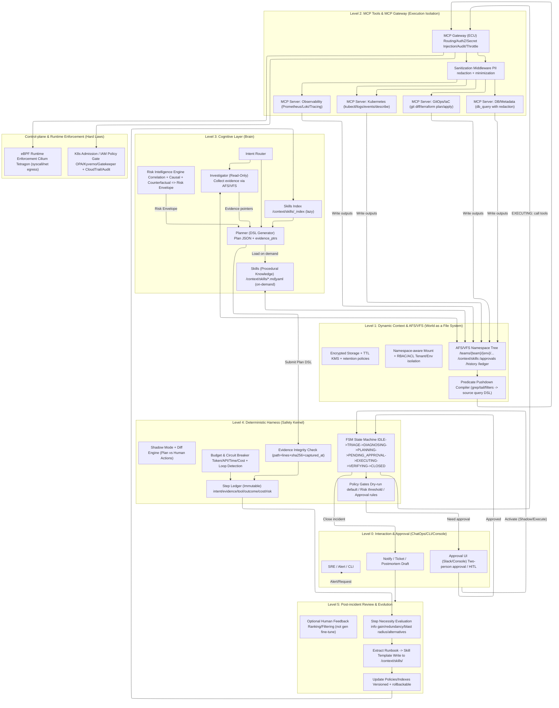
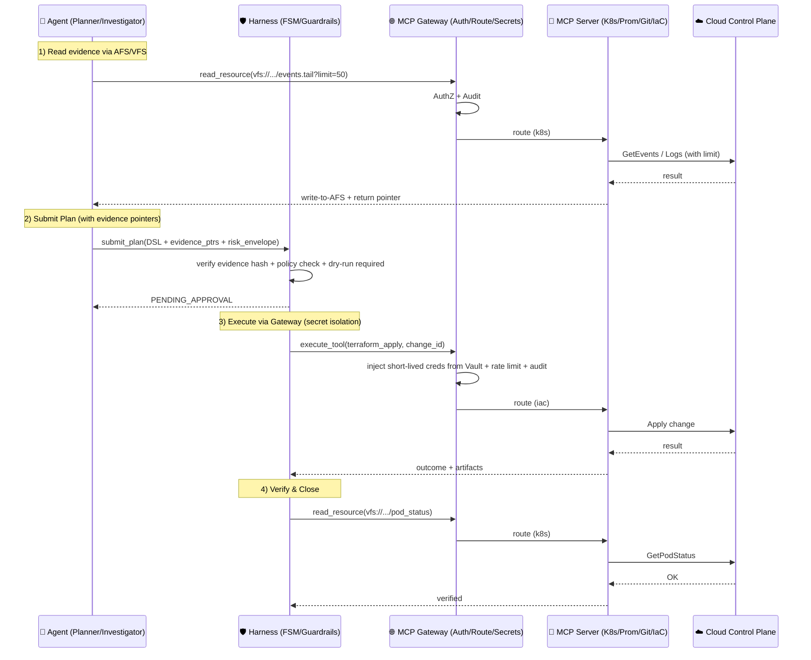



As cloud-native architectures (Kubernetes, AWS/GCP, multi-cloud, and hybrid cloud) grow exponentially in complexity, the traditional “static monitoring + human-run runbooks” response model is hitting the ceiling of human cognition and collaboration. Many AIOps systems still remain in a “RAG + chatbot” paradigm: context is truncated by window limits, cross-system evidence is difficult to cite consistently, and they lack industrial-grade execution safety and an auditable closed loop.

When LLMs are applied to critical infrastructure, the problems become even more pronounced as three structural barriers:

- **Context Fragmentation**: alerts, metrics, logs, traces, configs, changes, and permission signals are scattered across multiple systems and query languages, causing cognitive overload and context rot.
- **Nondeterministic Risk**: probabilistic generation in reasoning and planning leaves almost no room for error in operations—any “1% mistake” can be amplified into a production incident.
- **Execution Isolation Gaps**: if an agent directly holds cloud credentials or can bypass process controls to perform high-risk actions, hallucinations, prompt injection, or privilege abuse can become catastrophic side effects.

Project Aegis proposes an **Agentic Operator** architecture for critical infrastructure. It uses **“World as a File System”** as the core metaphor, abstracting heterogeneous cloud state into addressable resources on an **Agentic File System (AFS)/VFS**; adopts **Model Context Protocol (MCP) + MCP Gateway** as a standardized driver and isolation layer for reusable tool integration, routing/auth, and secret isolation; and, outside the Agent, introduces a **deterministic Harness** plus **control-plane/runtime hard enforcement** (Policy-as-Code, Admission Controllers, eBPF, etc.) to form a safety “immune system” that is auditable, gateable, replayable, and evolvable.

This article systematically breaks down Aegis’s **0–5 layer architecture**, focusing on:

- How AFS/VFS enables dynamic context discovery with performance via **predicate pushdown**;
- How **Agent Skills** encode expert procedural knowledge and load on demand, reducing ambiguity and hallucination risk from free-form generation;
- How the **Risk Engine** uses **Causal AI** and **counterfactual simulation** to characterize potential impacts of high-risk actions;
- How the **Harness** uses **Evidence Chain Integrity**, state machines, and execution gates to constrain probabilistic intelligence within deterministic safety boundaries.


## 1. Core Philosophy

Aegis follows three engineering “consensus principles” proven in practice, aiming to solve the “last mile” of bringing AI into production: **controllability, auditability, and sustainable evolution**.

### 1.1 The World as a File System

Inspired by Unix’s “everything is a file” and Plan 9’s distributed philosophy, Aegis abstracts logs, metrics, traces, IAM policies, Git commits, and runbooks as resources in AFS/VFS. The key idea is **not** to literally turn the world into files, but to **externalize everything that may enter context into addressable objects, so the Agent can discover and load them on demand** (inspired by Cursor’s dynamic context discovery). As a result, the Agent does not need to learn thousands of proprietary APIs—only a small set of primitives (read/ls/grep/diff/tail) to explore complex systems compositionally.

### 1.2 Physical Separation of Reasoning and Execution

The LLM (Agent) acts only as a planner, producing a structured plan (DSL) and evidence references. All side-effectful operations must be executed by deterministic tools, pass through the Harness’s process constraints and approval gates, and then be routed/authenticated with secrets injected by the MCP Gateway.

**Key principle:** the Agent never holds root cloud credentials and never directly performs privileged interactions with cloud control planes.

### 1.3 Safety Built into Process + Control-Plane/Runtime

Aegis assumes by default that the Agent can make mistakes, be prompt-injected, or hallucinate under incomplete context. Therefore, safety does not depend on prompts—it is guaranteed by two classes of “hard” mechanisms:

- **Deterministic process constraints (Harness-first):** explicit state machine, budget circuit breakers, shadow mode/dry-run, least privilege, and approval gating (optionally with two-person approval and immutable audit trails for high-risk actions).
- **Infrastructure hard enforcement (Kernel/Control-plane Enforcement):** Policy-as-Code / Admission Controllers at the control plane to block unauthorized configs; and runtime eBPF (e.g., Tetragon) to enforce non-bypassable interception of abnormal syscalls and network egress.

This makes safety a law of the system, not a moral expectation placed on the Agent.

---

## 2. Overall Architecture: The 0–5 Layer Model

To avoid “conceptually correct but hard to ship,” Aegis decomposes a long-running agentic operator into six layers (0–5). Each layer solves a concrete engineering problem and provides clear contracts (inputs/outputs) to adjacent layers. This layering enables incremental adoption: start with read-only diagnosis (Level 1–3), then supervised execution (Level 4), and finally post-incident evaluation and knowledge evolution (Level 5).

> **At a glance: from trigger to self-healing loop**  
> Level 0 handles triggers and human interaction; Level 1–2 unify how the system “sees” and “acts” compliantly; Level 3 handles reasoning and risk characterization; Level 4 provides deterministic gating and safe execution; Level 5 provides review, evaluation, and evolution of the skill base.

### Level 0: Interaction & Approval (ChatOps)

- **Problem it solves:** unify entry points and context injection, so the system starts with correct permissions and environment.
- **Main capabilities:**
  - Receive triggers from alerts/tickets (Slack / AlertManager / PagerDuty / CLI / Console).
  - Inject permission/environment context (team/env/tier/region/namespace, on-call info, change windows, freeze toggles).
  - Drive notifications and approval workflows (including two-person approval for high-risk actions).
- **Output (downstream):** standardized `Incident Context` (incident_id, severity, scope, SLO, budget caps, approval policy, etc.).

### Level 1: Dynamic Context & AFS/VFS (World Interface)

- **Problem it solves:** turn a fragmented ops world into an “addressable, searchable, progressively loadable” external memory space, avoiding context window blowups and truncation.
- **Main capabilities:**
  - **AFS/VFS resource abstraction:** map logs/metrics/traces/config/policy/code/runbooks into a directory tree of resources (read/ls/grep/diff/tail).
  - **Dynamic context discovery:** never truncate long outputs; persist full outputs to “external files” so the Agent can retrieve slices via tail/grep/semantic search.
  - **Predicate pushdown:** compile grep/tail/limit intent down to Loki/CloudWatch/Prometheus/SQL engines, returning only minimal necessary slices.
  - **Multi-tenant / multi-env isolation (namespace-aware mounts):** e.g., `/teams/payments/prod/...` vs `/teams/fraud/staging/...` to prevent cross-team leakage.
- **Output (upstream to Agent):** stable, repeatable “evidence files” and resource views (the foundation for evidence-chain mechanisms).

### Level 2: MCP Tools & Compliance Middleware

- **Problem it solves:** make execution and data access deterministic, auditable, and compliant—while removing real credentials from the Agent.
- **Main capabilities:**
  - **MCP (Model Context Protocol):** package system capabilities as atomic tools and resources—standardized “driver layer.”
  - **MCP Gateway (central routing/auth/secret isolation):**
    - Routing: `mcp://github/...`, `mcp://k8s/...`, `mcp://prometheus/...` forwarded to the corresponding MCP Server.
    - AuthZ: enforce read/write scope via team/env/namespace + RBAC/ABAC.
    - **Secret isolation:** real AWS AK/SK, kubeconfigs, DB creds live behind Vault/KMS; Gateway injects them only per call; the Agent never sees high-privilege secrets.
    - Connection reuse: connection pools reduce latency/jitter.
  - **Compliance & data governance middleware:**
    - PII/sensitive-field redaction (configurable).
    - VFS file TTL expiration (e.g., 72 hours) and at-rest encryption (KMS).
    - Idempotency/rollback semantics and audit hooks (each tool call emits audit events).
- **Output (to Harness/execution):** a controlled, traceable tool invocation channel plus compliant data ingress/egress.

### Level 3: Cognitive Layer (Router / Investigator / Planner / Risk Engine)

- **Problem it solves:** decompose reasoning into controllable roles and upgrade risk modeling from “intuition” to multi-signal correlation + causal/counterfactual evaluation.
- **Main capabilities:**
  - **Intent Router:** select strategies based on incident type and context (which skills to load, which signals to query first).
  - **Investigator (read-only):** collect evidence in VFS, validate hypotheses, produce structured RCA.
  - **Planner (structured planning):** output **Plan DSL / JSON DSL**, explicitly defining actions, targets, prerequisites, rollback, and evidence pointers.
  - **Agent Skills (procedural knowledge base):**
    - Store skills in `/context/skills/` as Markdown/YAML; load only the index at startup and lazily load full content as needed.
    - Promote high-value skills into composable DSL modules to reduce ambiguity/hallucinations.
  - **Risk Intelligence Engine:**
    - Correlate logs/metrics/traces/topology/changes.
    - **Blast Radius:** quantify impact scope via dependency graphs.
    - **Causal AI + Counterfactual Simulation:** answer “what happens if we do X,” producing structured `counterfactual_impact` (affected services, estimated downtime, failure likelihood, etc.).
- **Output (to Harness):** auditable `Plan DSL + Evidence Pointers + Risk Report`.

### Level 4: Deterministic Harness (Constraint Layer)

- **Problem it solves:** put probabilistic agent behavior into a deterministic “cage” so it can run long-term: gateable, replayable, correctable.
- **Main capabilities:**
  - **Explicit FSM:** e.g., `IDLE -> TRIAGE -> DIAGNOSING -> PLANNING -> PENDING_APPROVAL -> EXECUTING -> VERIFYING -> CLOSED`, forbidding illegal jumps.
  - **Budget circuit breakers & degeneration detection:** token/API caps, repeated action detection, mandatory escalation to humans.
  - **Shadow Mode:** generate plans without execution; diff against human actions to build trust.
  - **Evidence Chain Integrity:**
    - VFS writes evidence with `hash + timestamp`;
    - plans must carry `evidence_ptrs: (path, hash, line_range, captured_at)`;
    - Harness validates hashes before execution; mismatch/expiry triggers re-collection.
  - **Approval gating & immutable audit:** high-risk actions can require two-person approval with immutable ledger trails.
  - **Execution orchestration:** call deterministic tools via MCP Gateway (support dry-run, canary, rollback, verification).
- **Output:** auditable execution records, replayable state transitions, security event logs.

### Level 5: Post-incident Review & Evolution

- **Problem it solves:** ensure the system not only “fixes once,” but “gets better”—evaluating step necessity by human standards and evolving within safety boundaries.
- **Main capabilities:**
  - **Action necessity review:** evaluate each query/action in step ledger for necessity, information gain, and risk cost.
  - **Runbook/Skill extraction:** extract SOP from successful chains and write/update skills under `/context/skills/`.
  - **Guardrail evolution:** update policies, thresholds, approval rules, blacklist patterns (some actions always require humans).
  - **Human feedback loop:** collect explicit SRE feedback (useful/useless/dangerous) for ranking/filtering/routing—not end-to-end generation fine-tuning—to preserve determinism.
- **Output:** stronger skills, tighter guardrails, more reliable risk models, lower MTTR.

> **Recommended rollout:**  
> Ship Level 0–3 first (read-only diagnosis + planning + risk report) and accumulate shadow-mode diffs; then introduce supervised execution with Level 4; finally use Level 5 evaluation and skill extraction for continuous evolution.

---

## 2.1 Architecture Diagram (Mermaid)



---

## 3. Level 1: Dynamic Context & AFS/VFS (Dynamic Context Discovery)

This layer resolves the tension between “context window explosion” and “real-time data access,” and is one of Aegis’s core innovations. The key is not to stuff more into prompts, but to move context into an **addressable, searchable, auditable** external file space (AFS/VFS), and use **progressive disclosure** to stop loading as soon as information is “just enough.”

### 3.1 AFS/VFS: Semantic Resource Tree

From the Agent’s perspective, the cloud is not a set of API docs, but a semantic directory tree. With a few primitives (`ls/read/grep/diff/tail`), it can explore logs, metrics, traces, configs, permissions, and changes, and unify them into “evidence objects” that can be referenced.

```text
/
├── teams/
│   ├── payment/
│   │   ├── prod/
│   │   │   ├── logs/error.log                 (Loki/CloudWatch)
│   │   │   ├── metrics/latency.prom           (Prometheus)
│   │   │   ├── traces/checkout.trace          (Tempo/Jaeger)
│   │   │   ├── config/deploy.yaml             (K8s API)
│   │   │   ├── code/terraform/iam.tf          (GitOps/Terraform)
│   │   │   └── docs/runbook.md                (Wiki/Notion)
│   │   └── staging/...
│   └── fraud/...
└── context/
    ├── skills/                                 (Skill Library)
    │   ├── _index.json                         (Index/Router metadata)
    │   ├── k8s/crashloop_diagnosis.skill.yaml
    │   └── aws/iam_ecr_auth_fix.skill.yaml
    ├── history/session_log.md                  (Conversation/Action History)
    └── approvals/pending/                      (Approval Requests)
```

> **Where Skills live in VFS (light clarification):** `/context/skills/` is both skill storage and “versionable operational knowledge.” Level 1 provides addressability/searchability; Level 3 Router/Planner selects/loads/compiles these skills into concrete Plan DSL.

**Key principles (aligned with Cursor’s “files as external brain”)**
- **Never truncate long outputs:** full tool/query outputs are written to VFS (or object storage); the LLM receives only a path plus minimal summary pointers.
- **Default to tail first:** start with minimal context cost to detect errors, then decide whether to expand reads or locate via keywords.
- **Retrieve on demand, not pre-inject:** docs, skills, and history live in the external file space; only load relevant slices via grep/semantic search.

**Multi-tenant / multi-env isolation (namespace-aware mounts)**  
In enterprise deployments, AFS must support namespace-aware mounts (e.g., `/teams/payment/prod/...` vs `/teams/fraud/staging/...`) and enforce RBAC/ACL at the directory-tree level to prevent cross-team leakage or permission confusion.

---

### 3.2 Progressive Disclosure & Context Budget

To make dynamic discovery controllable (not arbitrary reading), Aegis introduces explicit budget policies on VFS reads:

- **Context Budget Policy:** per round cap on number of fragments / total tokens; each load must include `why-needed`; prioritize `tail` / keyword narrowing / small-window reads.
- **Default read strategy:** `tail -> grep -> narrow read -> wider read`, and stop expanding once the information is sufficient.

> This is operationally important: it shifts “context management” from prompt tricks to configurable system behavior, and can be evaluated post-incident.

---

### 3.3 Evidence Pointer Discipline

Merely “seeing” information is not enough—conclusions and actions must be **auditable and replayable**. Aegis requires that each critical conclusion and change recommendation include evidence pointers:

- Minimal: `file_path + line_range` (or equivalent locator)
- Recommended (paired with Level 4 integrity): `file_path + hash + timestamp + line_range`

If evidence references are missing or not locatable, the Harness will refuse to enter `EXECUTING`, keeping the system in a safe, reviewable state.

---

### 3.4 Evidence Chain Integrity

In long-running incidents, `path + line_range` alone can still suffer “context drift”: log rotation, overwrites, and index changes can break references. Aegis therefore adds evidence-chain integrity:

- When tool output is written into VFS, attach **timestamp** and **content hash (e.g., SHA256)**.
- Planner references must include `file_path + hash + line_range`.
- Before entering `EXECUTING`, Harness validates that the current content hash matches.
- If it doesn’t match (rotation/overwrite), Harness rejects execution and triggers re-sampling/re-location.

This keeps evidence consistent and traceable across shifts and long incident timelines.

---

### 3.5 Predicate Pushdown

Traditional RAG often pulls data locally and then processes it. For GB/TB logs and large metric sets, that is unacceptable. Aegis implements predicate pushdown at the AFS/VFS layer, pushing computation toward data sources:

- **Scenario:** Agent executes `grep "OOM" /logs/app.log | tail -n 50`
- **Anti-pattern:** download huge file -> local filter -> timeouts/oom
- **Aegis flow:**
  1) **Intercept:** recognize filter (`grep`) and limit (`tail`) intent
  2) **Translate:** compile into cloud-side query (Loki LogQL / CloudWatch Insights / ES DSL / SQL)
  3) **Execute:** run at source; return only the required results (e.g., 50 lines) and write to an evidence file

Example (Loki LogQL):
```json
{app="payment"} |= "OOM" | line_format " "
```
And enforce limit at the adapter:
```json
{ "query": "{app='payment'} |= 'OOM'", "limit": 50 }
```

This “move compute to data” design lets the Agent explore massive datasets at low token cost while remaining explainable and auditable.

---

## 4. Level 2: MCP Tools & MCP Gateway (Tools & Execution Isolation)

This layer answers “**how to execute safely**”: turn the Agent’s intent into deterministic, auditable, risk-controlled actions, and completely remove real credentials/high-privilege capabilities from the Agent side. It is the key for moving from demos to production, and the main carrier of “execution isolation.”

At Level 2, Aegis relies on two building blocks:
- **MCP (Model Context Protocol):** standardize external capabilities into “drivers + atomic tools”
- **MCP Gateway:** an ECU-like execution bus for routing, authZ, secret injection, auditing, and throttling

> Positioning: the Agent does not directly connect to K8s/AWS/Git/DB; it connects only to the Gateway. The Gateway forwards to the appropriate MCP Server and injects credentials only when needed.

---

### 4.1 MCP: The Driver Protocol

In Aegis, MCP Servers act as “device drivers,” exposing external system capabilities as **deterministic atomic tools** with structured I/O.

Examples:
- Observability: `query_prometheus`, `query_loki`, `query_trace`, `kubectl_get_events`, `kubectl_logs`
- Change: `git_diff`, `terraform_plan`, `terraform_apply`, `kubectl_rollout_restart`, `scale_deployment`
- Data: `db_query` (with redaction/minimization)
- Security/compliance: `policy_check`, `pii_redact`, `evidence_write`

**Production-grade tool requirements**
1. **Structured I/O (JSON):** enables auditing, replay, diffs, evaluation
2. **Idempotency:** write operations must include `change_id` and `idempotency_key`
3. **Rollback/compensation:** failures must have rollback paths or compensating actions
4. **Evidence write-through:** tool outputs are written to AFS/VFS with `timestamp + hash`
5. **Result minimization:** return only necessary fields/rows by default to protect context budgets

> You can think of MCP as turning “cloud APIs / CLIs / query languages” into governed building blocks, instead of having the Agent write raw shell or SDK calls.

---

### 4.2 MCP Gateway: ECU (Routing, AuthZ, Secret Injection, Audit)

If the Agent directly connects to K8s/AWS, you must hand it kubeconfigs, AK/SK, or DB admin credentials—unacceptable for critical infrastructure. Aegis introduces MCP Gateway as the only privileged egress, providing a hard boundary for execution isolation.

Core responsibilities:

#### 4.2.1 Secret Isolation
- The Agent holds only a **Gateway Token** (least privilege, expirable, revocable)
- Real credentials (AWS AK/SK, kubeconfig, DB admin, Git tokens) live in **Vault/KMS** behind the Gateway
- The Gateway performs **per-call short-lived credential injection** (time-limited, auditable, scope-bound)

> Result: even if the Agent is prompt-injected or hallucinates, it cannot obtain root cloud credentials.

#### 4.2.2 Unified Routing
Gateway routes by URI prefix/service name:
- `mcp://k8s/...` → Kubernetes MCP Server
- `mcp://prom/...` → Prometheus MCP Server
- `mcp://loki/...` → Loki MCP Server
- `mcp://github/...` → GitHub MCP Server
- `mcp://db/...` → Database MCP Server

This keeps the Agent’s interface stable: “read resources” and “call tools,” without dealing with per-system auth/API quirks.

#### 4.2.3 Connection Reuse
- Connection pools and long-lived connections
- Caching/dedup where policy permits
- Backpressure to avoid “query storms” during incidents

#### 4.2.4 Audit, Throttling, and Circuit Breaking
- Record full details: params, response summaries, latency, cost, trace_id
- Quotas and rate limits by team/env/tool class
- Circuit breaking when error rate rises or budgets approach limits; escalate to Harness/HITL

> Level 4 budget/loop detection is “session governance,” while Gateway throttle/circuit is “egress governance.” Together they provide defense in depth.

---

### 4.3 Compliance Middleware (Sanitization & Governance)

Before data enters the LLM context, Level 2 applies a configurable middleware chain:

#### 4.3.1 PII Redaction Middleware
- regex rules by default, optional NER
- typical targets: DB outputs, user identifiers, tokens, emails, IPs

Example:
```text
Input:  User email: admin@example.com
Output: User email: [REDACTED_EMAIL]
```

#### 4.3.2 TTL + Encryption
- TTL policies (e.g., 72-hour auto-expiration)
- at-rest encryption via KMS (AWS/GCP)
- tiered policies for `/logs`, `/sql-results`, `/traces` (different TTL/encryption/visibility)

#### 4.3.3 Result Minimization
- default projection/limit
- write large outputs to VFS, return “summary + pointer”
- synergizes with Level 1 tail/grep strategies to reduce token noise and cost

---

### 4.4 Idempotency & Rollback/Compensation

This is the tool-layer “production safety belt.”

- **Idempotency:**  
  Every write action binds `change_id` and `idempotency_key`; repeats do not re-execute; Gateway can deduplicate/replay-protect.

- **Rollback/compensation:**  
  - K8s: `rollout undo` / `scale back` / `traffic drain`
  - Terraform: preserve `plan` + `state snapshot`; failures trigger compensations (module rollback or version restore)
  - DB: only whitelisted change paths; optionally require a compensating script with approval

> Which rollbacks can run automatically is usually decided by Level 4 Harness (thresholds/approvals), but Level 2 must provide the executable primitives.

---

### 4.5 Read-only by Default, Controlled Writes

Aegis’s default policy is:
- AFS/VFS mounts are read-only by default (observability directories are readable)
- writes only allowed into controlled directories (e.g., `/change_requests/` or `/approvals/pending/`)
- any real execution must:
  1) be permitted by Harness state (`APPROVED/EXECUTING`)  
  2) pass Gateway policy checks with secret injection  
  3) generate auditable evidence and rollback paths

---

### 4.6 Boundary with Level 4: Who Decides “Execution Happens”?

To avoid confusion, it helps to state the boundary explicitly:

- **Level 2 (MCP + Gateway)** makes actions “executable with isolation”  
- **Level 4 (Harness)** decides “whether execution is allowed” (FSM, budgets, evidence integrity, approvals, risk gates)

In other words: **Level 2 makes execution safe and governed; Level 4 decides if execution occurs.**

---

## 5. Level 3: Cognitive Layer (Multi-Agent + Skills + Risk)

This layer answers “**how to be smart and professional**.” Aegis does not let a single agent freely improvise; it decomposes cognition into auditable, reusable, gateable modules: **evidence collection (Investigator)**, **planning (Planner)**, **procedural knowledge (Skills)**, and **risk intelligence (Risk Engine)**. Meanwhile, execution safety is enforced externally by Level 4 Harness rather than relying on the model’s self-discipline.

---

### 5.1 Multi-Agent Roles: Investigator and Planner (ReAct-style Decoupling)

To avoid confusion and permission sprawl, Aegis uses role specialization:

- **Investigator (read-only):** collect evidence via AFS/VFS, validate hypotheses, build the evidence chain (Evidence Chain).
- **Planner:** generate structured fix plans (JSON DSL) and **never execute directly**.

Benefits:
1) reasoning and evidence collection are separated, reducing drift
2) clean permission boundaries: Investigator always read-only; Planner only outputs plans
3) easier auditing: plans are inherently structured for gates/replay

**Planner JSON DSL example (simplified)**
```json
{
  "incident_id": "INC-2026-0127-001",
  "hypothesis": "ECR auth token missing",
  "evidence": [
    {
      "path": "/teams/payments/prod/monitor/eks/cluster-prod/pods/payment/describe.txt",
      "hash": "sha256:9b1c...f3a2",
      "lines": "120-140"
    }
  ],
  "actions": [
    { "tool": "terraform_plan", "params": { "workspace": "prod", "module": "iam" } },
    {
      "requires_approval": true,
      "tool": "apply_change",
      "params": { "change_id": "CHG-8891", "idempotency_key": "INC-2026-0127-001#CHG-8891" }
    }
  ],
  "verify": [
    { "tool": "check_pod_status", "params": { "pod": "payment-pod" } },
    { "tool": "query_metrics", "params": { "promql": "rate(http_5xx[5m])" } }
  ]
}
```

---

### 5.2 Skills: Procedural Knowledge (Not Redundant with MCP)

A common misunderstanding: if MCP provides tools/drivers, why Skills?  
Aegis’s answer is clear: **Skills are not redundant—Skills are the glue between cognition and execution.**

- **MCP/Tools are “hands and feet” (capabilities):** atomic deterministic operations like `kubectl_logs`, `query_prometheus`, `terraform_plan`.
- **Skills are the “SOP cortex” (procedural knowledge):** structured expert runbooks: how to do the right thing, in the right order, with constraints.

> Without Skills, an agent is like an intern with surgical tools but no medical training: capable, but unsafe and inconsistent.

#### 5.2.1 Skills Fit Naturally into the File-System Metaphor

Skills live under **`/context/skills/`**:

- **Lazy loading:** load only `_index.json` at startup; load full skill content on demand.
- **Value:** enterprises can have hundreds of runbooks; pre-injecting them into prompts is infeasible. On-demand loading aligns with Level 1 dynamic context discovery.

AFS example:
```text
/context/
  skills/
    _index.json
    k8s/
      crashloop_diagnosis.md
      ingress_debug.md
    aws/
      iam_policy_check.yaml
    db/
      postgres_deadlock_fix.yaml
```

#### 5.2.2 From Markdown Docs to Composable DSL Modules

Aegis supports promoting high-frequency runbooks into structured skill modules (YAML/JSON Schema), letting Planner “call a skill” rather than improvise.

Example:
```yaml
skill: k8s_ecr_auth_fix
triggers:
  - log_contains: "ECR authorization token"
  - pod_status: "ImagePullBackOff"
steps:
  - tool: get_iam_policy
    output_var: current_policy
  - tool: generate_terraform_patch
    input:
      policy: $current_policy
      required_perms: ["ecr:GetAuthorizationToken"]
  - tool: terraform_plan
    input:
      workspace: prod
guardrails:
  - require_evidence: true
  - max_retries: 2
  - allow_write: false   # default; must be lifted by Harness approval
```

Benefits:
- versioned, testable (CI)
- auditable
- reusable
- more stable (less free-form drift)

---

### 5.3 Risk Intelligence Engine: Correlation + Causal + Counterfactuals

Risk Engine is not “another LLM.” It is a signal fusion and risk modeling component that produces a **Risk Envelope** for Planner and Harness. Its goal: suppress hallucinations, reduce blind searching, and make high-risk actions justifyable with structured evidence.

#### 5.3.1 Correlation via Topology
- map signals (logs/metrics/traces/changes/topology) to dependency graphs
- aggregate noisy alerts into root-cause candidates
- reduce token waste and wrong turns

#### 5.3.2 Blast Radius
- quantify impact scope before any write action
- recommend gates: dry-run, approvals, two-person approvals

#### 5.3.3 Causal AI + Counterfactual Simulation
- answer “what happens if we do X”
- simulate propagation in shadow/sandbox/digital twin
- estimate cascading risks via SCM/graph/rules, not just similarity search

Risk Envelope example:
```json
{
  "blast_radius_score": 0.82,
  "impact_scope": ["payments/prod", "payment-service", "us-west-2"],
  "confidence": 0.74,
  "required_gates": ["dry_run_required", "human_approval_required", "two_person_approval_required"],
  "counterfactual_impact": {
    "affected_services": ["payment-api", "refund-worker"],
    "estimated_downtime_sec": 120
  },
  "why": ["IAM change impacts shared role used by multiple workloads"],
  "safe_alternatives": ["canary_rollback_first", "graceful_drain_then_restart"]
}
```

> Key: the Risk Engine provides structured inputs for automated gating/audit—not just natural-language warnings.

---

### 5.4 Interfaces: What Does the Cognitive Layer Output?

To align cleanly with Level 1/2/4, Level 3 should output:
1) **Evidence-backed Plan (DSL):** includes evidence pointers (path + hash + lines)
2) **Risk Envelope:** drives Harness gating decisions

This is how Aegis ensures “smart” also means “controllable, auditable, reproducible.”

---

## 6. Level 4: Harness (Deterministic Constraints for Long-running Agents)

In industrial systems, Harness is often more critical than the LLM: it is deterministic code (Go/Python) acting as a “guardian kernel.” Aegis’s core idea is to sandwich probabilistic reasoning between deterministic input governance and deterministic execution verification, forming a safe loop that is auditable, replayable, gateable, and correctable.

---

### 6.1 Explicit State Machine (FSM)

Harness enforces a global FSM:

`IDLE -> TRIAGE -> DIAGNOSING -> PLANNING -> PENDING_APPROVAL -> EXECUTING -> VERIFYING -> CLOSED`

Rules:
- **No jumps:** the Agent cannot jump from DIAGNOSING to EXECUTING; transitions are controlled by Harness code.
- **Assertions per transition:** e.g., evidence complete, risk thresholds satisfied, dry-run done, approvals present.
- **Pause/resume:** long incidents can pause and resume with persisted pointers/state.

---

### 6.2 Long-running Harness Checklist

A simplified checklist:
- Stateful execution (pause/resume)
- Budgeting (token/tool/time/api cost caps)
- Degeneration detection (repeated queries, no-progress)
- Action gating (dry-run first; approvals; least privilege; two-person approval when needed)
- Persistence & replay (evidence and ledger replay)
- Evaluation hooks (step-level structured outputs for Level 5)

---

### 6.3 Budget + Loop Detection

To prevent “endless querying”:
- **Loop Detection:** N similar actions in a row -> interrupt and escalate to humans
- **Budget Control:** session-level caps (e.g., $2.00 / N tool calls / N tokens / T minutes) -> circuit-break and escalate with ledger record

---

### 6.4 Evidence Chain Integrity

To prevent context drift:
- AFS/VFS attaches `sha256` + `captured_at`
- Planner must cite `path + lines + sha256 + captured_at`
- Harness validates before EXECUTING
- mismatch/expiry -> refuse and re-sample

This makes evidence replayable and non-repudiable across shifts.

---

### 6.5 Approval Gating: HITL, Two-person Approval, Immutable Audit

Harness makes HITL enforceable:
- risk-driven approvals (blast radius threshold -> PENDING_APPROVAL)
- high-risk -> two-person approval
- approvers must have correct RBAC/ACL scope
- immutable ledger trails (who/when/change_id/evidence hash/risk summary)

---

### 6.6 Shadow Mode + Diff Engine

Early-stage rollout defaults to Shadow Mode:
- run in parallel with humans: generate plans without execution
- diff Agent plan vs human actions: consistency, hit rate, false positives/negatives
- progressive privilege: `Read-only -> Suggest -> Execute w/ Approval -> Limited Autonomy`

Trust is built as measurable engineering, not one-time faith.

---

### 6.7 Step Ledger: Auditable, Replayable, Evaluatable Facts

Every step is recorded:
- intent
- evidence_ptrs (hash + captured_at)
- tool_call (params, idempotency/change ids)
- outcome summary + pointers to full outputs in AFS
- cost (token/time/api)
- risk_envelope
- approvals (if any)

---

### 6.8 Kernel/Control-plane Enforcement: The Last Non-bypassable Safety Line

Harness is deterministic “kernel safety,” but Aegis does not stop at the application layer. In cloud-native contexts, the “kernel” maps more accurately to the **cloud control plane** and **runtime**—so Aegis adds a non-bypassable hard line:

#### 6.8.1 Control-plane Enforcement (Kubernetes Admission)
Even if an Agent tries to apply malicious/noncompliant YAML, control-plane policy controllers (OPA/Gatekeeper/Kyverno) can deny:
- privileged containers / root
- noncompliant network policies
- unauthorized ServiceAccounts / RoleBindings, etc.

> This is “cannot pass,” independent of the Agent’s intent.

#### 6.8.2 Runtime Enforcement (eBPF: Cilium Tetragon, etc.)
Even after workloads are running, eBPF can enforce invisible hard rules:

- **Unauthorized public egress (suspected C2):**  
  a pod process tries to connect to an unauthorized public IP/domain -> kernel drops packets and terminates the process (or isolates it).

- **Suspicious syscalls / process behavior:**  
  abnormal exec, reading sensitive paths, privilege escalation patterns, high-risk syscall sequences -> intercept and alert (or kill).

This does **not** rely on the Agent “behaving.” It is an infrastructure-level physical law:
> Not “don’t do it,” but “you cannot do it.”

**Summary:** Aegis pushes safety down to control-plane + runtime layers the Agent cannot bypass, rather than relying on prompts or model self-control.

---

## 7. Level 5: Post-incident Review & Evolution

Aegis does not delegate “learning” to black-box end-to-end fine-tuning. Instead, it uses a controllable engineering feedback loop: **evaluate → extract → update**. The goal is not only to fix incidents, but to turn each fix into reusable organizational assets so future responses become faster, safer, and more reliable.

### 7.1 Step-level Necessity Evaluation

After each incident, Aegis evaluates the **Step Ledger** (query chain + action chain + risk gates + evidence chain) along dimensions such as:

- **Information Gain:** did the step reduce uncertainty and change the hypothesis space?
- **Redundancy:** was it too similar to previous steps? did it trigger “no-progress” patterns?
- **Risk-first Validation:** were low-risk validations done before high-risk actions (dry-run, read-only evidence)?
- **Evidence Sufficiency:** do key conclusions satisfy evidence pointer discipline (incl. hash/timestamp)?
- **Cheaper Alternative:** was there a smaller intervention (drain then restart, canary then rollback)?

**Outputs** include:
- mark invalid/redundant queries
- flag high-risk suggestions with insufficient evidence
- extract reusable runbook fragments
- produce versioned guardrail/policy update proposals

### 7.2 Versioned Evolution: Runbook / Skills / Policy

Evolution in Aegis is not just writing a summary; it crystallizes knowledge into executable, versioned assets:

#### 7.2.1 Auto-extract Runbooks into Skills
With Skills, the most important Level 5 artifact becomes a new or updated skill file:

- input: action chain + evidence chain + risk signals + approvals
- process: infer stable triggers and reproducible steps
- output: write to `/context/skills/` and update `_index.json`

Example:
- resolve a rare issue (Postgres deadlock recovery)
- auto-summarize the effective diagnostic/fix sequence
- generate `/context/skills/postgres_deadlock_fix.skill.yaml`
- next time: Router finds it and Planner reuses SOP directly

> This is “knowledge crystallization”: one-off experience becomes composable, auditable, versioned capability.

#### 7.2.2 Guardrails as Code
Update:
- policies: which actions require approval, which services stay in shadow mode, which require two-person approval
- risk thresholds: blast_radius_score/confidence thresholds and gate logic
- evidence requirements: enforce hash/time validation in certain scenarios to prevent drift

#### 7.2.3 Better Recall, Lower Cost
Update:
- skill indexes (metadata/tags/triggers)
- similar-case indexes (incident signatures)
- “metadata first” strategies (list/summary/head before full reads)

### 7.3 Optional: Human Feedback Loop (Ranking/Filtering, Not Generation)

Aegis can collect explicit SRE feedback on plans:
- ✅ useful
- ❌ unhelpful
- ⚠️ dangerous

Use it to:
- train a reward model / lightweight scorer
- rank/filter candidate plans, skill calls, investigation paths
- improve Router decisions and guardrail gating

But **do not** do end-to-end generation fine-tuning, to avoid behavior drift and preserve determinism.

---

**Recap:** Level 5 gives Aegis “organizational memory”: it not only fixes incidents, but turns the fixing process into reusable Skills and verifiable Policies, continuously evolving within safe boundaries.

---

## 8. End-to-End Workflow Demo (OS Metaphor)

To clearly explain how **Agent, AFS/VFS, MCP, MCP Gateway, Harness, Control-plane/eBPF** collaborate, we use an “operating system” analogy and trace how a concrete ops request flows across components:

- **Agent (CPU/process):** reasons and produces a structured plan (Plan/DSL), but does not directly cause side effects
- **AFS/VFS (file system):** unified world interface (resource tree + dynamic files), with predicate pushdown and progressive reading
- **MCP (driver protocol):** standard way to expose tool capabilities (like device drivers)
- **MCP Gateway (bus/device manager):** routing, auth, secret injection, auditing (like an ECU/bus controller)
- **Harness (kernel safety module):** FSM, evidence validation, budget breakers, approvals, shadow/diff constraints
- **Control-plane/eBPF (physical laws):** non-bypassable hard defenses (admission/runtime eBPF)

> Below we choose an **infrastructure-only** scenario: **Spark Job OOM (Driver memory too small)**.  
> This example emphasizes the full chain: “read → reason → plan → approve → execute → verify → evolve.”

### Scenario: Spark on Kubernetes Job Failure (Driver OOM)

#### 8.1 Trigger & Context Injection
1) **Level 0 (Trigger / ChatOps)**  
   AlertManager/Argo/EMR-on-EKS runtime alerts: `SparkApplication FAILED`, with `Driver OOMKilled`.  
   Slack/CLI injects incident context (cluster/env/job_id/namespace/owner).

2) **Level 4 (Harness init)**  
   Harness creates the session:
   - initialize FSM -> `DIAGNOSING`
   - create budget (token/tool/api/time) and step ledger
   - default policy: read-only + dry-run-first

#### 8.2 Discovery & Evidence Collection via AFS/VFS
3) **Level 3 (Router + lazy skill load)**  
   Router searches `/context/skills/_index` for `spark`, `oom`, `driver`, `k8s`  
   Lazily loads `skills/spark_oom_triage` (metadata first, then full steps).

4) **Level 1 (AFS/VFS reads: treat cloud state as files)**  
   Investigator (read-only) performs progressive reads:
   - recent events:
     `/teams/data/prod/k8s/namespaces/{ns}/pods/{driver_pod}/events.tail`
   - driver logs (limited):
     `/teams/data/prod/k8s/namespaces/{ns}/pods/{driver_pod}/logs.tail?limit=200`
   - SparkApplication/job spec:
     `/teams/data/prod/jobs/{job_id}/spec.yaml`
   - memory usage summary (if mounted):
     `/teams/data/prod/metrics/pods/{driver_pod}/memory.prom?window=15m`

   **Key: these “files” are dynamic.**  
   `read` triggers real-time queries via MCP Servers (k8s/loki/prometheus) and writes results into AFS for audit/citation.

5) **Level 1 (predicate pushdown: avoid fetching full logs)**  
   To locate OOM lines, AFS/VFS compiles filter/limit down to log sources and returns minimal lines, reducing latency and token cost.

#### 8.3 Reasoning & Planning
6) **Level 3 (Planner generates Plan DSL)**  
   Planner concludes driver memory is insufficient and proposes a low-risk path:
   - change job config only (driver memory -> 2G), no cluster-wide changes
   - dry-run/diff first, then request approval to apply
   - verify metrics and retry outcome

   Plan must include **evidence pointers** (`path + lines + sha256 + captured_at`) or Harness won’t allow execution.

7) **Level 3 (Risk Engine injects risk envelope)**  
   Risk Engine produces structured signals:
   - **Blast Radius:** changing one job spec is low/medium risk, but resource increase may affect queue fairness
   - **Counterfactual:** too large a bump can cause namespace resource pressure -> recommend incremental bump (1G→2G)
   - output: `risk_envelope` with gate recommendations (dry-run required / approval required)

#### 8.4 Execution Isolation & Approvals
8) **Level 4 (Harness gating: evidence validation + FSM + approval)**  
   - validate evidence hash/timestamp (prevent drift)
   - enforce dry-run (patch generation / server-side dry-run / pre-commit diff)
   - determine approval type: single approver vs two-person depending on risk policy

9) **Level 0 (Interaction: show diff + risk + evidence reveal)**  
   Slack card shows:
   - config diff (driverMemory: 1G → 2G)
   - risk explanation (blast radius + counterfactual)
   - evidence pointers (AFS path + line range + hash)

10) **Level 2 (Execution via MCP Gateway: secret isolation)**  
   Only Harness calls `gateway.execute_tool()`; Agent has no cloud keys.  
   - Gateway injects short-lived credentials (kubeconfig / repo token)
   - routes to MCP Server (k8s/gitops/job-service)
   - full audit records: who/what/why/cost/result

#### 8.5 Verify & Close
11) **Level 4 (Verify)**  
   - verify driver pod no longer OOMKills
   - verify job succeeds / retry succeeds
   - verify metrics (memory curve, failure rate, restart count)

12) **Control-plane/eBPF (final safety line)**  
   If anything goes off the rails:
   - admission blocks noncompliant changes (privileged, unauthorized resources, forbidden net policies)
   - runtime eBPF blocks suspicious syscalls/unauthorized egress

13) **Level 5 (Evolution)**  
   - generate postmortem draft from step ledger
   - evaluate necessity (remove redundant queries / optimize routing)
   - extract/update a skill: `skills/spark_driver_oom_fix`

---

## 9. Case Study: EMR on EKS (ImagePullBackOff / ECR Permission)

> This retains your original “ECR permission missing” storyline, but rewritten in the 2.0 framing to show:  
> **AFS/VFS (dynamic discovery) + predicate pushdown (low-cost evidence) + Plan DSL (evidence discipline) + Harness (gates) + Gateway (secret isolation) + Evolution (skill extraction)**.

### Background
An EMR on EKS job fails; Pod is `ImagePullBackOff` and cannot pull the image.

### End-to-end flow (0–5 layers)
1) **Level 0 (Interaction)**  
   Slack receives the alert; SRE clicks `Activate Aegis (Shadow Mode)`; injects incident metadata (cluster/namespace/job_id).

2) **Level 4 (Harness)**  
   Initialize FSM and ledger: `DIAGNOSING`; default read-only + dry-run-first.

3) **Level 3 (Router)**  
   Router classifies it as `K8s + ImagePullBackOff + Auth/Permission` and wakes Investigator (read-only).  
   Lazily loads `skills/image_pull_backoff_triage` from `/context/skills/_index`.

4) **Level 1 (AFS/VFS: non-truncating, tail first)**  
   Investigator reads and persists:
   - `/teams/data/prod/k8s/.../pods/{pod}/describe.txt`
   - `/teams/data/prod/k8s/.../pods/{pod}/events.tail?limit=50`

   **Key evidence (tail):**  
   `401 Unauthorized: ECR authorization token is expired or missing`

5) **Level 3 (Risk Engine: eliminate wrong directions quickly)**  
   Correlate signals: NAT/routing/node network metrics normal → rule out network; converge to `IAM/ECR`.

6) **Level 1 (AFS/VFS: read IAM evidence)**  
   Read role policy file:
   `/teams/data/prod/aws/iam/roles/EMR_Job_Role/policy.json`  
   Find missing `ecr:GetAuthorizationToken`.

7) **Level 3 (Planner: evidence-bound Plan DSL; change IaC, not ad-hoc cloud edits)**  
   Planner reads IaC:
   - `/teams/data/prod/change/git/...`
   - `/teams/data/prod/change/terraform/...`
   Generates a structured Plan with `evidence_ptrs` and `risk_envelope`.

8) **Level 4 (Harness: dry-run + evidence validation + gating)**  
   - run `terraform plan` (dry-run)
   - validate evidence hash/timestamp
   - enter `PENDING_APPROVAL`

9) **Level 0 (Interaction: diff + risk + approvals)**  
   Slack shows Terraform diff + gate suggestions; high-risk policies trigger two-person approval.

10) **Level 2 (Execution via MCP Gateway: secret isolation)**  
   Harness calls Gateway to apply:
   Gateway injects short-lived AWS/IaC creds from Vault and writes audits.

11) **Level 4 (Verify)**  
   Validate image pull recovers; job retry succeeds; confirm no suspicious egress (audit/eBPF if enabled).

12) **Level 5 (Evolution)**  
   - generate postmortem draft from ledger
   - necessity evaluation (optimize query chain)
   - extract skill `skills/ecr_auth_fix` and update index

### Key points to emphasize
- **AFS/VFS + predicate pushdown** keeps evidence collection cheap even for massive logs
- **Evidence discipline**: plans must cite `path + lines + sha256 + captured_at`
- **Harness gating**: dry-run, approvals, budgets, FSM, hash checks
- **Gateway isolation**: agent never sees cloud keys; execution requires injected short-lived creds
- **Evolution loop**: one fix -> one reusable skill (not black-box tuning)

---

### Sequence Diagram



> Note: the diagram emphasizes that both read/write go through Gateway + Harness, and **secret isolation** + **audit** are default.

---

## 10. Performance, Cost, and Engineering Reality

Shipping Aegis is not just about “correct ideas.” This section focuses on practical constraints: abstraction tax, token economics, and enterprise-scale integration/governance.

### 10.1 Abstraction Tax: Latency vs Performance
- AFS/VFS (FUSE-like abstraction) introduces user-space overhead; usually acceptable for control-plane ops (seconds/minutes).
- The real risk is naive “fetch then grep” approaches (remote grep over TB logs).
- Therefore Aegis must rely on **predicate pushdown**: compile `filter/limit/window/aggregate` to the source (Loki/CloudWatch/ES/Prometheus/K8s API) and return only necessary slices.

> Conclusion: VFS’s value is not “being files,” but being a unified, governable read/search interface with baked-in performance optimization.

### 10.2 Token Economics: Lazy Loading First
Aegis cost control follows progressive disclosure:
- **Metadata first:** `ls` -> `read head` -> `read full`
- **Skills indexing:** load only `/context/skills/_index` at startup; load full skill content on demand
- **Write large outputs to files:** full tool outputs go into AFS; LLM gets “path + summary pointer,” then tail/grep/semantic-search incrementally

This reduces token cost, latency cost, and repeated queries caused by context rot.

### 10.3 MCP Gateway: A Must-have for Enterprise Scale
At dozens/hundreds of tools and sources, Gateway is not optional:
- unified routing + connection reuse (connection pools, stable URIs)
- audit + throttling + circuit breaking
- **Secret Isolation (critical):** Agent holds only Gateway token; real cloud creds remain in Vault and are injected short-lived per call

> Conclusion: Gateway turns a “tool pile” into an operable enterprise platform.

---

## 11. Conclusion and Outlook

Project Aegis is not just a set of automation scripts—it is a **Trustworthy Agentic Operations** architecture for critical infrastructure. The goal is not “AI takes over ops,” but AI becomes a **observable, auditable, evaluatable, and continuously improving** collaborator—capturing LLM reasoning benefits while meeting strict requirements for determinism and security.

Aegis establishes a “trust chain” via five key mechanism groups:

- **AFS/VFS + predicate pushdown:** solves how the Agent “sees” with low cost, low noise, governed dynamic context discovery and multi-tenant namespace isolation.
- **Evidence Chain Integrity (hash + timestamp):** ensures evidence consistency across long incidents, preventing context drift from causing misjudgment or unsafe actions.
- **MCP + MCP Gateway:** solves how the Agent “acts” with a standardized driver ecosystem, unified routing/audit, and credential isolation that prevents secrets from leaking to the Agent.
- **Risk Intelligence Engine (Correlation + Causal + Counterfactual):** structures multi-signal correlation, blast radius, and what-if impacts for explainable pre-action risk characterization.
- **Deterministic Harness + control-plane/runtime hard enforcement (Admission/eBPF):** state machines, budget breakers, shadow mode, approval gating, and non-bypassable “physical laws” to cage probabilistic intelligence inside deterministic boundaries.

Looking forward, Aegis should not chase ever-larger model capability. Instead, it should strengthen the engineering closed loop: crystallize successful handling into versioned Skills/Runbooks, solidify reviews into traceable policy updates and evaluation metrics, and continuously reduce MTTR and change risk—providing a practical, verifiable, governable path toward higher levels (L4/L5) of “autopilot cloud operations.”
