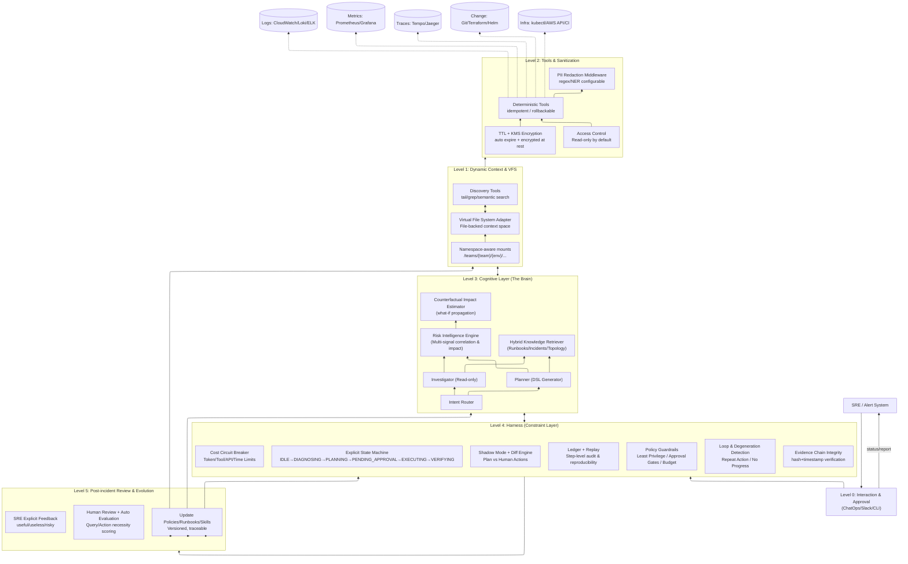



As cloud-native systems (Kubernetes, AWS/GCP) grow exponentially in scale and complexity, traditional static-rule monitoring plus human-in-the-loop runbooks increasingly become a bottleneck for system resilience. Many AIOps attempts still remain in a “RAG + chatbot” pattern, suffering from three common issues: context window limits that truncate or lose critical evidence, hallucination risk that is hard to control, and the lack of industrial-grade execution safety and auditability.

This article introduces **Aegis** — an agentic incident diagnosis and self-healing system designed for critical infrastructure. Rather than treating an LLM as an all-powerful black box, Aegis positions it as a **structured reasoning and planning engine**, and achieves a controllable, auditable, continuously improvable production agent via three key designs:

- **Virtual File System Adapter (VFS Adapter)**: unifies heterogeneous cloud state into file read/write primitives and enables “zero-copy” dynamic context discovery. Long tool outputs are never truncated; instead, they are persisted and loaded progressively via `tail/grep/semantic search`.
- **Multi-signal Risk Intelligence Engine**: filters noise, correlates signals, and evaluates blast radius across Logs/Metrics/Traces/Topology/Change. During dry-run, it introduces counterfactual impact estimation to improve pre-action risk characterization for high-risk changes.
- **Deterministic Harness (Constraint Layer)**: with an explicit state machine, budget circuit breakers, degeneration/loop detection, shadow mode, and permission gating, the long-running agent becomes observable, replayable, evaluable, and correctable. It further adds **evidence chain integrity verification** (hash + timestamp) to prevent context drift from causing incorrect decisions in long-lived incidents.

We will break down Aegis’s **0–5 layer architecture** and its implementation highlights, and walk through an end-to-end workflow using a real-world cloud operations scenario.

---

## 1. Core Philosophy

When building Aegis, we refused to treat the LLM as an omniscient black box. Instead, we follow three engineering principles:

1. **The World as a File System**  
   Inspired by Cursor IDE’s dynamic context discovery, we unify heterogeneous cloud states (Logs, Metrics, IAM Policies, Git Commits, Terraform Plans, Incident Timelines) into standard file read/write operations.  
   The point is not merely “turning the world into files,” but: **persist everything that may enter context into external storage, then let the agent discover and load it on demand**.

2. **Separation of Reasoning & Execution**  
   The LLM only produces structured plans (Plan / DSL) and evidence references. All side-effect actions are executed by deterministic tools, governed by harness-level code constraints and approval gates.

3. **Safety Native**  
   The system must assume the agent will make mistakes. The harness has higher authority than the agent; the system defaults to **shadow mode / dry-run mode**; any real write requires least privilege, risk assessment, and approvals. For high-risk changes (e.g., `blast_radius_score > 0.7`), Aegis can enforce **two-person approval** and immutable approval audit trails to satisfy compliance in highly regulated environments.

---

## 2. The 0–5 Layer Architecture

To avoid “conceptually correct but hard to ship,” Aegis decomposes a production long-running operations agent into six layers (0–5). Each layer solves a specific engineering problem:

- **Level 0: Interaction & Approval (ChatOps)**  
  User entry points, identity and permission context injection, approvals and notifications (Slack/CLI/Console).
- **Level 1: Dynamic Context & VFS (VFS Adapter)**  
  A unified external memory space, long-output persistence, progressive retrieval, predicate push-down; plus namespace isolation for multi-tenant/multi-environment deployments.
- **Level 2: Deterministic Tools & Sanitization**  
  Predefined atomic tools, idempotency/rollback, PII redaction, access control and audit integration; optional TTL and KMS encryption for VFS files.
- **Level 3: Cognitive Layer**  
  Task routing, investigation and planning, multi-signal risk engine, and knowledge retrieval; optional structured Skills/DSL modules to reduce ambiguity from free-form generation.
- **Level 4: Harness (Long-running Constraint Layer)**  
  Explicit state machine, budget circuit breakers, degeneration/loop detection, shadow mode, permission gating, replayability; plus evidence chain integrity checks before execution.
- **Level 5: Post-incident Review & Evolution**  
  Evaluate whether each query/action was necessary, extract reusable runbooks, and update guardrails/skills; optionally incorporate explicit SRE feedback for ranking/filtering (not end-to-end generation fine-tuning).

---

## 2.1 Architecture Diagram (Mermaid)



---

## 3. Level 1: Dynamic Context & the VFS Adapter

Aegis addresses the core tension between “context window limits” and “real-time operational data” by **moving context out of the prompt into an external file-backed memory space**, then using progressive disclosure to load only what’s needed.

### 3.1 The Virtual File System: Cloud Environment as a Directory Tree

From the agent’s perspective, the cloud environment is a controlled directory tree (read-only by default), for example:

```plaintext
/
├── teams/
│   ├── payments/
│   │   ├── prod/
│   │   │   ├── monitor/eks/cluster-prod/events/warning.txt
│   │   │   ├── monitor/eks/cluster-prod/pods/payment/describe.txt
│   │   │   ├── monitor/eks/cluster-prod/logs/payment-pod/tail.log
│   │   │   ├── metrics/payment/5xx_rate.prom
│   │   │   ├── traces/payment/last_15m.trace
│   │   │   ├── config/aws/iam/roles/{role}/policy.json
│   │   │   └── change/terraform/plans/latest.plan
│   │   └── staging/...
│   └── fraud/...
└── context/
    ├── active_incidents.md
    ├── conversation_history.txt
    └── skills/
        ├── k8s_triage.skill.yaml
        └── iam_debug.skill.yaml
```

Key principles (aligned with Cursor’s “files as the external brain” approach):

- **Never truncate long outputs**: persist full tool outputs; the LLM only receives a path and a short pointer/summary.
- **Start with `tail` by default**: cheaply probe conclusions/errors, then expand reading only if needed.
- **Discover on demand, not upfront stuffing**: skills, tool manuals, and conversation history are retrievable via grep/semantic search and only then loaded as relevant snippets.
- **Multi-tenant / multi-env isolation**: namespace-aware mounts restrict visibility to `/teams/{team}/{env}/...`, preventing cross-team leakage or permission confusion.

### 3.2 Context Budget & Evidence Pointer Discipline

To keep “dynamic context discovery” controlled rather than arbitrary, Aegis enforces two hard constraints:

- **Context Budget Policy**: per turn, limit the number of snippets and total token budget; every load requires a `why-needed`; prefer tail/keyword targeting.
- **Evidence Pointer Discipline**: every major conclusion and action recommendation from the Planner must cite evidence pointers:  
  `file_path + query_id + line_range` (or equivalent).  
  If evidence is missing, the harness refuses to enter EXECUTING.

### 3.3 Evidence Chain Integrity

`path + line_range` alone can still fail in long-lived incidents: log rotation, file overwrite, and index updates can cause evidence drift. Therefore, Aegis adds an evidence chain integrity mechanism:

- When tool output is written to VFS, it automatically appends a **timestamp** and **content hash (e.g., SHA256)**.
- When the Planner cites evidence, it must provide: `file_path + hash + line_range`.
- Before entering EXECUTING, the harness verifies the hash against the current file content.
- If mismatched (e.g., rotation/overwrite), execution is denied and the system triggers re-collection or re-location of evidence.

This keeps reasoning grounds consistent and traceable across shifts and long incident timelines.

### 3.4 Predicate Push-down

Traditional RAG retrieves data locally and processes it afterward — unacceptable for GB-scale logs or massive metric sets. Aegis’s VFS Adapter includes a lightweight query compiler to push filters and limits down to the data source.

- Scenario: the agent wants  
  `grep "Timeout" /.../logs/payment/error.log | tail -n 50`

- Anti-pattern: download 10GB → local grep → timeout/OOM.

- Aegis flow:
  1) **Intercept**: detect grep(Filter) + tail(Limit) intent  
  2) **Compile**: translate into a backend query (Loki LogQL / CloudWatch Insights)  
  3) **Execute**: execute in the cloud; only return the final 50 lines to a VFS file

Example (Loki LogQL):

```sql
{app="payment"} |= "Timeout" | line_format "{{.ts}} {{.msg}}"
```

And enforce the limit at the adapter:

```json
{ "query": "{app='payment'} |= 'Timeout'", "limit": 50 }
```

This “move compute to data” design lets the agent explore massive datasets with millisecond-level latency and very low token costs.

---

## 4. Level 2: Tools & Sanitization

This layer guarantees that all operations are **atomic, replayable, and compliant**, and that write operations always remain within a controlled boundary.

### 4.1 Deterministic Tooling: No Arbitrary Code Execution

The agent cannot run arbitrary Python/shell; it can only invoke predefined tools, for example:

- `check_pod_status`
- `get_pod_events`
- `query_logs(filter, window, limit)`
- `query_metrics(promql, window)`
- `git_diff(range)`
- `terraform_plan(workspace)`
- `apply_change(change_id)` (only after approval)

Tools must satisfy:

- **Structured I/O (JSON)**
- **Idempotency (idempotency key)**
- **Rollbackability or compensating actions**
- **Automatic evidence persistence (write outputs to VFS)**

### 4.2 Idempotency & Rollback (Production Requirements)

- **Idempotency**: each write binds `change_id` and an idempotency key; retries do not duplicate side effects.
- **Rollback/Compensation**:
  - K8s: `rollout undo` / `scale back` / `traffic drain`
  - Terraform: persist plan + state snapshots before apply; failures trigger compensation (rollback modules or restore versions)

### 4.3 PII Redaction Middleware

Before tool outputs are written to VFS and made available to the LLM, they pass through configurable redaction (regex or NER):

- Input: `User email: admin@example.com`
- Output: `User email: [REDACTED_EMAIL]`

This supports GDPR/CCPA-style compliance (especially if SQL results contain user data).

### 4.4 VFS File TTL & Encryption (TTL + Encryption)

To reduce leakage risk, Aegis supports:

- **TTL policies**: e.g., auto-delete after 72 hours
- **Encryption at rest**: via KMS (AWS KMS / GCP Cloud KMS)
- **Tiered policies**: different TTL/encryption levels per directory (logs / sql-results / traces)

### 4.5 Read-only by Default

- VFS mounts are **read-only by default**: the agent can read `/monitor/ /metrics/ /traces/` and similar.
- Writes are only allowed into controlled paths (e.g., `/change_requests/`) and must pass harness approval gates.

---

## 5. Level 3: The Cognitive Layer

To avoid the chaos of a monolithic agent, we use a multi-agent collaboration pattern (ReAct-style), while relocating execution safety from inside the agent to the external harness.

### 5.1 Specialized Agents

- **Investigator**: read-only. Collects evidence from VFS, validates hypotheses, builds evidence chains.
- **Planner**: generates remediation plans; does not execute. Outputs a JSON DSL plan.

A simplified DSL example:

```json
{
  "incident_id": "INC-2026-0127-001",
  "hypothesis": "ECR auth token missing",
  "evidence": [
    {
      "path": "/teams/payments/prod/monitor/eks/cluster-prod/pods/payment/describe.txt",
      "hash": "sha256:9b1c...f3a2",
      "lines": "120-140"
    }
  ],
  "actions": [
    { "tool": "terraform_plan", "params": { "workspace": "prod", "module": "iam" } },
    {
      "requires_approval": true,
      "tool": "apply_change",
      "params": { "change_id": "CHG-8891", "idempotency_key": "INC-2026-0127-001#CHG-8891" }
    }
  ],
  "verify": [
    { "tool": "check_pod_status", "params": { "pod": "payment-pod" } },
    { "tool": "query_metrics", "params": { "promql": "rate(http_5xx[5m])" } }
  ]
}
```

### 5.2 Risk Intelligence: Multi-signal Correlation, Blast Radius, and Counterfactuals

The risk engine is not another LLM; it is a **signal fusion component** that outputs a quantitative Risk Envelope used by the Planner and the Harness:

- **Correlation via topology**  
  Merge isolated alerts into a RootCauseCandidate.  
  Example: DB CPU spike + API 500, with dependency topology supporting a plausible causal chain.
- **Impact analysis**  
  Assign risk scores and gates for actions like restarting pods, rolling back deployments, or changing IAM.
- **Counterfactual reasoning**  
  During dry-run, beyond tool dry-run (terraform plan / helm diff), the risk engine estimates “what-if” propagation:  
  after changing IAM, which dependent services could lose access, estimated impact duration, whether canary rollout or pre-validation is required.

Risk Envelope example:

```json
{
  "blast_radius_score": 0.82,
  "impact_scope": ["payments/prod", "payment-service", "us-west-2"],
  "confidence": 0.74,
  "required_gates": ["dry_run_required", "human_approval_required", "two_person_approval_required"],
  "counterfactual_impact": {
    "affected_services": ["payment-api", "refund-worker"],
    "estimated_downtime_sec": 120
  },
  "safe_alternatives": ["graceful_drain_then_restart", "canary_rollback_first"]
}
```

### 5.3 Skills: From Markdown Documents to Composable DSL Modules

To reduce hallucination risk and increase plan reuse, Aegis upgrades frequent runbooks into structured skill modules (YAML/JSON schema). The Planner can invoke skills rather than free-form generation.

Example:

```yaml
skill: k8s_ecr_auth_fix
triggers:
  - log_contains: "ECR authorization token"
  - pod_status: ImagePullBackOff
steps:
  - tool: get_iam_policy
    output_var: current_policy
  - tool: generate_terraform_patch
    input:
      policy: $current_policy
      required_perms: [ecr:GetAuthorizationToken]
  - tool: terraform_plan
    input:
      workspace: prod
  - tool: request_approval
    input:
      severity: high
      required: two_person
```

These composable modules are versionable, testable, and auditable — and significantly reduce ambiguity.

---

## 6. Level 4: The Harness — Long-running Constraints

In industrial systems, the harness is often more important than the LLM. It is deterministic code (Go/Python) outside the agent, acting as a “guardian.”

### 6.1 Explicit State Machine

Global state machine:

`IDLE → DIAGNOSING → PLANNING → PENDING_APPROVAL → EXECUTING → VERIFYING`

The harness prevents arbitrary jumps. Each transition requires assertions (evidence completeness, risk thresholds, dry-run passed, approvals granted).

### 6.2 Long-running Harness Checklist (Effective Constraints)

Aegis turns “long-running agent reliability” into an engineering checklist:

- **Stateful execution**: explicit task/step state, pause/resume
- **Budgeting**: limits for tokens, tool calls, time, cloud API cost
- **Degeneration detection**: repeat-query and no-progress detection (progress metrics)
- **Action gating**: dry-run by default; approval for high-risk; least privilege
- **Persistence & replay**: evidence files and step ledger are replayable/reproducible
- **Evaluation hooks**: step-level structured interfaces for post-incident evaluation

### 6.3 Cost Circuit Breaker & Loop Detection

- **Loop Detection**: 3 consecutive similar actions (similarity threshold) → force interrupt and request human intervention
- **Budget Control**: per-session budget (e.g., $2.00 or N tool calls) → trip breaker and escalate to SRE

### 6.4 Shadow Mode & Diff Engine

Early-stage or high-risk services run in shadow mode:

- Human SRE performs real actions
- Agent generates a plan in the background
- Diff engine compares “Agent Plan vs Human Actions”

Only after sustained success (action match rate, correct risk gates, low false positives) will write permissions be gradually granted.

### 6.5 Two-person Approval & Immutable Audit Trails

For changes where `blast_radius_score > 0.7` or policy indicates high risk:

- Enforce **two-person approval** (two authorized SREs confirm sequentially in Slack)
- Persist immutable approval records: approver identities, timestamp, optional rationale, linked `change_id`, and evidence hashes
- Optionally integrate with enterprise IAM (e.g., Okta) for identity verification

### 6.6 Step Ledger: Auditable, Replayable, Evaluable Facts

Every step is written to a structured ledger:

- `intent`: why this step
- `evidence_ptrs`: which files/queries (with hashes)
- `tool_call`: tool and parameters
- `outcome`: brief summary + pointer to full output file
- `cost`: token/time/api cost
- `risk_envelope`: risk score and gates at the time

This ledger powers Level 5 evaluation and is central to trust.

---

## 7. Level 5: Post-incident Review & Evolution

Aegis avoids black-box “learning by fine-tuning” and instead uses a controlled loop: **evaluate → extract → update**.

### 7.1 Necessity Evaluation: Was Each Query/Action Necessary?

For each incident’s query and action chain, evaluation dimensions include:

- **Information Gain**: did it materially reduce uncertainty?
- **Redundancy**: was it too similar to previous steps?
- **Blast Radius Discipline**: did high-risk actions follow low-risk validations?
- **Cheaper Alternatives**: were there lower-impact options?

Outputs:

- Tag “ineffective/redundant queries”
- Tag “high-risk recommendations lacking evidence”
- Extract reusable runbook fragments
- Produce versioned guardrail update proposals

### 7.2 Evolution Updates: Versioned, Traceable Changes to Runbooks / Skills / Policies

All updates are versioned, traceable, and revertible:

- Update skills: add/modify `.skill.yaml` modules
- Update policies: approval requirements, shadow-mode rules, etc.
- Update retrieval indexes: accelerate future matches for similar incidents

### 7.3 Optional: RLHF-style Feedback for Ranking/Filtering (Not for Generation)

While keeping the “LLM as planner only” philosophy, Aegis can record explicit SRE feedback (useful/useless/risky) to:

- Train a reward model or lightweight scorer
- Rank/filter candidate plans and skill invocations

But avoid end-to-end generation fine-tuning to preserve determinism and control.

---

## 8. Scenario Walkthrough: Self-healing an EMR on EKS Failure

Incident background: an EMR big-data job fails; pod status shows `ImagePullBackOff`.

1) **Level 0 (Interaction)**: Slack alert arrives; SRE clicks “Activate Aegis (Shadow Mode)”.  
2) **Level 3 (Router)**: identifies a K8s/permission-like issue; wakes the Investigator.  
3) **Level 1 (VFS)**: Investigator reads `kubectl describe pod` output via VFS (persisted, never truncated).  
   - Key evidence (tail): `401 Unauthorized: ECR authorization token is expired or missing.`  
4) **Level 3 (Risk Engine)**: correlation suggests a permission/credential issue rather than networking (NAT/routing metrics look healthy).  
5) **Level 1 (VFS)**: reads IAM role policy: `/config/aws/iam/roles/EMR_Job_Role/policy.json`  
   - finds missing `ecr:GetAuthorizationToken`  
6) **Level 3 (Planner)**: does not modify AWS directly; modifies IaC by reading `/change/git/...` and `/change/terraform/...`  
   - outputs JSON Plan with evidence hashes + risk envelope + counterfactual impact estimate  
7) **Level 4 (Harness)**: runs `terraform plan` (dry-run); transitions to `PENDING_APPROVAL`  
8) **Level 0 (Interaction)**: Slack shows diff and risk gates; if high-risk policy matches, triggers two-person approval  
9) **Level 4 (Harness)**: applies change and verifies recovery (pod pulls successfully, job retries succeed)  
10) **Level 5 (Evolution)**: drafts post-mortem; evaluates necessity across the step chain; extracts a reusable skill module and updates indexes.

---

## 9. Conclusion

Aegis is more than a bundle of automation scripts. It represents an architectural direction for **Trustworthy Agentic Operations** in critical infrastructure:

- **VFS Adapter** makes dynamic context discovery controllable, low-cost, and “zero-copy,” with namespace isolation for multi-tenant deployments.
- **Evidence Chain Integrity** (hash + timestamp) preserves grounding consistency in long-lived incidents and prevents context drift from corrupting decisions.
- **Risk Intelligence + Counterfactuals** structures multi-signal correlation, blast radius, and what-if impact estimation to better evaluate high-risk actions before execution.
- **Deterministic Harness** — with state machines, budgets, shadow mode, two-person approval, replay, and evaluation hooks — provides industrial-grade constraints for long-running agents.
- **Post-incident Review** turns retrospectives into structured necessity evaluation and versioned policy updates, enabling continuous evolution without relying on black-box fine-tuning.

Ultimately, Aegis is not about “AI taking over ops.” It is about making AI a partner that is **observable, auditable, evaluable, and continuously improvable** — reducing MTTR, lowering change risk, and providing a reproducible engineering blueprint for digital infrastructure resilience.
